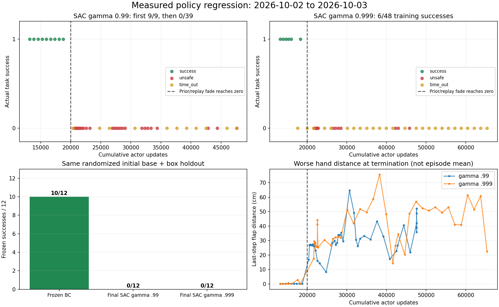
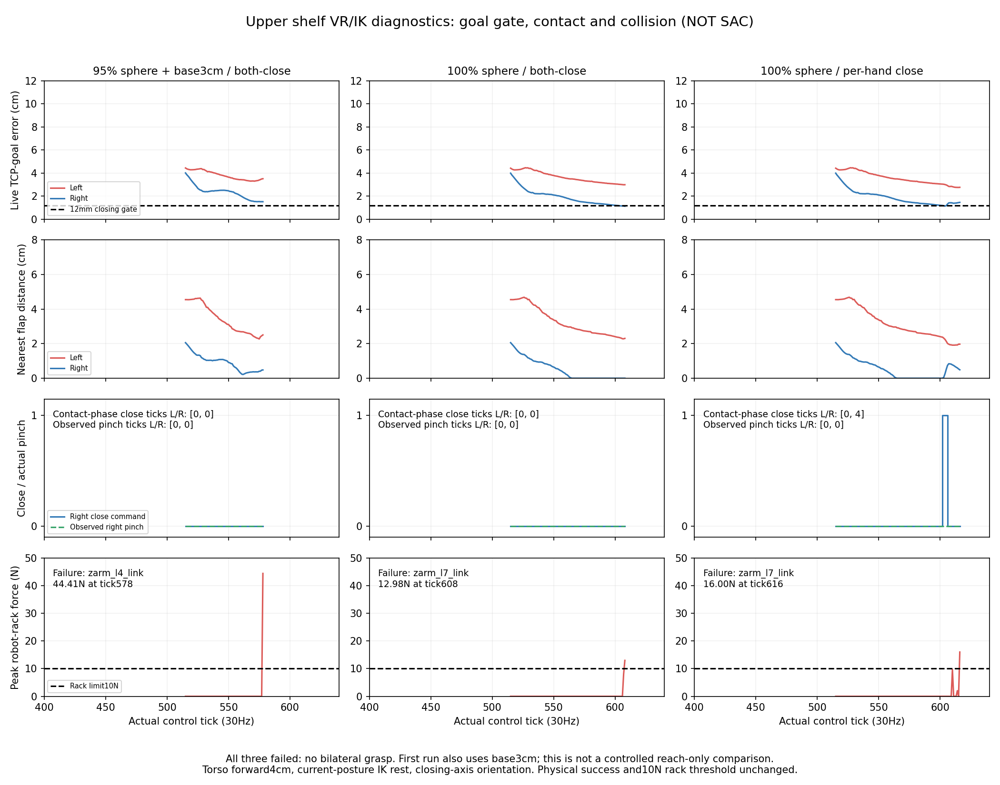
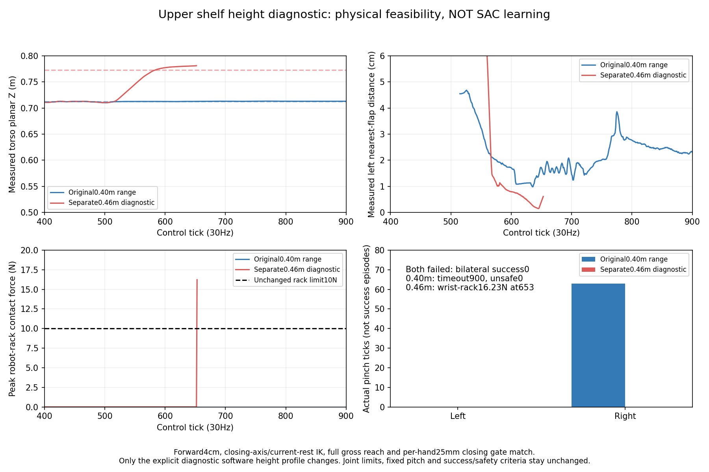
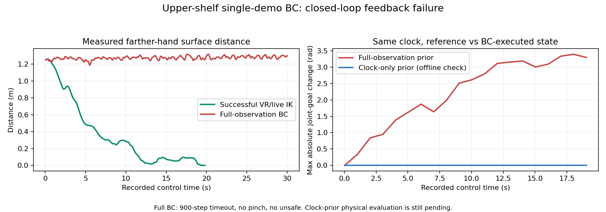
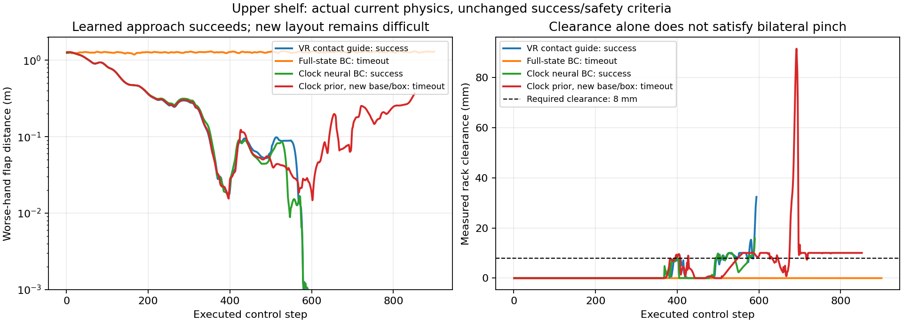
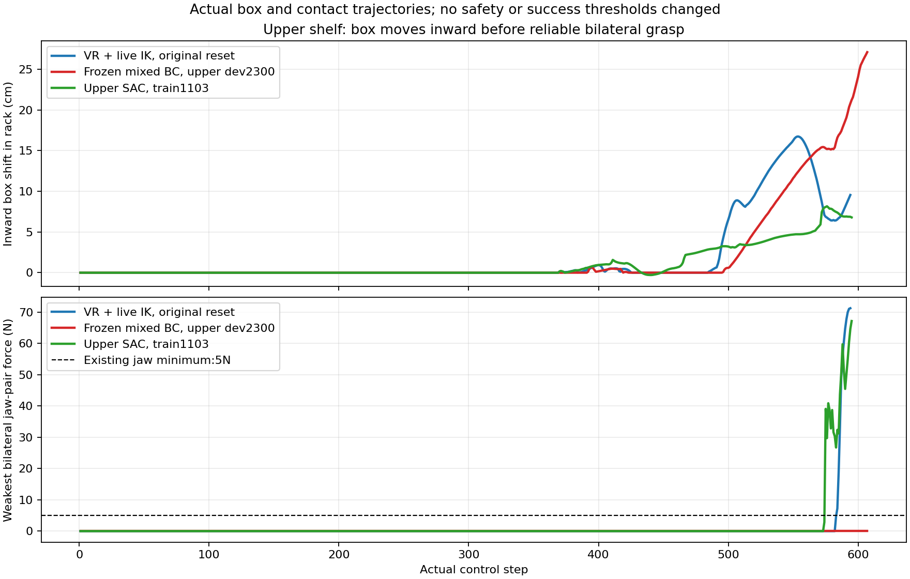

# V2 grasp SAC: 장기 학습 붕괴와 복구 실험 (2026-10-03)

## 종료된 실험 결과

10/02 초반의 연속 성공은 장기 SAC 학습에서 유지되지 않았다. 예정된 횟수를
모두 수행한 뒤 종료했으며, 런타임 오류나 OOM으로 중단된 실행은 아니다.
아래 결과는 종료된 `results.json`과 각 실제 물리 실행의 `metrics.json`에서 집계했다.

| 실험 | 실제 훈련 | 마지막 모델 고정 평가 | 안전 위반 / 시간 초과 |
|---|---|---|---|
| GPU3 목표 SAC, gamma0.99 | 9/48 성공 | 0/12 성공 | 훈련28/11, 평가11/1 |
| GPU0 목표 SAC, gamma0.999 | 6/48 성공 | 0/12 성공 | 훈련16/26, 평가0/12 |
| GPU0 BC, optimizer 업데이트0 | 훈련 없음 | 10/12 성공 | 평가0/2 |

동일한12개 랜덤 box·초기 base XY/yaw 평가에서 **현재 BC가 마지막 SAC보다 좋다.**
SAC가 BC보다 우월하거나 다양한 크기·위 선반까지 성공했다고 주장하지 않는다.
종료된 세 suite의 최종 Drive 업로드 크기·MD5 검증은 완료됐다.



[그림 원본 지표와 물리 실행 출처](assets/rl_v2_goal_sac_collapse_20261003.json).
거리 그래프는 **종료 시 더 먼 손의 거리**이며 에피소드 평균 거리가 아니다.

## 원인 후보와 확인된 사실

GPU3은13,190–18,774 actor update 사이 처음9/9 성공했다. Prior 손실 가중치는
3.41에서0.61로 떨어졌다. 다음 실행이20,384 update에 도달하면서 가중치가0이
되었고, 그 이후39개 훈련은 모두 실패했다. 왼손 거리가16.7cm로 벌어지고 이후
랙 충돌이 반복됐다. 실패 중에도 Q 추정값이 상승했으므로 TD loss 감소만으로
실제 파지 성능이 개선됐다고 판단할 수 없다.

기존에는 실제 데모 replay 혼합과 frozen 신경망 prior 손실을 **같은 schedule로
동시에 제거**했다. 성공 동작 주변에서 측정한 좁은 replay로 학습한 Q gradient가
그 영역 밖으로 actor를 이동시키는 것이 주요 원인 후보다. 감쇠와 붕괴의 시간적
일치는 뚜렷하지만 단독 인과를 확정한 실험은 아니다. Gamma0.999 수정만으로도
실패했으므로 할인율 불일치 하나로 모든 실패를 설명하지 않는다.

## 수정한 학습

`PoseGoalSACPilot`의 새 BC 초기화와 명시적인 checkpoint fork에 다음을 연결했다.

- 실제 데모 replay는 기존처럼20%에서20,000 actor update 동안0%로 감소한다.
- Frozen **신경망**의 현재 관측·clock 출력과의 actor MSE 가중치 floor10을 유지한다.
  실행 중 데모 명령 배열을 공급하지 않으며, 이 손실은 가상의 Q 전이를 만들지 않는다.
- SAC가 생성하는 normalized absolute goal을 neural prior 출력의±0.05 범위로 제한한다.
  실제 범위는 goal scale에 비례한다. 이번 초기 모델은 base XY 약±2.33/2.71mm,
  yaw±0.00840rad, 팔 관절 약±0.015–0.058rad이다. 환경의 관절/충돌 기준은 그대로다.
- 과거에 **실제로 실행한** off-policy action과 reward는 clipping하거나 수정하지 않는다.
  Q 데이터에는 이전 실제 명령을 그대로 보존하고, inverse goal decode 재현 검사를 유지한다.
- 몇 회 학습마다 동일한 개발 배치에서 optimizer를 끈 평가를 한다. 성공 수가 검증된
  최고 actor보다 줄면 그 actor만 복구한다. 최신 critic·critic optimizer·실제 성공/실패
  replay·전체 update count는 유지한다. Actor optimizer moments는 초기화한다.
- 개발 배치는 선택과 진단에 반복 사용하므로 독립 최종 성능으로 보고하지 않는다.
  마지막 평가 seed600–611은 앞선 튜닝에서 쓰지 않은 별도 배치다.

코드: `src/kuavo_isaaclab_scene/rl/multi_box/experiments/pose_goal_sac.py`,
`scripts/rl/fork_pose_goal_sac.py`, `scripts/rl/recover_pose_goal_actor.py`,
`scripts/rl/layout_residual_with_drive.py`.

## 실행과 지속 작업

GPU3의 `goal_guarded_base_box_sac_gpu3_20261003_160950` 실행을10/03 16:11 KST에 시작했다.
Parent와 Isaac child 모두 `CUDA_VISIBLE_DEVICES=3`; 내부 장치는`cuda:0`이다.
새 checkpoint는 기존 성공 actor12,494와 실제 replay7,192개에서 fork했다.
Gamma0.999에 맞추는 critic-only warmup2,000회 후 actor12,494/critic14,994로 시작한다.
실행 전 실제 native seed410개와 모든 goal/replay contract를 확인했다.

24개 랜덤 훈련 배치×2회, 처음 개발 평가4회와 훈련4회마다 개발 평가4회,
마지막 새 holdout12회로 총112개 실제 실행을 예정했다. 10/03 17:24 KST 기준,
학습 전 개발 기준 평가는 **4/4 성공**, 이어진 실제 SAC 훈련은 **4/4 성공**이다.
Actor는15,310까지 갱신됐고 첫 개발 재평가도3/3 성공 후 네 번째 배치를 수행한다.
기준 평가에는 기존 BC가 시간 초과한405/406도 포함한다. 종료된 실행의 Drive 검증은
완료됐다. 과거 붕괴 지점20,000 update 이후와 새 최종 holdout은 아직 확인 전이며,
장기 개선이나 독립 최종 성능으로 해석하지 않는다. 현재는 정확한 복구 진단을
위한 sequential one-env이며80GB VRAM을 채우는 병렬 학습은 아니다.

박스는 동적 물체이며 안쪽2–4cm·yaw±1°·주변 박스0–3개 randomization을 유지한다.
실제 초기 base는 rack-frame 좌우±20cm·밖으로3–25cm·yaw±15°다. Curriculum,
성공 판정, rack10N/obstacle5N, self-collision off 설정을 변경하지 않았다.
기존 Drive remote를 재사용해5분마다 백업하고, 검증된 오래된 checkpoint만 정리하며
로컬에 최신2개와 형식별 검증된 최신2개를 보호한다. 복구 replay도 업로드·검증한다.

사용자의 성공까지 계속하라는 요청에 따라 Codex의 **지속 목표를 active로 등록**했다.
이 도구는 현재 thread에서 후속 작업을 자동으로 이어가는 기능이다. 현재 연결에는
`automation_update` 예약 도구가 없어 특정 시각의 채팅 예약을 만들었다고 주장하지 않는다.
실행 종료·오류·성능 퇴행을 확인하고 분석·수정·재학습을 계속하며, 목표를 아직 완료로
표시하지 않는다. 다른 사용자 GPU1/2 실행과 파일에는 변경하지 않았다.

## 위 선반과 남은 검증

위 선반의 current-rest IK 진단은900tick 시간 초과였고, 이어진 base6cm 접근 진단은
566tick에`zarm_l4_link`–rack35.51N으로 실패했다. 모두 종료·백업 검증됐다.
따라서 위 선반은 여전히 미해결이다. Base 접근량을 늘리는 것만으로 해결된다고
보지 않으며, 팔 진입 자세와 그리퍼 닫힘 시점을 함께 검토해야 한다. GPU0에서
`upper_coordinated_reach_gpu0_20261003_161948` 진단을 시작했다. 실제 생성된
폴더와 상태로 완료 여부를 확인한다. Base 접근3cm, 양손12mm 안에 들어온 뒤
함께 닫기, current-rest IK와 torso 앞쪽4cm를 비교했다. 이 실행도578tick에 왼팔
`zarm_l4_link`–rack44.41N으로 실패했다. Gripper는 열려 있었고 왼손 목표에2.83cm
IK reach projection이 남았다. 종료·최종 Drive 검증 완료. 접근 거리를 줄이고
닫힘을 늦추는 것만으로 도달 범위·팔 진입 문제를 해결하지 못했다. 이 VR/IK 실행은
SAC가 아니며 실패 데이터에서 가상의 native 성공 seed를 만들지 않는다.

이번 정책 제약·legacy resume·실제 replay 보존·개발 평가 rollback 회귀 검사
**73 passed**, 기존 SAC·replay·Drive·배치·영상 회귀까지 포함해 **130 passed**.
새 제약 적용 후의 파지 성공률은 실제 실행 결과로 추가 보고한다.

## 위 선반: 높이 상한, IK projection과 닫힘 gate (10/03 후속)

실제 torso XZ는 약(0.0629,0.7129)m까지 올라간다. 현재 upright height profile의
최고 Z는 nominal0.3127m+height0.40m=0.7127m이므로 이미 높이 상한이다.
이 상태에서 동일 profile의 목표만 더 위로 지정해도 clamp되어 도움이 되지 않는다.
이번 진단에서는 torso pitch·travel profile과 기존 SAC 물리 계약을 변경하지 않았다.

URDF IK의 gross reach sphere가 전체 길이의0.95를 사용해 왼손 요청 목표를
2.826cm 잘라내는 것을 확인했다. 목표의 어깨 기준 거리는0.756034m로 현재 tool
offset을 포함한 arm reach0.766076m의0.9869다. 실제 관절 범위 안에0.9983 reach의
FK pose도 존재한다. Offline bounded IK는1.0 sphere에서 요청 목표에 약1.2e-10m
오차로 도달했고 관절 여유0.212rad를 유지했다. **이는 운동학 결과이지 실제 파지나
랙을 피하는 경로의 증명이 아니다.**

`UrdfArm(..., reach_fraction=...)`와 VR 진단 전용
`--vr-arm-reach-fraction`을 추가했다. 기본0.95는 그대로이며 진단의1.0도 기존
관절·속도·가속도 범위를 지킨다. SAC/BC/recorded action과 함께 지정하면 거부한다.

| 실제 GPU0 VR/IK 진단 | 결과 | 종료 순간 rack force / body |
|---|---|---|
| sphere0.95, base3cm, 양손12mm 동시 닫기 | 578tick unsafe, pinch0 | 44.41N / zarm_l4_link |
| sphere1.0, base 추가 접근0, 양손12mm 동시 닫기 | 608tick unsafe, pinch0 | 12.98N / zarm_l7_link |
| sphere1.0, base 추가 접근0, 손별12mm 닫기 | 616tick unsafe, pinch0 | 16.00N / zarm_l7_link |

모두 current-rest·closing-axis IK·torso 앞쪽4cm이며 종료·Drive 크기/MD5 검증 완료다.
첫 실험에는 base3cm 보조도 있어서 force 감소를 reach 비율 하나의 효과로 단정하지
않는다. Full reach여도 실제 박스가 움직이면서 왼손 목표 오차가 남고 손목이 랙에
닿는다. 오른손은 flap 최근접 거리0까지 왔지만12mm **TCP 목표** gate에서 닫기
명령이4tick뿐이었다. 목표 오차와 flap 최근접 거리는 서로 다른 값이다.



[그림 원본 측정과 run 경로](assets/rl_v2_upper_reach_gate_20261003.json).
[실제 실패 영상](assets/rl_v2_upper_full_reach_failure_20261003.mp4)은 GPU0 PhysX 자세를
CPU mesh로 표시한 VR/IK 진단이다. SAC 성공 영상이 아니다. H.264/avc1·yuv420p·
faststart로 저장했고 전체 decode를 검증했다. Notion의 요약·상세 기록에도 native
영상과 그림으로 첨부했다.

`upper_staggered25_full_reach_gpu0_20261003_172051`의 손별25mm gate 진단은
900tick 시간 초과, unsafe/invalid0으로 끝났다. 오른손의 실제 pinch가63tick(2.1초)
검출됐고 왼손은0이다. 오른손 pinch는717–790tick 사이에 있었으나 그 전 구간
연속 유지가 아니므로2.47초 연속 grasp로 해석하지 않는다. Contact phase에서
닫기 명령은 왼손39tick·오른손317tick이다. 왼손 최소 flap 거리는9.87mm였고
TCP 목표 오차는최소20.10mm다. 마지막 왼손 gross reach projection은33.99mm로,
박스가 이동하며 다시 도달 범위를 벗어났다. 종료·최종 Drive 크기/MD5 검증 완료.

후속 `upper_staggered25_base3_gpu0_20261003_173321`은 같은25mm gate에 bounded
base3cm 접근을 더했지만579tick에`zarm_l4_link`–rack24.26N으로 실패했다.
`upper_staggered25_torso8_gpu0_20261003_174231`은 base 추가 접근 없이 기존 travel
profile 안에서 torso 전진을4→8cm로 바꿨지만613tick에 같은 왼팔–rack47.45N으로
실패했다. 두 진단 모두 양손 pinch0, 종료·최종 Drive 검증 완료다. 접근량을 키워
왼손 reach sphere projection을 없애도 실제 팔 경로가 랙에 닿을 수 있다.

`upper_staggered25_full_wrist_gpu0_20261003_175310` 진단은1.0 reach·torso4cm·
손별25mm를 유지하고 성공 demo의 full wrist orientation을 맞췄다.900tick
시간 초과, unsafe/invalid0, 양손 pinch0으로 종료·Drive 검증 완료다.
마지막 flap 거리는 왼손20.73mm·오른손7.24mm였다. 전체 손목 자세를 맞추는
것만으로 남은 도달·파지 문제를 해결하지 못했다.
양손 opposing flap·8mm clearance·0.25초 유지의 최종 성공 조건,
rack10N/obstacle5N은 그대로다. 위 선반 actual positive native seed는 아직 미확보다.

## 여러 실제 성공 episode를 학습에 연결

현재 SAC의 첫 두 훈련 성공으로부터 **830개 실제 전이(416+414)**를 읽었다.
현재 물리/reward 계약, GPU 실행, 초기 제어 상태, step 시간과 관측 연속성,
최종 양손 pinch·성공 관측을 검사했다. Physical action inverse의 최대 오차는
1.073e-6이며 action/reward를 수정하지 않았다. 해당 pool은 현재 실행에 주입하지
않았고 `actual_multi_seed_import_audit.json`에 출처·검사 결과를 저장했다.

- `read_executed_successes`는 같은 strict 물리 검사로 현재 goal-SAC/BC 등의 실제
  성공을 받는다. Collection source만으로 성공을 인정하지 않는다.
- `--native-dataset`과 `--pose-student-native-seed`를 반복 지정할 수 있다.
  Episode마다 clock0과 각 초기 박스 anchor를 따로 사용하며 terminal 경계를 넘지 않는다.
- 단일 파일의 기존 goal contract/hash는 유지한다. 서로 다른 성공 episode를
  결합한 계약은 episode context와 ordered source SHA256을 명시한다.
- 원래410개 단일 데모로 만든 목표 범위를 벗어나는 실제 inverse command가
  두 실행에서 각각21/24행 있었고 normalized 최대값은2.398/2.418이다. 초기 base
  차이와 servo의 physical clipping 때문에 실제로 같은 명령을 재현하는 inverse
  goal이 옛 목표 범위 밖에 있을 수 있다. **실제 action을 clipping해서 억지로
  넣지 않는다.** 새로운 pool의 실제 goal label로 center/scale을 다시 fit하고,
  새 정책을 물리에서 검증한 뒤 별도 SAC 계약으로 시작해야 한다.
- 위/아래 선반을 묶을 때는 full observation fit을 사용한다. Clock-only로 서로
  다른 동작을 같은 시간 입력에 학습하지 않는다. 위 선반 실제 성공이 아직 없어
  해당 positive 데이터는 미확보다.

```bash
# 파일은 현재 물리에서 성공한 실제 GPU 전이여야 한다. Output은 새 고유 경로다.
CUDA_VISIBLE_DEVICES='' PYTHONPATH=src:scripts/rl python scripts/rl/fit_v2_pose_student.py \
  --native-dataset /absolute/path/to/actual-success-a/executed_transitions.hdf5 \
  --native-dataset /absolute/path/to/actual-success-b/executed_transitions.hdf5 \
  --initial-box-relative --clock-horizon 900 --steps 20000 \
  --output-dir /absolute/path/to/unique-pooled-student
```

새 pose/seed/URDF 진단과 SAC·배치·Drive 관리 회귀 검사 **153 passed**.
학습과 성공 판단은 실제 완료된 물리 결과로 계속 확인한다.

Demo TCP frame이 현재 calibrated closed TCP와 다른지도 따로 확인했다.
데모2개와 현재 물리 진단에서30tick마다 기록된20관절로 URDF FK를 계산했다.
두 데모의 TCP 차이는 최대0.84µm, 현재 진단은1.20µm였다. 기록된 EEF 회전도
FK와 약1.8e-6 이하 차이로 일치했다. **이 샘플 검사에서는 오래된 TCP offset
불일치가 원인이라는 가설을 지지하지 않는다.** Box/flap frame과 demo grasp offset의
동일 pinch-frame 재구성도 오차0으로 맞았다. 이와 별개로 upright torso 변경 후의
팔 경로와 live servo 추종 문제는 남아 있다.
[TCP frame 검사 방법·원본 SHA256·측정값](assets/rl_v2_demo_tcp_fk_audit_20261003.json).

## Pooled 목표 범위와 관측 기반 prior 준비 (10/03 17:53)

`pooled_lower_goal_bc_cpu_20261003_174452`는 종료·검증된 SAC **훈련 성공5개,
2,073전이**만 사용했다. 개발/최종 평가 episode를 fit에 포함하지 않았다.
CPU 한 스레드·`CUDA_VISIBLE_DEVICES=''`로20,000회 BC fit, clock horizon900,
full observation과 initial-box-relative goals를 사용했다. 기존 GPU3 학습에는
교체하거나 replay를 주입하지 않았다.

새 center/scale에서 실제5개 episode를 `PoseGoalSACPilot(training=False)`에
넣어 **2,073전이 모두** 받아지는 것을 확인했다. Episode 시작 clock은 다섯 개
모두0이고 각 초기 박스 anchor를 따로 유지한다. Normalized actual goal 최대1.0,
physical action inverse 최대 오차1.073e-6; 과거 action/reward를 clipping하지 않았다.
Actor/critic 업데이트0으로 수행한 데이터 계약 검사이며 **새 정책의 물리 성공을
뜻하지 않는다.** Fit 모델과 종료 로그의 Drive 크기/MD5 검증은 완료됐다.
새 데이터 계약 검사 기록도 별도 고유 폴더로 Drive 업로드·MD5 검증했다.

Fit 오차는 팔 관절 최대 평균0.00360rad·최대0.02457rad, base XY 평균0.256/0.403mm·
최대2.89/3.11mm였다. Offline 오차가 작다는 것만으로 실행 안정성을 주장하지 않는다.
실제 모델은 frozen 개발 평가를 통과해야 이후 SAC 초기화 후보로 사용할 수 있다.
`pooled_lower_bc_dev406_gpu0_20261003_180737`에서 새 모델의 optimizer를 끄고
반복 사용한 개발 배치406을 평가해 **429tick에 성공·unsafe/invalid/timeout0**을
확인했다. Model·영상·종료 로그의 Drive 검증 완료다. SAC actor/critic update0인
**BC 개발 평가1/1**이며 기존 GPU3 SAC에는 교체하지 않았다.
SAC 실행이나 새 독립 최종 holdout 성공으로 기록하지
않으며, 해당 평가 전이를 training seed로 사용하지 않는다. Native reader는
`layout.split=validation/holdout/eval/evaluation` 데이터를 training seed에서 거부한다.
평가 데이터 누출 거부 회귀를 추가한 관련 검사 **157 passed**.

같은 시각 기존 GPU3 SAC는 **훈련7/7 성공**, 학습 전 개발4/4·첫 개발 재평가4/4,
actor17,410으로 다음 훈련을 수행한다. 완료된15개 실행의 Drive 검증은 끝났다.
아직20,000update 이후와 새 최종 holdout600–611은 확인 전이다.


## Upright 상단 이동 범위와 첫 위 선반 실제 파지 (10/03 18:52)

GPU3 guarded SAC는 학습12/12 성공, unsafe0, actor20,914까지 진행했다.
학습 전·첫·두 번째 개발 검사는 각각4/4였으며,20,000update 이후 개발 재평가는
진행 중이다. 전체112개 실행 중24개를 완료했다. 이는 개발 중인 하단 정책이며
마지막 독립 seed600–611 평가 결과는 아직 없다. 학습을 중단하거나 교체하지 않았다.

위 선반 실패의 일부는 보수적인 upright torso **소프트웨어 이동 범위**와 관련됐다.
기본0.40m 추가 높이에서0.46m로 바꾼 별도 물리 계약을 사용했다. 원래 관절
하드 리미트·속도·pitch 고정·랙10N/장애물5N·성공 조건은 유지했다. URDF
오프라인 계산에서6cm 상승 목표의 pitch 오차0, 최소 관절 여유0.5967rad를 확인했다.
이 계산만으로 물리 성공을 판단하지 않고 실제 GPU 실행을 따로 수행했다.


[측정 지표와 원본 실행](assets/rl_v2_upper_height_diag_20261003.json).

- `upper_up6_staggered25_gpu0_20261003_182631`:6cm 상승·4cm forward·full gross
  reach·current rest·closing-axis.25mm TCP-goal gate를 사용하면653tick에
  왼손목–랙16.23N으로 실패했다. 왼손 최근접 표면1.50mm까지 접근했지만 그때
  양쪽 jaw는 open(-1)이었고 pinch는 없었다. 표면 거리와 TCP-goal closing
  gate 거리의 차이로 실제 가까운 상태에서도 닫지 못한 사례다.
- `upper_up6_reference_jaws_gpu0_20261003_183758`:높이와 나머지 제어는 유지하고
  원 데모의 jaw 닫힘 시점(left496/right495, original bilateral pinch514)을
  유지했다. **594tick/19.8s에 실제 성공1, unsafe/invalid/timeout0**. 서로
  반대 flap0/1을 집고 stable hands 둘 다 true, proof lift true, hold0.267s,
  최종 rack clearance32.39mm. 실제 실행 HDF594행은 strict native reader가
  초기 제어 상태·시간·관측 연속성·성공 terminal까지 검사해 받아들였다.
  기존0.40m action contract로 읽으면 거부된다.

[위 선반 실제 성공 진단 영상](assets/rl_v2_upper_actual_success_20261003.mp4).
H.264/avc1/yuv420p/faststart·전체 decode 검증,60tick 간격11프레임의 실제
물리 pose CPU mesh 재생이다. 시간은 압축됐다.

이는 **VR/live-contact IK 진단의 첫 위 선반 성공이며 SAC 성공이 아니다.**
두 실행은 모두 종료 후 영상·HDF·로그를 기존 Drive 연결로 크기/MD5 검증했다.
기본 height 범위와 현재 GPU3 학습은 그대로 유지했다. 기존0.40m 전이나 Q를
새0.46m 전이로 재표기하지 않는다.

학습 연결은 `--torso-extra-height-m 0.06`이라는 명시적 옵션으로 동일 물리
계약을 선택한다. VR 위치 assist는 이 옵션과 별개다. 새 BC checkpoint에
physical contract를 기록하고 실행 시 비교하며, 계약이 없는 옛 prior는 새로운
높이 범위에서 거부한다. `--vr-contact-torso-up-m` 진단은 기존 측정 계약을
보존한다. 새 실제 upper594행만으로 full-observation·initial-box-relative·
clock900 BC20,000회 CPU fit을 시작했다. Frozen 물리 재평가 후 새 SAC를
시작하며, 다양한 실제 initial base와 dynamic box 결과를 별도 확인할 계획이다.
단일 seed 성공을 일반화 성공으로 기록하지 않는다.

첫 CPU fit은 inverse 오차0.000356115 때문에 종료1로 모델을 만들지 못했다.
상태의 `phase=finished`/백업 완료만 보고 모델 완료로 판단했던 중간 기록을
정정한다. 해당 모델을 요구한 평가도 실행 전에 종료2였다. 실제 성공 HDF는
유지하고 오류 로그도 보관했다. 원인은 base의 실제 roll/pitch가 있는 상태에서
3D rotation transpose를 XY 투영의 역으로 사용한 데 있었다. XY만 보관한
goal에서는 상단2×2 투영 행렬의 역을 사용해야 한다. 새
`...projected_base_v2` action coordinate를 추가했고 실제594행 최대 복원 오차
8.34e-6를 확인했다. Action/reward를 수정하거나 검사 기준을 완화하지 않았다.
새 prior에서만 이 좌표를 사용하며 진행 중인 GPU3의 v1 checkpoint는 기존
좌표 해석을 유지한다. 새 CPU fit을 재실행하고 actual exit0·모델 파일·백업을
확인한 뒤 frozen 물리 평가를 진행한다.

GPU0에서는 위 선반 dynamic box와 실제 초기 base를 바꾼 훈련용 seed1000
진단도 시작했다. Box inward25mm/yaw0.007rad, base rack-X−4cm/outward6cm/
yaw−0.03rad, lower distractor5. Native 물리의 box는 고정/attach하지 않고
reset footprint만 검사했다. 개발 seed2000은 분리해 fit/Q seed에서 제외한다.
훈련 성공 여부와 frozen 학습 정책의 성공 여부를 분리해 기록한다.

관련 변경·SAC·Drive·layout 검사174 passed.


## 경계 이후 개발 평가와 실제 upper 연결 상태 (10/03 19:16)

GPU3 SAC actor20,914를 고정한 개발 재평가도 **4/4 성공·unsafe0**이었다.
온라인 훈련12/12·unsafe0, 전체28/112 완료 후 다음 훈련을 계속한다. Actor
복구 횟수0이며 아직 독립 마지막 평가나 장기 안정성 완료로 판단하지 않는다.

수정 후 upper projected-base v2 CPU fit은 실제 exit0·student.pt 생성·종료
로그 및 모델 Drive 크기/MD5 검증을 확인했다. 이 모델로 goal-Q seed594행을
검사해 normalized 최대1.0·inverse 최대8.34e-6·SAC update0을 확인했고,
`upper_actual_seed_audit_20261003_191141` 기록도 Drive 검증했다. 이 데이터
검사는 정책 성능 검사가 아니다.

첫 위 선반 train seed1000 VR 진단은 **851tick timeout, pinch0, unsafe0**.
실제 초기 base는 원 seed에서 약7.2cm·yaw0.03rad 바뀌었다. Target9와
낮은 distractor5는 모두 올바른 셀에서 settling했고 box는 dynamic 상태였다.
최종 왼손/오른손 flap 표면 거리9.60/58.19mm, gross reach projection21.75/
11.71mm였다. 이 실패는 성공1/1을 일반화 성공으로 부르지 못하는 근거다.
다른 박스가 settling하는 동안 target의 ready timer가 흐르므로 기록된 행동은
900tick보다 짧았다. 성공 조건이나 timeout을 완화하지 않았다.

별도 `--vr-layout-retarget`은 실제 초기 선택 박스의 위치/yaw로 VR 접근 경로
전체의 rack-relative base 목표를 이동한다. Live 접촉 이후만 retarget했던
경로와 비교하는 물리 진단 전용이다. 같은 seed1000에서 신경망 frozen 평가
종료·Drive 검증 후 이 진단을 자동 실행하도록 실제 서비스로 대기시켰다.
Q 입력에는 retargeted demo 가상 관측/명령을 쓰지 않고 새 실제 물리 전이만
기록한다. 기본 sampler는 하단 분포를 유지하며 explicit upper layout은
선반/box type을 바꾸지 않고 target9·footprint·initial base 변환을 검사한다.

Frozen upper full-observation BC는 아직 실행 중이다.121tick에서 원 실제
경로의 양손 거리0.63/0.70m와 달리1.23/1.27m로 접근 진행이 늦다. 단일 경로의
관절 상태와 다음 목표가 강하게 상관돼 BC가 현재 자세를 유지하는 피드백을
학습했을 가능성을 진단한다. 완료 결과 전에 실패로 확정하지 않는다.
동일594행으로 **단일 upper 전용 clock-only·time harmonics16** neural prior를
CPU에서 별도 fit하기 시작했다. Runtime 데모 배열은 사용하지 않고 실제
servo feedback으로 목표를 추종한다. 서로 다른 위/아래 작업을 unconditioned
clock-only로 합치지 않는다. 새 정책은 물리에서 통과한 뒤 SAC에 연결한다.

새 explicit-upper layout과 기존 데이터/goal 회귀 검사50 passed.


## 실제 BC 피드백 실패와 순차 실행 보강 (10/03 19:41)

GPU3 SAC는 **온라인 훈련15/15 성공·unsafe0**, actor23,010, 전체31/112를
완료했다.20,914 고정 개발4/4 이후 다음 학습을 계속하며 actor 복구0이다.
독립 최종 seed600–611이나 위 선반 SAC 성공은 아직 확인 전이다.

`upper_up6_bc_frozen_gpu0_20261003_191616`은 종료 후 **900tick timeout,
pinch0, unsafe0**, 최종 손 거리1.17/1.30m를 확인했다. 현재 물리0.46m 프로필과
같은 source로 fit했지만 실제 접근이 진행되지 않았다. 종료 로그/영상/전이의
Drive 크기/MD5 검증은 완료됐다.


[측정·모델·데이터 SHA256과 검사 방법](assets/rl_v2_upper_bc_feedback_20261003.json).

같은 clock에서 원 성공 관측과 BC가 실제 실행한 관측을 넣으면 full-observation
prior의 팔 관절 목표가121tick에 최대1.39rad·501tick에3.25rad 달랐다. 단일
경로에서 현재 자세와 다음 목표의 강한 상관관계를 학습해 실행 상태가 달라지면
접근하지 못하는 피드백이 생겼을 가능성과 일치한다. 이 비교는 단독 인과를
증명하는 제어 실험은 아니다. Clock-only prior는 관측 입력 가중치가0이라
같은 시간의 neural goal 차이가0이지만, 실제 servo 명령은 현재 물리 상태에
따라 달라진다. 해당 대안의 **물리 성공은 아직 확인 전**이다.

단일 upper 전용 clock-only·time harmonics16 fit은 실제 exit0·모델 생성·
Drive 크기/MD5 검증 완료다. 동일594 실제 전이를 새 goal-Q 계약에서 검사해
모두 받아들였고 actor473D·critic533D·normalized goal 최대1.0, SAC update0이다.
다른 위/아래 작업을 같은 unconditioned 시간 정책으로 합치지 않는다.

첫 실패했던 BC 서비스의 `Restart=on-failure`가 새 모델 생성 후 다시 평가를
시작해 동일 모델 평가가 중복된 것을 host PID/cgroup으로 확인했다. 우리
중복 서비스 `...bc-frozen-gpu0...` 하나만 정상 종료했다. 해당 기록은
`requested_stop`/interrupted 평가로 보관하고 성능 실패 분모에 넣지 않는다.
종료 로그·HDF·영상의 최종 Drive 검증은 끝났다. 기존 GPU3 학습은 계속했다.

`scripts/rl/queued_experiment.py`는 CPU-only 공용 대기 gate다. `active`,
`activating`(재시작 대기),`deactivating`은 모두 기다린다. Terminal 서비스·
MainPID0·현재 ExecMainPID와 기록된 supervisor 일치·실행 exit0·writer 종료·
최종 Drive 검증·launch와 실제 run 경로 일치가 있어야 다음 작업을 시작한다.
물리 결과가 timeout이면 정상 완료된 진단이므로 후속 진단은 허용하지만,
실행 자체가 실패하거나 백업이 끝나지 않은 경우 진행을 거부한다. 이 gate는
학습 성공 판정이 아니며 SAC 연결은 실제 성공 조건을 따로 확인한다.
GPU child가 없는 대기 서비스 두 개만 새 gate로 다시 읽게 했다.
재시작 경합·다른 attempt 포인터·실행 실패·미검증 백업 검사 **8 passed**.

동일 base/box train1000의 whole-path retarget 진단이 GPU0에서 진행 중이다.
실제 settled target shift−25.12mm/yaw0.001545rad를 사용했다. 샘플 yaw0.007rad와
settled yaw를 구분해 기록한다. 종료/검증 뒤 clock prior의 실제 frozen 평가가
자동으로 이어진다. Retargeted demo는 가상의 Q 전이가 아닌 VR 진단 guide다.


## 위 선반 신경망 실제 성공과 두 선반 연결 (10/03 20:31)

GPU3 기존 하단 SAC는 **온라인18/18 성공·unsafe0**, 최근 개발4/4,
actor25,114, 전체38/112 완료 후 계속 진행 중이다. 이전 붕괴 경계20k를
넘었지만 독립 최종 seed600–611 평가는 아직 수행 전이다. 개발 평가 반복을
독립 일반화 성공 횟수로 세지 않는다.

위 선반 `upper_up6_clock_bc_frozen_gpu0_20261003_194629`의 clock neural BC는
**590tick 성공·unsafe0**이다. Opposing flap0/1·양손stable·proof lift·
hold0.26667s·실제rack clearance15.83mm를 확인했다. Runtime 데모 배열/IK
guide 없이 학습한 goal network와 현재 상태를 읽는 실제 servo로 움직인다.
BC fit20k이며 SAC actor/critic update는0이다. 원래 성공 배치에서의 물리
확인이고 위 선반 SAC 성능이나 독립 일반화 완료라는 뜻은 아니다.
모델·실제 전이·종료 로그·영상의 Drive 크기/MD5 검증을 마쳤다.

[실제 위 선반 BC 성공 영상](assets/rl_v2_upper_clock_bc_success_20261003.mp4)
(CPU mesh render,60 control ticks/frame 시간 압축,H264/avc1/yuv420p/faststart,
전체 decode 검증).


[측정 출처와 metrics SHA256](assets/rl_v2_upper_learned_success_20261003.json).

GPU0에서 별도 `upper_guarded_base_box_sac_gpu0_20261003_200823`을 시작했다.
새 위 선반 physical0.46m 데이터594행으로 **새 Q의 critic-only500**, actor0을
초기화했으며 lower0.40m Q/replay를 섞지 않았다. Fixed neural prior floor10,
radius±0.05, actorLR1e-6, std0.001(0.0001..0.003), discount0.999를 사용한다.
Target9 SMALL, boxinward2–4cm·yaw±1°·depth±6mm, 실제초기base rackX±8cm·
outward3–10cm·yaw±5°이며 box는 dynamic 상태다. Upper의 첫 시험 분포이고
lower의±20cm/±15° 전체 분포를 upper에서도 통과했다고 표현하지 않는다.
Train1100–1103×2pass, 개발2100/2101을 매2train 재검사, 최종3100–3103:
총22회다. 실행 중 VR 배열을 참조하지 않으며 초기 frozen 개발 결과는
**0/2(1timeout,1unsafe)**였다. 실제 SAC 훈련은 이 baseline 뒤 시작했다.

개발2100은852tick timeout·unsafe0·pinch0.496tick 손 거리54.1/18.7mm,
551tick32.0/7.0mm로 접근은 진행했지만 양손 안정 파지로 이어지지 않았다.
Rack clearance가8mm를 넘은 구간도 있지만 opposing/stable/hold 조건이 없으면
성공 처리하지 않는다. 기존 VR whole-path retarget train1000도851tick
timeout·unsafe0·pinch0로 끝났다. Gross reach projection은0에 가까웠지만
actual IK error11.0/7.4mm가 남았다. Reach clipping을 없애는 것만으로
일반화 파지 문제가 해결됐다는 근거는 없다.

두 선반을 한 정책으로 연결하려고 lower도 **같은0.46m 물리 프로필**로
VR/live-IK 성공 데이터를 새로 수집했다. 최초GPU2실행은
`OMNI_KIT_ACCEPT_EULA` 누락으로 bootstrap 입력EOF·exit1(물리 step0)였다.
실패 console을 Drive 검증한 뒤 envvar를 고친 새 고유 실행
`lower_new_travel_seed_eula_gpu2_20261003_202146`은 **410tick 성공·unsafe0**,
hold0.26667s·clearance45.51mm이고 종료 데이터/로그 Drive 검증을 마쳤다.
기존0.40m 성공 데이터의 action contract를 덮어쓴 것이 아니다.
GPU1/2의 다른 사용자 프로세스는 그대로 유지하고 단일환경 약3GiB만 썼다.

새 opt-in `fit_v2_pose_student.py --shelf-conditioned-clock-fit --hold-final-clock`
은 perceived selected-box region의 upper 비트와 clock/harmonics로 두 선반의
진행 prior를 구분한다. 단일경로 full-observation feedback의 자세 유지 문제를
피하고 실제 servo와 SAC는 live state를 계속 사용한다. 같은 physical/reward
계약의 actual lower+upper 성공 모두를 요구하고 validation/holdout data를
거부한다. Actor raw-state438열은 BC fit 중0으로 고정, critic은 full state와
실제 elapsed clock을 유지한다. Actor clock만 마지막 실제 label에서 멈춰
미학습 시간 영역의 extrapolation을 방지한다. 기본/기존 checkpoint 동작은
그대로이고 새 checkpoint에 input 계약을 명시한다.

`shelf_conditioned_clock_goal_bc_cpu_20261003_202731`은 actual1004행(410+594),
20k BC fit, inverse command 최대8.34e-6, actor472D·shelf0/1,
clock_limit593이다. CPU fit·모델·로그의 Drive 검증 후
`shelf_clock_bc_both_shelves_gpu2_20261003_203014`이 자동으로 실제 물리 평가를
시작했다. 이 시점의 두 선반 통합 BC 성공은 아직 확인 전이다. 성공 시에만
SAC로 연결하며, fit loss를 물리 성공으로 판단하지 않는다.

후속 CPU fit과 GPU2 물리 평가를 **실제 systemd 대기 서비스**로 등록했다.
공용 gate가 선행 실행 종료·exit0·writer 종료·Drive 검증을 확인한 뒤
시작한 것을 실제 서비스/PID로 확인했다. 활성 native goal이 후속 원인 분석과
수리를 이어간다. 정확한2시간 채팅 예약 도구는 제공되지 않아 그 기능을
설정했다고 주장하지 않는다. 각 checkpoint300s 업로드·checksum검증·최근2개
보호·writer 종료 후 로그 검증 정책은 유지한다.

`replay_v2_grasp_reference.py --contact-diagnostics`는 이미 계산한 privileged
접촉의 hand/flap/jaw별 힘·in_region·opposed·qualified·ambiguous·assigned flap과
기존 jaw최소5N을 reset 전에 기록한다. 새 센서/actor입력/보상/성공조건을
추가하지 않는다. 다음 실패를 접촉힘 부족·영역 이탈·반대 jaw 없음 등으로
구분하는 opt-in 진단이다. 새 replay manifest의 `num_envs`도 실제1로 기록한다.

Pose/input·실제전이·Drive layout·순차gate 검사 **51 passed** 및 관련 Python
compile 통과. 위 성공 영상과 비교 그림은 Notion에도 native파일로 업로드했고
video MIME는 실제 `video/mp4`로 명시한 업로드 완료 파일을 연결했다.


## 같은 신경망의 두 선반 물리 성공과 mixed SAC 시작 (10/03 20:50)

Shelf-conditioned clock BC의 **동일 student.pt**를 frozen 상태로 평가해
하단409tick·상단603tick 모두 **성공·unsafe0**을 확인했다. 하단 실제
rack clearance41.38mm, 상단16.84mm이며 양손 opposing flap0/1·
stable·proof lift·0.26667s hold를 만족한다. 양쪽 실행에서 SAC optimizer
update0이고 runtime VR array나 live IK guide는 없다. Original successful
reset poses에서의 BC 물리 검사이며 **새 initial base/box에서의 일반화/SAC
성공을 뜻하지 않는다**. 각 종료 HDF·로그·영상을 Drive 크기/MD5 검증했고
`shelf_clock_bc_both_shelves_gpu2_20261003_203014`은2/2로 종료했다.

[통합 신경망의 실제 위 선반 성공 영상](assets/rl_v2_mixed_shelf_bc_upper_success_20261003.mp4)
(CPU mesh render,90tick/frame 압축,H264/avc1/yuv420p/faststart·full decode검증).

실제1004행을 동일0.46m MDP의 goal 좌표로 읽어 새 critic-only500을 학습한
`mixed_shelf_clock_goal_initial_20261003_204501`을 생성했다. Actor update0,
actor474D·critic533D, shelf-conditioned clock limit593이고 fresh Q/normalizers/
optimizer를 사용한다. Lower0.40m 체크포인트나 replay를 섞지 않았다.
모델·manifest·verification의 Drive checksum 검증 뒤 **GPU2에서
`mixed_shelf_guarded_base_box_sac_gpu2_20261003_204617`을 실제 시작**했다.
이 시점에는 baseline frozen 개발 평가 중이고 새 SAC train 성공은 아직 없다.

같은 actor를 위/아래 번갈아 사용한다. Train lower1200–1203·upper1300–1303
×2pass=16회, 개발2200/2201·2300/2301을 매4train 재평가(초기4+중간16),
독립 final3200–3203·3300–3303=8회: 총44회다. Target boxes는 dynamic,
inward2–4cm·yaw±1°이며 lower 초기base rackX±20cm·outward3–25cm·yaw±15°,
upper rackX±8cm·outward3–10cm·yaw±5°·boxdepth±6mm다. Upper 분포를
lower보다 작게 시작한 사실을 명시하며 full upper 일반화 완료로 주장하지 않는다.

공용 driver의 opt-in `--reference-episode-map` JSON은 모든 layout seed에
초기 장면용 demo episode를 명시한다. 기존 `GraspLayout` 파일 형식이나
기본 single-episode 학습은 유지한다. Demo는 reset 장면을 선택할 때만 쓰고
runtime policy는 perceived shelf/box·clock·live state로 움직인다. Frozen final은
한 checkpoint를 쓰며 optimizer를 업데이트하지 않는다. Explicit episode map과
reset-only provenance를 manifest/results에 남긴다.

개발 성능은 전체 성공 수와 **episode/선반별 성공 수를 함께 비교**한다.
예를 들어 lower2/2·upper0/2에서 lower1/2·upper1/2로 바뀌면 total2/4가
같아도 lower 회귀를 검출해 best actor/actor optimizer로 복구한다. 최신 Q와
실제 replay·총 update 수는 유지한다. Best는 같은 checkpoint의 공동 성능을
기준으로 하며 서로 다른 actor의 per-shelf 최고 수치를 합치지 않는다.
Mixed reset 라우팅·frozen final·누락/부적절 map·선반간 회귀 검사와 기존
관련 검사 **58 passed**, Python compile 통과.

등록한 후속 CPU gate는 transient systemd가 종료 뒤 `ExecMainPID=0`으로
기록을 비운 것 때문에 처음 assertion으로 멈췄다. 종료 launch의 supervisor와
두 closed status의2346292를 host journal로 확인해 명시적으로 기록했고,
현재 PID가 제공되면 추가 비교하되 실제 종료·exit0·backup·writer provenance는
계속 필수로 검사한다. 수정 후 CPU 초기화가exit0 및 백업 검증을 마쳤고
후속 GPU2 batch가 실제로 시작했다. 실패 상태를 성공으로 덮어쓰지 않았다.

기존 GPU3 하단은 **train20/20·unsafe0**, actor26,516, 최근 개발4/4를
유지한 채 다음 개발 block을 진행한다. GPU0 upper SAC는 새 변형 train
**0/2(unsafe2)**로 첫 개발 재평가 중이다. Original upper BC 성공과 달리
현재 변형 upper 학습이 성공한다고 보고하지 않는다. 세 작업 모두
`CUDA_VISIBLE_DEVICES`로 물리 GPU를 명시하고 다른 사용자의 작업은 유지한다.
새 mixed 실행은 per-jaw diagnostic 로그를 켜 실제 힘·영역·opposed 등
실패 원인을 다음 물리 데이터에서 구분한다. Upper generalization 문제를
수정하고 독립 final success를 확인하는 active goal은 계속 유지한다.

## 상단 SAC 첫 변형 배치 성공과 박스 밀림 진단 (10/03 21:30)

GPU3 하단 SAC는 완료된 **train23/23·개발24/24·unsafe0**, actor28,616이다.
개발24회는4개 개발 장면의 반복 검사이고 독립 final12회는 아직 수행 전이다.
GPU0 upper SAC의 train1103은 **595tick 성공·unsafe0**, actor4,772였다.
양손 opposing flap0/1·stable·proof lift·hold0.26667s,
rack clearance44.04mm·실제 flap거리1.26/0mm를 확인했다. 실제 terminal HDF도
success=true·terminated=true·unsafe=false이고 종료 파일 Drive 검증을 마쳤다.
실행 중 VR 배열/live IK guide는 없으며 matching0.46m physical contract의
learned pose-goal SAC다. 초기 base rackX+1.01cm·outward8.17cm·yaw−2.75°,
boxinward2.17cm·yaw−0.69°·depth−4.49mm·distractors5/6이 적용된
**훈련 배치**다. 이 seed의 frozen 초기 모델 비교가 없어 이1회만으로
SAC 업데이트가 BC보다 개선됐다는 인과 결론을 내리지는 않는다.

현재 upper 총 train1/4(unsafe3), 개발0/4(unsafe3/timeout1)이므로
일반화가 해결됐다고 보고하지 않는다. GPU2 mixed의 초기 개발은
lower2/2·upper0/2(unsafe2)이고 첫 lower train1200은408tick 성공이다.
기존 GPU3·GPU0·GPU2 학습과 다른 사용자 프로세스를 계속 유지한다.

[상단 SAC train1103의 실제 성공 영상](assets/rl_v2_upper_sac_train1103_success_20261003.mp4)
(CPU mesh render,90tick/frame 시간 압축,H264/yuv420p·전체decode검증).



Mixed frozen 개발2300은607tick에 왼팔 `zarm_l4_link`–rack36.67N으로
실패했고 **전체607행의 모든 flap-force 채널이0N**이다. 이미 계산된 센서는
available=true이며 같은 물리/관측 계약의 실제 VR 성공 및 SAC train1103에서는
양손 matched jaw-force가 측정됐다. 단순히5N 접촉 기준을 조금 못 넘은 실패와
구분된다. Nominal flap에 실제 두 jaw를 정렬하기 전에 박스가 rack 안쪽으로
약27cm 이동한 것을 native every-step next-state에서 확인했다. 원래 VR 성공도
중간에 약17cm 안쪽 이동 후 live IK가 다시 잡는 경로였다. 실제 접촉 이전
박스의 이동과 뒤늦은 추적이 일반화 실패와 연관된다는 진단이며, 이 위치 기록만으로
박스를 밀었던 특정 robot link를 확정하지 않는다.

그림은 rack rotation을 역산한 box 중심 위치와 privileged force8채널을 사용한다.
Force는 기록의50N scale을 복원했으며200N에서 clipping된다. 하단 곡선은
`min_hand(max_flap(min_jaw(force)))`로 한 jaw만 강하게 닿는 것을 구분하는
진단값이다. 실제 성공은 별도의 opposed/in_region/stable/hold 조건 모두가
필요하다. [수치·native SHA256 출처](assets/rl_v2_upper_box_motion_20261003.json)에
VR594·실패607·SAC595의 원본을 기록했다. 개발 데이터를 성공 imitation에
사용하거나 실제 next-state/reward를 재작성하지 않았다.

GPU1의 train1000 별도 진단에서 contact 중 base를2cm 가까이 가져가는 것만으로는
해소되지 않았다.851tick timeout·unsafe0·양손 pinch0, 마지막 IK위치오차
11.7/12.2mm였다. 모든 종료 파일 Drive checksum 검증 후 후속
`upper_early_handoff_train1000_gpu1_20261003_212253`을 실제 시작했다.
`--vr-handoff-distance-m 0.12`는 양손이 perceived assigned flap 중점의
12cm 이내에 오면 원래 demo pinch 시점보다 일찍 live geometry를 추적한다.
양손 조건·finite/bounds 검사·한 번 전환 후 유지·원래 시점 fallback을 적용했고
기본0은 기존 동작이다. 같은 full-path retarget/current-rest/closing-axis,
torsoforward4cm/up6cm·full reach·원래 jaw 타이밍을 유지하고 base advance는0이다.
이는 **VR/IK 성공 경험 수집 진단**이며 SAC 성능으로 보고하지 않는다.
접촉/보상/성공/충돌 조건은 그대로이고 neural replay에는 옵션을 거부한다.
이 시점에서 후속 진단의 결과는 아직 확인 전이다. 관련66개 검사 통과.
