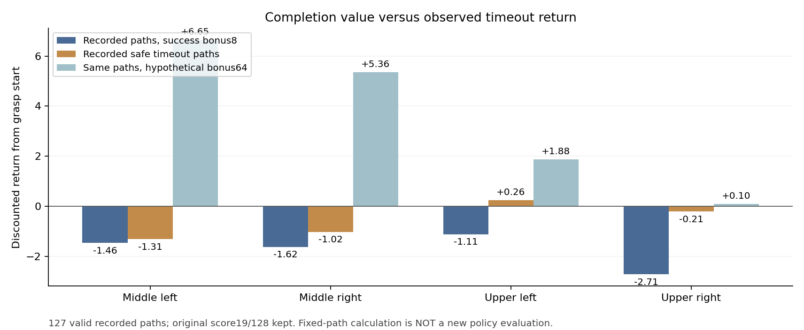

# 실패 회피보다 실제 파지 성공을 가치 있게 만드는 SAC 비교

성공 동작 유지 손실을 추가한 SAC의 저장 모델에서는 파지 직전 그리퍼 명령과
일부 팔 명령의 유지가 좋아졌다. 그러나 같은 과거 성공 상태의 초기 접근
명령은 더 달라졌다. 별도의 원래 학습 정책은 네 위치에서 성공했지만 마지막
전체 성능19/128은 초기23/128을 넘지 못했다. 성공 보상의 상대적인 크기도
점검하고 **성공 이벤트8→64만 바꾸는 선택형 비교**를 구현했다.
초기 입력·실제 full trainer 복원·기존 Drive의 checkpoint/계약7개 검증 뒤,
**10/07 11:25 KST에 GPU3에서 별도 실제 SAC를 시작했다.** 초기화를 마치고
첫 DEV에 진입했으며 실제 reward manager의+64 적용, 새 actor/Q 카운터와
replay·성공·n-step 은행0을 확인했다. 학습 후 성공률 개선은 아직 확인 전이다.
[실제 실행](assets/rl_v2_success64_actual_launch_20261007.json),
[실제 첫 DEV와 보상 적용](assets/rl_v2_success64_first_actual_DEV_20261007.json).

## 실제 경로에서 확인한 보상 관계

완전히 종료된 원래 정책 actor4337/Q19396의 마지막 DEV128 중 유효한127경로에서
파지 단계 시작 이후의 실제 할인 누적 보상을 계산했다. 할인율0.999·reward
scale1이며 원래 평가 성공률의 초기화 무효 분모는 유지해19/128이다.

| 위치 | 실제 평균 return·성공 보상8 | 실제 안전한 시간 초과 경로의 평균 | 같은 경로·성공 보상64의 가상 계산 |
| --- | ---: | ---: | ---: |
| 중간 왼쪽 | −1.46 | −1.31 | +6.65 |
| 중간 오른쪽 | −1.62 | −1.02 | +5.36 |
| 상단 왼쪽 | −1.11 | +0.26 | +1.88 |
| 상단 오른쪽 | −2.71 | −0.21 | +0.10 |

오른쪽 열은 **새 정책을 실행한 결과가 아니다.** 실제 경로·성공 여부·다른
보상을 고정하고 성공 이벤트만 변경한 계산이다. 시간 초과 경로는 실제로
움직였던 경로이며 무동작 정책의 기준이 아니다. 특히 상단 오른쪽의 안전한
시간 초과는2개뿐이므로 보상64가 일반화나 충돌 감소를 보장하지 않는다.
다만 같은 경로에서 기존 평균보다 안전한 시간 초과 수익이 높았고, 상단 오른쪽은
성공 보상이약58일 때 두 평균이 같아졌다. 64를 별도 실제 학습 비교로 선택했다.



[127개 실제 reward 경로의 계산 근거](assets/rl_v2_tail19_closed_DEV_reward_preference_20261007.json).
DEV를 학습 bank에 넣거나 기존 Q의 reward 라벨을 변경하지 않았다.

## 변경과 유지 조건

| 항목 | 새 비교 |
| --- | --- |
| 실제 안전한 최종 성공 이벤트 | +64, 기존 +8 |
| 접근·랙 앞 진입·정렬·포획·실제 접촉·들기 보상 | 기존 그대로 |
| 한 손·양손 파지 이벤트 | +0.5 / +2 유지 |
| 로봇–랙 / 로봇–장애물 실패·감점 | 10N /5N, −6 /−4 유지 |
| 낙하·과도한 들기·과속·작업영역 실패 | 원래 기준·−12 유지 |
| 성공 판정 | 서로 다른 flap의 실제 양손 pad5N·0.25초 유지·8mm proof lift 유지 |
| 무작위화 | 박스·base·배경·단단한 동적 flap 그대로, 박스 고정·curriculum 없음 |
| 새 Q·optimizer·온라인 replay·성공/n-step bank | 모두0에서 시작, 기존 reward 전이 미사용 |
| 초기 actor | 보존된 actor4337의 몸체·gripper·actor normalizer만 사용 |
| 제어·탐색·sampling | 기존 반경0.30·표준편차0.03–0.12·AR0.99·episode20% 팔 탐색·tail64-half 유지 |

일반 보상 클래스는 파괴적 실패 감점이 성공보다 커야 한다는 기존 검사를 유지한다.
이 비교는 **인식된 success64 조합 하나만 허용하는 별도 weights 클래스**를 사용한다.
Grasp에서는 안전 위반 시 성공 이벤트가0이고 즉시 실패로 종료하므로, 큰 성공
보상을 위험 동작과 함께 받을 수 없다. 감점까지 함께64보다 크게 바꾸면 이번
상대 가치 비교를 취소하게 되므로 감점은 유지했다. 이는 충돌 없는 성공을
학습하겠다는 목적의 비교이며 위험한 rollout 자체가 사라진다는 보장은 아니다.

선택형 profile은 [success_value.py](../src/kuavo_isaaclab_scene/rl/multi_box/rewards/success_value.py)에 있다.
일반 기본값·함께 진행 중인 세 실행은 유지한다. 알 수 없는 보상 값이나 변경된 충돌
가중치는 actor 호환성 검사로 우회할 수 없다. 새 metadata는 full contract에 남고
기존 Q로 직접 resume할 수 없다. 초기 reward manager의 실제64 적용도 런타임에서
검사해 console에 기록한다.

## 실제 초기화와 사용법

초기 Q는 같은 controller의 미학습 checkpoint에서 가져온다. 학습된 source의
Q·target·critic normalizer·entropy·optimizer나 reward bank는 가져오지 않는다.
Actor4337과 실제 TRAIN1,240상태의 greedy 몸체 목표·binary jaw가 정확히 같고,
실제 full training pilot의 모든 model·네 optimizer·빈 bank 복원이 일치했다.
입력7개는 기존 Drive 연결로 크기·MD5 검증했다. Raw replay·HDF는 전송하지 않았다.
[실제 full trainer와 새 계획](assets/rl_v2_success64_fulltrainer_and_plan_20261007.json).

```bash
CUDA_VISIBLE_DEVICES='' PYTHONPATH=src:scripts/rl python scripts/rl/prepare_success_value_actor.py \
  --initial-checkpoint /absolute/path/to/matching-untrained-input/checkpoint_00000000.pt \
  --actor-checkpoint /absolute/path/to/protected-final-DEV16/checkpoint.pt \
  --actor-capture-proof /absolute/path/to/protected-final-DEV16.json \
  --training-manifest /absolute/path/to/matching-input/training_manifest.json \
  --waypoints /absolute/path/to/matching-input/waypoints.json \
  --output-dir /absolute/path/to/unique-success64-inputs
```

보상·strict 호환성·빈 Q 초기화·각 안전 위반의 성공 감점 억제와 기존 profile을
검사했다. 초기49개 검사가 통과한 뒤 각 위험 종류의 동일 감점 검사5개를 추가했다.
큰 전체 suite나 별도 물리 진단은 실행하지 않았다. 새 TRAIN은1,536조건·원래
DEV128·17개 wave, seed2330700000이며 다른12개 계획과 겹치지 않는다.
독립 FINAL은 남긴다. GPU3의 추가 비교는 checkpoint/계약/로그만5분마다
검증·업로드하고 검증된 오래된 checkpoint만 정리하며 최신2개를 유지한다.
실제 writer3251518·supervisor의 소유자·고유 run·`CUDA_VISIBLE_DEVICES=3`,
서비스 실행과 실제17개 계획의 입력 일치를 확인했다. 기존 writer2089063·
2413288·2933629는 유지했고 raw replay·HDF·영상은 전송하지 않는다.

## 성공 명령 유지 비교의 진단

첫 TRAIN3개 wave에서 성공은8+9+14=31건이었다. 저장 용량4096행/구역으로
24경로가 남았으며 중간 좌10·우10·상단 좌4·우0이다. 실제 관측31건을
저장된24경로와 구분한다. 평가에 쓰는 actor693/Q4818을 같은 과거 상태의
초기 actor0와 비교했다.

| 구역 | 파지 직전 실제 body-servo MAE·초기→693 | 양쪽 jaw 일치율·초기→693 | 초기16동작 body-servo MAE·초기→693 |
| --- | ---: | ---: | ---: |
| 중간 왼쪽 | 0.337→0.264 | 68.4→95.6% | 0.356→0.459 |
| 중간 오른쪽 | 0.315→0.315 | 80.0→93.3% | 0.364→0.490 |
| 상단 왼쪽 | 0.378→0.356 | 72.3→85.5% | 0.368→0.484 |

MAE는 실제 제어 단위로 정규화한 차이이며 m나 rad가 아니다. 초기 정책은
후속 성공 상태를 실제로 실행한 것이 아니므로 새 rollout 성능이나 원인의
인과적 증거로 보지 않는다. 그리퍼와 마지막 구간의 일부 유지가 좋아졌어도
초기 접근이 보존되지는 않았다. 자기 성공의 종료 Q−실제 마지막 reward 평균은
중간 좌−0.047·우+0.055, 상단 좌−0.809이다. 성공만의 보존 은행이므로 전체
실패 Q의 보정 상태를 나타내지 않는다.
[같은 과거 성공 상태의 진단](assets/rl_v2_retention_actor693_own_success_path_diagnostic_20261007.json).

첫 학습 후 전체 DEV는 **25/128(중간 좌19·우5, 상단 좌1·우0)**이며 초기23에서
2건 늘었다. 그러나 유효한 초기화가117→127건으로 달랐다. 양쪽 모두 유효한
116조건의 성공은23→21건이다. 중간 좌는12→17, 중간 우6→4, 상단 좌5→0,
우0→0이며 같은 요청 layout이더라도 실제 reset 물리가 동일하다고 가정하지 않는다.
주 성능의 분모128은 유지하되 **전체 학습 개선의 증거로 단정하지 않는다.**
현재 랙73·시간 초과29·초기 무효1건이며 대표30을 넘지 못하고 상단 오른쪽도
성공이 없다. [전체 실제 평가와 짝 비교](assets/rl_v2_servo_retention_first_full_DEV_after384_20261007.json).
