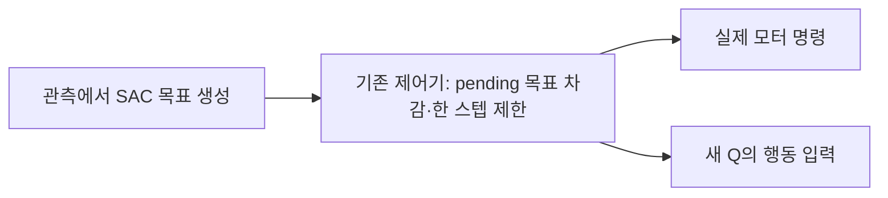

# 실제 한 스텝 제어 명령을 평가하는 SAC Q 옵션

기존 비교는 초기 성능을 넘지 못했다. 팔 탐색20%는29→21→18→22→18/128,
출력 포화 완화는29→24→12→18→7/128이었다. 마지막7건은 중간 좌3·우4이며
상단 양쪽은0건이다. 랙 충돌73·박스 낙하6·시간 초과41·초기화 무효1건을
원래128개 분모에 포함했다. 실제 양손 접촉·유지·들기 조건으로 확인한 반복 DEV이며
독립 FINAL은 사용하지 않았다. Writer는 exit0으로 끝났고 원래 관리자가
10/07 05:36 KST에 닫힌 로그를 포함한 최종 Drive 체크섬 검증을 완료했다.
[마지막 평가](assets/rl_v2_mean3_final_full_DEV_after1536_20261007.json),
[종료·백업 근거](assets/rl_v2_mean3_final_backup_verified_20261007.json).

## 새로 확인한 문제

Actor306·Q3,272를 닫힌 파일로 보존하고 실제 성공 TRAIN15개/6,899행을 확인했다.
정규화된 목표 오차가 크더라도 실제 단위와 제어 명령을 따로 봐야 한다.
상단 오른쪽 성공 경로의 마지막64행에서 앞뒤 torso 목표 RMSE는0.57cm였고
일부 왼팔 관절 목표 RMSE는 약4.9–5.1°였다. 이것은 과거의 같은 성공 상태에서
계산한 목표 차이이며 실제 로봇의 흔들림·EEF 오차·새 성공을 측정한 것이 아니다.
[관절·상체별 목표 오차](assets/rl_v2_body_goal_groups_20261007.json).

기존 제어기는 관측한 pending drive 목표를 빼고, 관절별 한 스텝 변경량을
제한한다. 따라서 서로 다른 절대 목표가 동일한 즉시 모터 명령으로 변환될 수 있다.
그런데 기존 Q는 clipping 이전의 절대 목표를 그대로 입력받았다.

| 상단 오른쪽 마지막64행 | 왼팔 | 오른팔 | torso 앞뒤·높이 |
| --- | ---: | ---: | ---: |
| 한 스텝 제어 제한을 넘은 목표 좌표 비율 | 49.3% | 49.6% | 54.7% |
| 그 구간에 걸린 Q 목표 경사의 절댓값 비율 | 46.4% | 64.1% | 89.7% |

실제 production decoder와 telemetry를 사용했고, 모든6,899행에서 명시한
unclipped 식에 clamp를 적용한 결과가 기존 decoder와 정확히 같았다.
다른 목표와 성공 정답의 **전체 동작이 같다는 뜻은 아니다**. 각 좌표에서 이미
제한을 넘은 동안 Q가 물리 변화 없는 방향도 선호할 수 있다는 진단이다.
Deterministic body mean의 부분 경사이며 live stochastic 혼합 배치·공유 신경망·
entropy·그리퍼 손실의 전체 optimizer 방향을 측정한 것은 아니다.
이 분석만으로 학습 실패의 유일한 원인이나 새 옵션의 성공을 주장하지 않는다.
[실제 명령 변환·clipping·Q 경사 근거](assets/rl_v2_goal_servo_alias_20261007.json).

## 변경한 방법

새 checkpoint 형식 `staged_actual_flap_reanchored_servo_critic_hybrid_sac_v1`을
명시적으로 선택하면, Q가 **실제로 실행되는 body delta와 두 binary jaw**를 본다.
Actor·온라인 replay의 action은 원래 absolute goal21개로 유지하고 Q 입력 직전에
현재 actor 관측의 proprioception·pending target을 사용해 기존
`physical_body_actions.goal_body_command`로 변환한다.



One-step Q, 실제 n-step16 보조 Q, actor의 네 jaw 조합, 모든 target Q가 같은
변환을 사용한다. 종료 placeholder는 변환에 넣지 않는다. 제한 밖 좌표의
actor-Q 경사는 정확히0이 되고, 같은 명령을 만드는 목표의 Q 입력은 같아진다.
Actor의 affine goal 탐색·goal-space entropy·실제 controller는 유지한다.
이는 속도 제한이나 새로운 IK 동작을 바꾸는 수정이 아니다.

새 Q 입력은 기존에 학습한 Q·optimizer와 호환되지 않으므로 **학습 전 actor0·Q0,
빈 네 optimizer·critic 정규화·온라인 replay**에서만 준비한다. 실제 TRAIN 성공
목표·보상·결과·episode 은행은 그대로 사용하며 다시 붙이거나 변환해 저장하지 않는다.
학습한 기존 Q를 잘못 재개하면 계약 검사에서 거부한다.

박스·base 시작점·배경·단단하지만 움직이는 flap의 무작위화, 충돌10N/5N,
양손 실제 파지·유지0.25초·지지면 clearance8mm의 성공 조건을 유지한다.
보상·가중치는 [Q 영상과 reward 설명](RL_V2_EVAL_Q_REWARD_20261006.md)과 같다.
Curriculum·고정 박스·안전 기준 완화는 적용하지 않는다.

## 검증과 다음 비교

관련 고유 테스트89개가 통과했다. 같은 clipped 명령의 Q 입력 일치, 실제 clipping
경사의0, pending target 사용, 종료 placeholder 제외, 모든 Q 경로 적용,
기존 default 보존, 저장·복원과 잘못된 구형 Q 거부를 확인했다.

실제 TRAIN 관측698개에서 초기 몸체·jaw 출력이 bit 단위로 동일했고, 성공6,899행의
명령 변환은 유한·범위 내·같은 binary jaw였다. 실제 전체 training pilot에서도
엄격한 계약과 모델 tensor, 성공·n-step 은행6,899행을 복원했다. 업데이트·온라인
replay·네 optimizer state·critic 정규화 count는0이다.
[초기화](assets/rl_v2_servo_critic_initialization_20261007.json),
[실제 trainer 복원](assets/rl_v2_servo_critic_full_restore_20261007.json).

이는 연결·수학적 불변성 검증이며 새 파지 성능은 아직 검증하지 않았다.
기존 tail 비교의 첫 학습 후 DEV도 유지한다. 새 옵션은 자신의 전체 초기 DEV128을
기준으로 네 구역32개씩 평가하고 초기화 실패도 분모에 남긴다. 다른 실행의
flap 추첨·solver 이력까지 같다고 가정하지 않는다. 독립 FINAL은 최종 검증에 남긴다.

```bash
CUDA_VISIBLE_DEVICES='' PYTHONPATH=src:scripts/rl python scripts/rl/prepare_servo_critic_actor.py \
  --initial-checkpoint /absolute/path/to/closed-fresh-initial/checkpoint_00000000.pt \
  --training-manifest /absolute/path/to/matching/training_manifest.json \
  --waypoints /absolute/path/to/matching/waypoints.json \
  --output-dir /absolute/path/to/new-unique-servo-critic-inputs
```

학습은 기존 `batched_staged_goal_with_drive.py`와 GPU3 마스크를 재사용한다.
고유 실행 폴더·기존 Drive 연결·300초마다 checksum 검증·최신2개 보존·종료 후
닫힌 로그 검증을 유지한다. 준비 파일의 존재만으로 실행 중이라고 판단하지 않는다.

**10/07 05:31 KST에 GPU3의 별도 비교 실행을 시작했다.** Code `c3f445f`를
main에 push하고 입력8개의 기존 Drive 크기·MD5 검증을 마친 뒤 실행했다.
실제 writer438071의 소유자·고유 run·`CUDA_VISIBLE_DEVICES=3`을 확인했다.
확인 시점은 초기 장면 준비 단계이며 새 Q·actor 갱신과 전체 초기 평가는 아직
확인 전이다. 별도 TRAIN1,536조건과 원래 DEV128요청, 독립 FINAL 미사용을
유지한다. 기존 writer2701747·3847594도 유지했고 어떤 프로세스에도 signal을
보내지 않았다. [실행·입력 백업 근거](assets/rl_v2_servo_critic_actual_start_20261007.json).

코드: [encoder](../src/kuavo_isaaclab_scene/rl/multi_box/experiments/servo_critic.py),
[새 pilot](../src/kuavo_isaaclab_scene/rl/multi_box/experiments/actual_flap_servo_critic_sac.py),
[공통 hybrid Q 배선](../src/kuavo_isaaclab_scene/rl/algorithms/hybrid_goal_sac.py),
[초기화 도구](../scripts/rl/prepare_servo_critic_actor.py).
