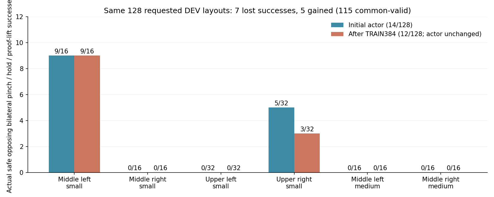
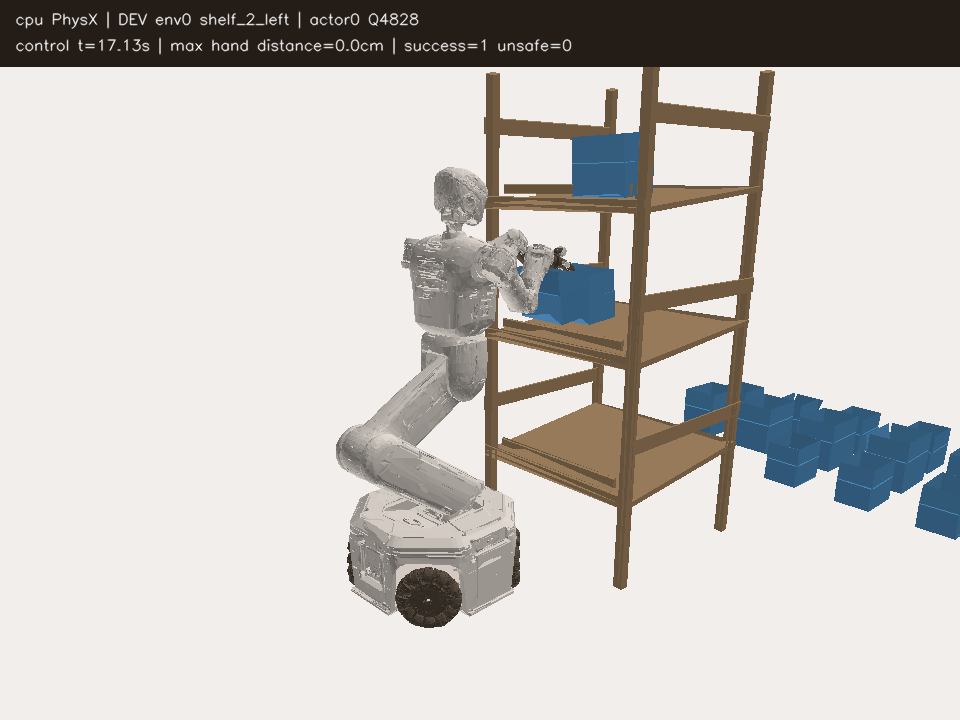
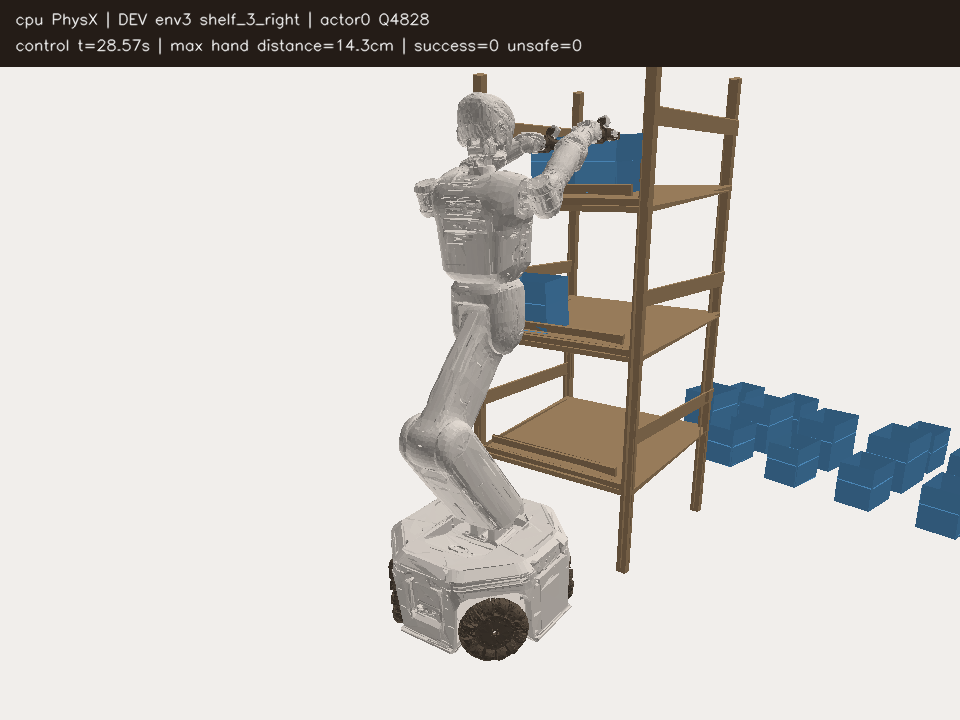

# SAC 갱신이 멈춘 원인과 구역별 성공 경로 보호

10/10 12:44 GPU3 비교는 15:15 정상 종료했고, 15:17 기존 Drive의 마지막
체크포인트·닫힌 로그 검증까지 마쳤다. **실제 DEV 성공은 초기 14/128에서
최종 12/128이었다. actor는 한 번도 갱신되지 않았다.** 이 결과를 SAC 개선으로
설명하지 않는다. 독립 FINAL은 사용하지 않았고 목표는 아직 미달성이다.

## 실제 결과

성공은 안전한 양손 opposing flap two-pad pinch, 상대 자세 안정,
0.25초 hold와 proof-lift가 함께 기록된 경우다. 두 평가의 분모128을 유지한다.

| DEV128 | 성공 | 초기화 실패 | 안전 위반 | 시간 초과 | 수치 오류 |
|---|---:|---:|---:|---:|---:|
| 이번 실행의 초기 실측 | 14 | 13 | 44 | 57 | 0 |
| 최종 실측 | 12 | 0 | 47 | 69 | 0 |

공통 initial-valid115조건은 성공14→12, lost7·gained5다. 요청 layout은 같지만
반복 reset의 실제 물리 상태까지 같다고 주장하지 않는다. actor와 고정
normalizer의 29개 tensor가 모두 동일하므로 성공 이동을 정책 학습의 효과로
해석할 수 없다.

| 구역·크기 | 요청 수 | 초기→최종 성공 | 초기화 실패 초기→최종 | 최종 실패 |
|---|---:|---:|---:|---|
| 중간 왼쪽 small | 16 | 9→9 | 0→0 | 안전7 |
| 중간 오른쪽 small | 16 | 0→0 | 3→0 | timeout16 |
| 상단 왼쪽 small | 32 | 0→0 | 4→0 | timeout32 |
| 상단 오른쪽 small | 32 | 5→3 | 5→0 | 안전20·timeout9 |
| 중간 왼쪽 medium | 16 | 0→0 | 0→0 | 안전16 |
| 중간 오른쪽 medium | 16 | 0→0 | 1→0 | 안전4·timeout12 |

최종 안전47회는 모두 robot-rack 충돌이며 base 접근 뒤 `held_grasp`에서 발생했다.
중간 왼쪽23회는 왼팔 `zarm_l4_link`15회·오른쪽 gripper base7회·왼쪽 base1회다.
중간 오른쪽4회는 오른쪽 gripper base, 상단 오른쪽20회는 오른쪽 gripper base18회·
오른팔 `zarm_r4_link`2회다. 최대 종료힘은 약195.8N, TRAIN rack 최대는340.8N이다.
이는 종료 순간의 최대힘·몸체이며 첫 접촉이나 전체 접촉 이력이 아니다.
초기화가 모두 유효한 최종 평가에서도 구역별 timeout·충돌이 지속됐으므로
이 실패를 초기화 문제만으로 설명할 수 없다.

[실제 결과·구역·실패·checksum 집계](assets/rl_v2_persistent_success_DEV128_result_20261010.json)

## 실제 TRAIN과 갱신 병목

TRAIN384의 안전한 실제 성공은 wave별12·12·14회다. held TRAIN replay240,461행,
마지막 성공은행18경로/8,846행, critic4,828회 갱신을 확인했다.
demo BC·teacher·prior weight는0이다. critic tensor20개는 바뀌었지만 actor와
entropy optimizer의 최대 step은0, critic optimizer만4,828이다.

구역·크기별 첫 안전한 성공2경로는 실제 성공 발생 순서와 일치했다.
보호 cohort6경로/3,126행은 보존됐고, 그중 wave1의 첫4경로는 마지막 성공 replay
은행에서 빠졌어도 cohort에 남았다. 접근과 tail64, 양팔·rest·양쪽 jaw의
분리 검사가 적용돼 있었다. 경로 보존 자체는 정상이나 **695개 actor 제안이
모두 거절**됐다. 투영33,417회, 수용0, 이동 비율0뿐이었다. 첫 성공을 기다리는
상태가 아니라 갱신을 못 하는 상태다. 두 entropy parameter도 초기값 그대로다.

첫 원인은 고정 손실 한도의 계산이었다. 모든 경로를 합친 배치로 검사하므로
경로가 추가될 때 GEMM shape가 달라졌고, float32의 작은 반올림 차이를
역대 최저 한도로 저장했다. 마지막 GPU 검사에서도 **바뀌지 않은 정책 자체가**
한도를 벗어난 항목이 있었다. CPU 재확인에서도 동일 문제가 재현됐다.

이 숫자 문제만 고친 실제 TRAIN 표본2개에서도 actor 제안은 거절됐다.
팔 기준 손실이 거의0인 상태에서 Adam 이동의 2차 오차가 남았고, 기존
최소 비율1/64로는 고정 허용 오차를 만족하지 못했다. 모든 구역을 함께
축소하므로 아직 성공하지 못한 구역의 독립 actor 갱신도 막혔다.

## 작은 수정과 확인 범위

새 초기화 선택 옵션은
`--actor-success-guard train-success-cohort-stable-Adam-backtrack`이다.
기존 두 보호 옵션과 기본 설정을 유지한다.

- 각 고정 경로의 접근/tail64를 같은 배치 shape로 따로 계산한다. production
  actor·servo 출력은 float32 그대로이며, 보호 손실의 제곱·BCE·평균만 float64다.
- 기존 구역별 독립 actor head를 각각 축소·거절한다. 후보는1부터1/1024까지다.
  한 구역의 거절이 다른 구역의 갱신을 막지 않는다. 거절한 구역의 parameter와
  Adam moment는 복원하고, 수용한 구역은 기존처럼 제안 moment를 유지한다.
- 모든 구역을 조합한 뒤 전체 cohort를 다시 검사한다. 역대 최저 손실 한도,
  허용 오차 `1e-9 + 1e-6*abs(limit)`, 행·손별 정답 jaw 보호는 유지한다.
  보호 표본이 다음 물리 rollout의 성공을 보장한다고 주장하지 않는다.
- 갱신 전 기준 위반, 후보별 위반 term, 실제 parameter 이동량,
  구역별 수용·거절·축소 비율을 metrics와 checkpoint에 추가한다.
  실제 parameter 이동이0이면 actor 갱신으로 집계하지 않는다.

종료 TRAIN 데이터의 CPU 복사본에서 실제 SAC update2개를 최소 확인했다.
기존판은2개 모두 actor 이동0, 수정판은2개 모두 최종 보호 검사 후 수용됐다.
성공이 없는 중간 오른쪽은1배, 중간 왼쪽·상단 오른쪽은1/128,
상단 왼쪽은1/256이었다. parameter 이동 norm은0.000341~0.000366이며
몸체 mean·jaw logits·두 entropy parameter가 실제로 바뀌었다.
이는 disposable 모델에서의 숫자/갱신 진단이다. 원본은 보존했고 평가 데이터는
쓰지 않았다. episode-return 보조 critic loss는 이 최소 진단에 포함하지 않았으므로
production 전체 학습이나 성공률 개선의 증거로 보지 않는다.
[최소 실제 TRAIN update 기록](assets/rl_v2_stable_success_guard_actual_TRAIN_step_20261010.json)

관련30개 검사에서 경로 추가의 계산 불변성, 고정 오차의 비누적,
행·손별 jaw, 부분 거절의 실제 Adam 복원, 저장·재개 및 기존 구역별 actor/Q
계약을 확인했다. 새 초기 모델은 실제 factory load/training resume를 통과했고
직전 초기 actor의29개 tensor와 현재 보상 profile이 같다. Q·replay·은행·cohort는
0부터 시작하며 종료 평가·기존 Q·optimizer를 가져오지 않는다.

## 다음 GPU3 비교

10/10 18:25 고유 실행을 시작했다. writer782720·supervisor782467이며
`GPU3_URDF_stable_success_guard_SAC128_pilot_20261010_182507` /
`batch_sac_20261010_182508_5a4520`이다. 학습 소스는 커밋`638e904`의 고정
복사본이다. 실제 manifest에서 새 보호 계약과 현재 보상을 확인했다.
writer namespace에는 `nvidia3`만 있고 그래픽·연산 컨텍스트도 GPU3에만 있다.
18:31 첫 manifest·env·agent의 기존 Drive 업로드·checksum 검증을 완료했다.
18:31 초기 DEV wave0의 실제 수집을 확인했다(step1·115행). actor/Q 갱신은0이며
이 수집을 TRAIN 학습량이나 성공률 개선으로 집계하지 않는다.
[실제 시작 증거](assets/rl_v2_stable_success_guard_SAC_actual_startup_20261010.json)

DEV128→TRAIN384→DEV128을 비교한다. CPU PhysX와 GPU3 CUDA learner,
box/base/flap randomization, 양손 성공·안전 기준, no curriculum을 유지한다.
20% gentle arm/80% greedy 수집, AR1 rho0.98, actor LR1e-6, replay250,000도 같다.
실제 contact guidance에는77handoff/23,311행,67close-command행이 있었지만 lift
시도는0이었다. 따라서 안전한 정밀 접촉·lift 발견 문제는 별도로 남아 있다.

손별 정밀 거리·축 정렬·capture 및 실제 same-flap opposing two-pad pinch
0.25초 discounted potential은 각각 weight1이다. 양손 집계는
`0.25*(left+right)+0.5*min(left,right)`, terminal potential0을 유지한다.
자세 안정·성공 조건은 변경하지 않는다.

선택 GPU UUID와 single-GPU 장치 namespace를 재사용한다. GPU1·2에는 실행하지
않으며 다른 사용자 파일/프로세스를 건드리지 않는다. 기존 Drive 연결의
300초 업로드·크기/MD5 검증·최신 checkpoint2개 보호·종료 로그 검증을 유지한다.
raw replay/HDF는 업로드하거나 삭제하지 않는다. 기존 best 모델·영상을 보존한다.

CPU 감시833773은 빈 CUDA 마스크로 종료·최종 Drive 검증을 기다린다. 같은
대화 연결을 읽기 전용으로 확인했고, writer·supervisor가 끝난 후 실제 DEV128·
parameter 변화·구역별 갱신을 재검토하고 다음 개선을 이어간다. 새 에이전트나
중복 학습을 만들지 않는다. 기존 Codex 서비스와 서버가 계속 실행돼야 한다.

## 실제 평가 자료

[Notion 중간보고](https://app.notion.com/p/3f163918d42a817aa98cec7e2114034e)에
최종 평가의 성공/실패 H264 영상2개와 비교 그림을 기록했다. 기존 media95개와
table5개를 모두 보존했고 현재 media는98개다. 영상은 당시 측정한
몸체 자세를 렌더링한 것이며 새 물리 replay가 아니다. `actor0/Q4828`은 갱신
횟수다. Q value나 성공 확률이 아니다. 이번 actor는 초기와 동일하므로 개별
영상의 성공을 새로운 SAC 학습 성과로 설명하지 않는다.

[영상의 실제 결과·base 초기 randomization·H264 검증](assets/rl_v2_persistent_final_video_evidence_20261010.json)
