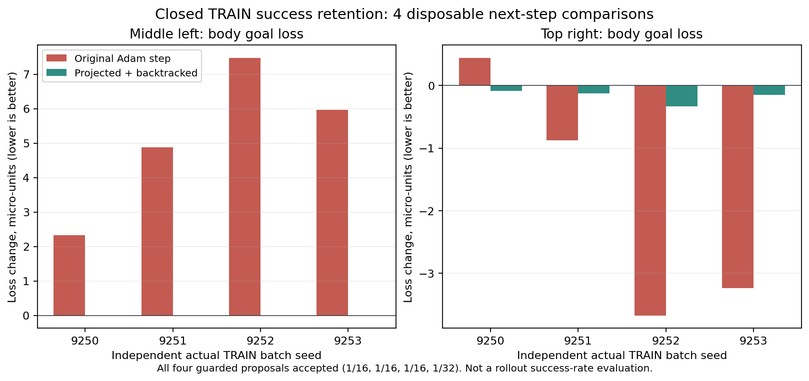

# 성공 경험을 지키는 SAC 갱신과 정밀 접촉 보상

성공 시연을 추가하기 어려운 상태에서, 실제 TRAIN에서 얻은 양손 파지 성공을
SAC 갱신이 훼손하는 문제와 접촉 단계의 부족한 학습 신호를 수정했다.
아래 확인은 새 정책의 실제 성공률 개선을 뜻하지 않는다. 새 설정은 별도
실험으로 평가한다.

## 성공을 훼손하는 actor 갱신 제한

`--actor-success-guard train-success-Adam-backtrack`을 초기화에 선택한다.
자기 실행의 **완료된 안전한 TRAIN 성공** 표본만 사용한다. DEV/FINAL 및
새 시연은 가져오지 않는다. 첫 TRAIN 성공이 쌓이기 전에는 actor 갱신을
기다리며 critic은 실제 replay로 학습한다.

각 랙 구역에서 몸체 관절 목표 손실, jaw 손실, 실제 greedy jaw 명령의
정답 일치를 따로 보호한다. 손실 gradient만 자르는 대신 현재 Adam 상태가
제안한 실제 parameter 이동을 성공 유지 방향으로 투영한다. 제안 이동의
1, 1/2, …, 1/64를 직접 평가하고 허용된 손실 오차 내의 후보만 적용한다.
구역 간 또는 팔/jaw 간 손실 상쇄로 퇴행을 숨기지 않는다.

모든 후보가 실패하면 actor parameter와 Adam moment를 되돌리고, actor
갱신 횟수와 두 entropy temperature 갱신을 건너뛴다. critic·replay 갱신은
계속한다. frozen actor normalizer와 명시적인 checkpoint 계약이 필요하다.
이 보호는 해당 표본의 국소 조건이며 미래 접촉 성공을 보장하지 않는다.

실제 종료된 v7의 checkpoint와 replay를 복사한 CPU 진단에서, 보존된 안전한
TRAIN 성공 16경로를 사용하는 실제 다음 Adam 갱신 4개를 비교했다.
기존 갱신은 4/4개가 같은 보호 기준을 위반했고 수정 갱신은 0/4개였다.
수정 갱신은 모두 수용됐으며 이동 비율은 1/16, 1/16, 1/16, 1/32였다.
원본 model·optimizer·replay checksum은 유지했다.



원시 관측과 궤적은 로컬에 유지하며 [집계 JSON](assets/rl_v2_closed_TRAIN_success_guard_projected_Adam_20261009.json)만 기록했다.

## 손별 정밀 접근과 실제 pinch 유지

`--staged-contact-reward`는 기존 보상에 두 potential progress 항목을 추가한다.
기존 randomization, 접촉·안전 종료 및 양손 opposing flap 파지·hold·proof lift
성공 조건은 유지한다. curriculum은 추가하지 않았다.

손별 정밀 준비 점수는 다음과 같다.

```
s_hand = exp(-distance / 0.03m)
       * clamp(alignment_cos, 0, 1)^2
       * exp(-capture_error / 0.025m)
Phi_precision = 0.25 * (s_left + s_right) + 0.5 * min(s_left, s_right)
```

한 손의 접근·정렬·capture가 동시에 좋아져야 그 손의 점수가 오른다.
한 손만 완벽하면 최대 0.25, 두 손이 완벽하면 1이다. 별도로 두 pad가
실제 flap을 pinch한 시간을 손별로 누적한다. 같은 flap에서 0.25초를 유지하면
그 손의 hold 점수가 1이 된다. 손이 놓거나 flap이 바뀌면 다시 시작한다.
한 손만 유지하면 합산 점수 최대 0.25, 서로 다른 flap을 두 손이 유지하면 1이다.
같은 flap을 두 손이 잡아도 양손 점수를 받지 못한다. close 명령이나 거리만으로
실제 pinch를 대신하지 않는다. 최종 성공의 상대 자세 안정 조건도 그대로다.

두 항목의 weight는 각각 1이며 `gamma * Phi_next - Phi_previous`로 보상한다.
성공·실패·시간 초과의 terminal potential은 0으로 닫는다. reset과 flap
배정 변경도 처리하므로 접근 반복·접촉 반복으로 무한 점수를 얻지 못한다.
기존에 계산한 geometry와 pinch evidence를 재사용하며 새 센서나 물리
substep을 추가하지 않는다.

## 실행·저장·확인

`prepare_urdf_regional_goal_sac.py`의 새 초기화 옵션은 다음과 같다.

```bash
CUDA_VISIBLE_DEVICES='' PYTHONPATH=src:scripts/rl python \
  scripts/rl/prepare_urdf_regional_goal_sac.py \
  ... \
  --servo-retention-profile full-arm-independent-hand-close \
  --actor-success-guard train-success-Adam-backtrack \
  --staged-contact-reward \
  --measured-train-credit measured-episode-return-balanced50
```

필수 source·manifest·waves·waypoints·demo·native-seed 인수는 기존 URDF 초기화
문서를 따른다. reward가 달라졌으므로 actor만 연결하고 Q·replay·optimizer와
기존 보상 라벨을 가져오지 않는다. 초기화의 엄격한 실제 load 검사를 통과했고
actor/Q 갱신·online replay·success/return bank는 모두 0에서 시작한다.
초기 actor518/critic578/action21과 flap midpoint 관측을 유지한다.

새 비교는 GPU 3만 사용한다. 성능이 퇴행한 이전 장기 실험 8개는 최신
전체 DEV의 성공이 각각 6, 6, 5, 6, 0, 6, 3, 1회로 초기 11~14회보다
좋지 않아 정리했다. 8개 모두 체크포인트·로그의 최종 Drive 검증을 마쳤다.
7개는 정상 종료했고 1개는 supervisor의 120초 종료 제한이 적용됐으며 저장된
체크포인트와 닫힌 로그의 검증은 완료했다. raw replay와
HDF는 삭제하거나 업로드하지 않았다. 기존 GPU 3 balanced-return 비교는
10/09 18:47 정상 종료했고 최종 Drive 검증을 마쳤다. TRAIN 384조건 뒤 전체
DEV 128조건의 성공은 8회로 자기 초기 14회보다 낮았다.

사용자 승인 후 10/10 01:06 GPU 3에서 수정판을 시작했다. writer PID는
2224444이며 우리 학습은 이 1개다. 기존 CPU PhysX 계약과 GPU 3의 CUDA 학습을
유지했다. 선택 GPU UUID를 CUDA 마스크에 사용하고 해당 프로세스에는 물리
GPU 3 장치만 노출했다. 실제 연산·그래픽 컨텍스트도 GPU 3에만 생성됐으며
GPU 1·2에는 우리 학습을 실행하지 않는다. 다른 사용자의 실행은 유지했다.
NVIDIA의 CSV `minor_number` 조회 미지원으로 실패한 시작 경로는 지원되는
XML inventory 조회로 수정했다.

환경 초기화 후 초기 DEV 수집이 시작됐고 실제 manifest에서 성공 갱신 보호와
새 접촉 보상을 확인했다. 첫 설정 파일 Drive 업로드·검증도 완료했다.
이 단계의 actor/Q 갱신 횟수는 0이며 새 성공률 개선을 뜻하지 않는다.
[실제 시작 확인 기록](assets/rl_v2_guarded_staged_contact_SAC_actual_startup_20261010.json)에
GPU 격리와 저장 상태를 기록했다.

업로더는 기존 Drive 연결을 이용해 300초마다 checksum을 검증하고 형식별
최근 checkpoint 2개를 유지한다. 종료 후 로그도 검증한다. 상세 저장 범위는
[Drive 문서](RL_GOOGLE_DRIVE.md), 다른 GPU의 6MiB 컨텍스트 방지는
[GPU 격리 문서](RL_GPU_ISOLATION.md)에 기록했다.

검증은 SAC·보상 관련 96개 테스트와 실행/격리/저장 관련 36개 테스트를 통과했다.
실제 다음 Adam 갱신 CPU 진단과 GPU 3만 사용하는 짧은 Isaac/CUDA 초기화도
확인했다. 새 물리 파지 성공 또는 장기 학습 개선은 아직 주장하지 않는다.
