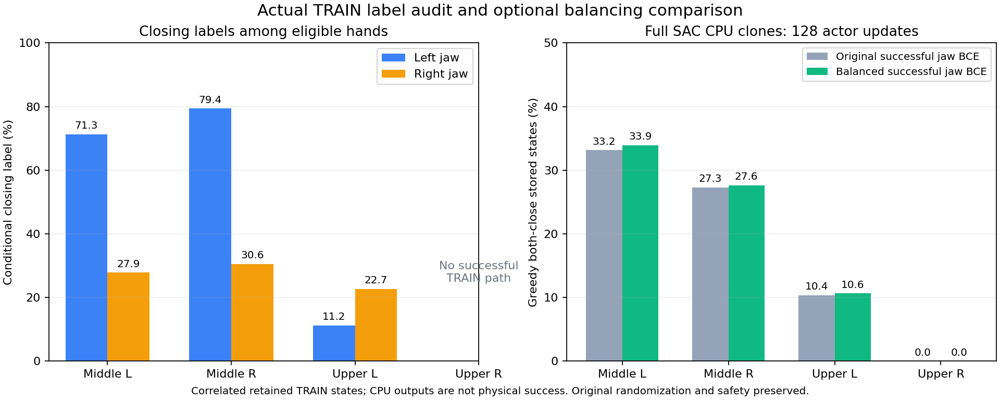

# 실제 성공 TRAIN의 열림·닫힘 학습 신호 균형

단단한 동적 flap과 원래 박스/base/배경 randomization을 유지한 SAC 양손 파지를 진행한다. **네 구역 일반화 성공은 아직 확인되지 않았다.** GPU3의 weak/strong logit 복구 비교는 유지하면서 실제 성공 TRAIN의 jaw NLL 표본을 조사했다. 두 VR 데모의 원래 action을 다시 라벨로 넣은 결과가 아니라, 현재 환경에서 실행하여 안전한 opposing bilateral pinch·stable hold·8mm proof lift까지 완료한 TRAIN 경로의 실제 명령이다.

## 확인한 불균형

Source Q6864의 성공 bank에는15경로/6,346행이 있다. 실제 sampler는 가능한 구역을 균등하게 선택한 뒤 에피소드·시점을 각각 균등하게 뽑는다. Jaw BCE는 production nominal near gate(배정된 flap midpoint까지12cm) 안의 손에만 적용된다. 아래 비율은 에피소드 길이를 그대로 합산한 비율이 아니라 **실제 구역/에피소드/시점 표본 가중치에 따른 조건부 닫힘 비율**이다.

| 구역 | 성공 경로 | 왼손 near 중 닫힘 | 오른손 near 중 닫힘 |
| --- | ---: | ---: | ---: |
| 중간 왼쪽 | 5 | 71.3% | 27.9% |
| 중간 오른쪽 | 9 | 79.4% | 30.6% |
| 위 왼쪽 | 1 | 11.2% | 22.7% |
| 위 오른쪽 | 0 | 데이터 없음 | 데이터 없음 |

실제 sampler로64행×1,000batch를 뽑아 기존 BCE의 near-hand reduction을 재현하면 batch별 닫힘 라벨 비율 평균은34.3%다. 손별 전체 조건부 닫힘은44.4%/27.1%다. 성공까지의 긴 접근 구간이 짧은 닫힘/파지 구간보다 자주 나타난다. 이는 열림 쪽 학습 압력을 만들 수 있다는 근거이며 **전체 학습 실패의 단독 원인이라고 증명한 결과는 아니다.** 위 오른쪽의 성공 경로 부재도 별도의 한계다. [실제 경로·표본 수·입력 MD5](assets/rl_v2_actual_success_jaw_label_balance_20261006.json).



## 선택형 변경

`--success-jaw-balance region-hand-class`는 실제 성공 TRAIN jaw BCE만 `존재하는 구역 → near 손 → 존재하는 열림/닫힘 class` 순서로 평균한다. 같은 열림 구간을 오래 유지한다고 그 구간의 class가 닫힘 class보다 더 큰 총 가중치를 받지 않는다. 기존 outer jaw weight0.05와64행의 성공 TRAIN 표본, body goal loss, Q replay 및 성공 replay fade는 그대로다. 구역·손·class가 해당 minibatch에 없으면 새 표본이나 target을 만들지 않는다. 먼 손은 기존과 같이 제외한다.

일반 RL 기본은 비활성화다. 새로운 설정은 actual-flap TRAIN learner에만 명시적으로 적용한다. 모델·Q·normalizer·네 optimizer·기존 실제 replay·실제 action 라벨을 보존하고 이후 actor update의 손실 reduction만 바꾼다. 저장된 활성 설정과 activation origin은 checkpoint/replay/report에 함께 기록하며 암묵적 비활성 재개와 provenance 불일치를 거부한다. Frozen DEV에는 이 loss나 탐색 혼합을 적용하지 않는다. Physics/성공/termination/안전 조건, flap/박스/base randomization, 네 가지 jaw branch의 Q target과 actor SAC 식은 유지한다.

## 실제 입력으로 전체 SAC CPU 비교

같은 source Q6864/actor1204와 네 optimizer를 독립 복원하고 두 변형에 동일 RNG와 실제 replay256+성공 fade mix·TRAIN n-step64(weight0.1)·성공 TRAIN64를 적용했다. 각 변형은 Q512/actor128회다. 두 변형 모두 strong logit recovery weight0.001을 사용하고 성공 jaw BCE reduction만 다르다. Teacher BC는 비활성화다. 모든 손실/모델이 유한했고 첫 Q/target update가 정확히 일치했다. Source checksum·파일 불변성도 확인했다.

| 저장된 안전·양손 near 실패 TRAIN의 greedy 양손 닫힘 | 기존 BCE | 균형 BCE |
| --- | ---: | ---: |
| 중간 왼쪽1,318상태 | 437 | 447 |
| 중간 오른쪽832상태 | 227 | 230 |
| 위 왼쪽2,498상태 | 259 | 266 |
| 위 오른쪽572상태 | 0 | 0 |

위 오른쪽의 평균 P(양손 닫힘)은4.28×10⁻⁵/4.25×10⁻⁵로 개선되지 않았다. 위 오른쪽에는 성공 라벨이 없으므로 **균형 조정만으로 해당 구역을 해결했다고 보지 않는다.** 다른 구역의 작은 출력 차이도 보관한 상관된 TRAIN 상태의 CPU clone 결과이며 실제 성공/일반화 증거가 아니다. Clone 모델을 GPU checkpoint로 배포하지 않았다. [전체 CPU 비교·실제 loss 적용 통계](assets/rl_v2_balanced_success_jaw_actual_mixed_TRAIN_CPU_20261006.json).

관련29검사가 통과했다. 실제 GPU 비교는 기존 두 실행을 유지하고 원래 source/replay/네 구역 schedule에서 `전체 DEV → 실제 TRAIN 두 wave → 전체 DEV`를 별도 고유 폴더로 실행한다. 자기 초기 DEV 대비 실제 안전 양손 접촉/hold/clearance와 전체 구역 성능으로 판단한다. Independent FINAL은 모델 선택 후에만 사용한다. 아직 목표 완료가 아니다.

08:42 KST에 `actual_flap_balanced_success_jaw_credit16_sac_pgs128_gpu3_20261006_084235` / `batch_sac_20261006_084235_d73ae4`를 실제 시작했다. Writer3173061·supervisor3173028의 소유자/run/`CUDA_VISIBLE_DEVICES=3`을 확인했다. 시작 직전 GPU3 free46,750MiB, host available956.9GiB, private tmpfs free493.6GiB였고 기존 weak/strong writer1547049·2726960을 유지했다. Drive `about`도 기존 인증으로 통과했다. 08:48에 실제 manifest에서 `region-hand-class`·strong saturation0.001·동적 flap 물성 범위·rack/obstacle 안전 기준을 검증했다. 초기 전체 DEV·새 TRAIN 효과는 아직 확인 전이다. [실제 시작·manifest 근거](assets/rl_v2_success_jaw_balance_actual_GPU3_startup_20261006.json).

## 실행 및 재현

현재 actual-flap TRAIN 명령에 다음 옵션을 추가한다. 물리 reward identity와 observation/action 계약이 같은 checkpoint만 사용한다.

```bash
--jaw-saturation-penalty logit4-soft-strong --success-jaw-balance region-hand-class
```

라벨 진단은 immutable Drive 검증 입력만 사용한다. Active writer의 replay/HDF를 입력으로 사용하지 않는다.

```bash
CUDA_VISIBLE_DEVICES='' PYTHONPATH=src:scripts/rl python scripts/rl/audit_success_jaw_balance.py \
  --experience /absolute/path/to/immutable-input/staged_goal_experience.pt \
  --verified-receipt /absolute/path/to/input-verification.json \
  --output-json /absolute/path/to/success-jaw-balance.json
```

기존 [복구 신호 강도 비교](RL_V2_JAW_RECOVERY_STRENGTH_20261006.md)와 [실제 손가락 정밀 포착 진단](RL_V2_PRECISE_CAPTURE_AUDIT_20261006.md)을 함께 본다. 닫힘 회복 후에도 접촉이 부족하면 더 좁은 moving-fingertip capture falloff와 약한 손 점수의 **새 reward identity·fresh matching Q/replay** 비교가 필요하다. 기존 평균 capture 점수에서 개별 손 error를 추정하여 replay를 재라벨링하지 않는다.
