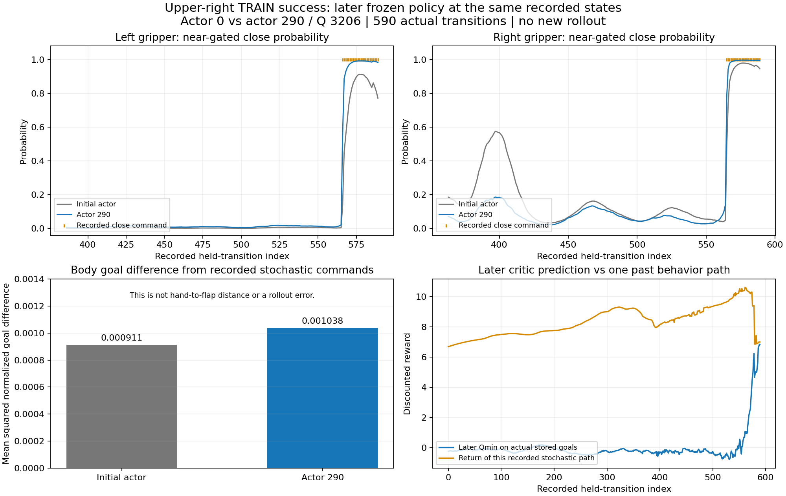

# 새 SAC가 발견한 상단 오른쪽 성공 경로를 학습하는지 확인

새 반경0.30 제어의 첫 TRAIN 탐색에서 실제 상단 오른쪽 양손 파지·들기1건을
발견했다. 이 성공590개 전이는 계속 보관됐고, 이후 actor290/Q3206의 닫힌
체크포인트에서 **같은 과거 상태의 그리퍼 명령 불일치가17→0회**로 줄었다.
몸체 목표 차이는 줄지 않았다. 따라서 아직 새 정책의 물리 재현·평가 개선이나
네 구역 일반화를 확인한 결과는 아니다.

## 무엇을 비교했나

첫 TRAIN128개 중 상단 오른쪽 env47·seed2250700311에서 양손이 서로 다른
flap을 잡고0.267초 유지하며3.35cm 들었다. 박스·base·배경·동적 flap 무작위화,
성공·충돌 기준을 유지했고 안전 위반은 없었다. 이때 새 actor 갱신은0회로,
옮겨온 초기 정책의 stochastic 탐색에서 얻은 성공이었다.
[실제 성공 근거](assets/rl_v2_reanchored30_first_upper_right_TRAIN_success_20261007.json).

그때 기록된 실제 관측·정규화 목표21개·보상·종료를 그대로 사용한다.
초기 actor0와 이후 actor290을 같은590개 TRAIN 관측에 입력했다.
실제로 실행한 stochastic 목표와 이후 정책의 greedy 출력을 비교했으며,
새 greedy 출력은 물리에 실행하지 않았다. 관측 행들은 한 경로의 연속 상태로,
590개의 독립 성공 사례가 아니다. 목표를 제어 명령에서 역추정하거나 바꾸지 않았다.

| 실제 근접 gate가 열린 상태의 지표 | 초기 actor0 | 이후 actor290 |
| --- | ---: | ---: |
| 왼손 명령 불일치 / 근접204행 | 2 | 0 |
| 오른손 명령 불일치 / 근접227행 | 15 | 0 |
| 실제 왼손 닫기24행에서 평균 닫기 확률 | 0.790 | 0.961 |
| 실제 오른손 닫기25행에서 평균 닫기 확률 | 0.931 | 0.984 |
| 기록된 stochastic 몸체 목표와의 평균 제곱 차이 | 0.000911 | 0.001038 |

그리퍼 불일치는 닫기·열기 둘 다 포함한다. Body 값은 정규화 목표 좌표의
차이이며 손과 flap 사이의 물리 거리나 새 동작의 추종 오차가 아니다.
확률의 개선은 이 과거 성공 상태에서만 확인했다. 잘못된 상태에서도 더 자주
닫는지, 실제 접근 경로를 만들 수 있는지는 별도의 물리 평가가 필요하다.
새 body head의 활성 평균 최대 절댓값은0.376이고 절댓값3 초과 좌표는0개였다.

## 이 그림의 Q와 평가 영상의 Q는 다르다

그림은 **나중에 학습한 critic3206**에 과거 TRAIN 성공 경로의 실제 관측과
실제로 실행했던 목표를 넣은 진단이다. Qmin은 처음−0.231, 마지막+6.840이다.
그 과거 한 stochastic 경로의 실제 할인 누적 보상은 처음+6.682,
마지막+6.994이며 할인율은0.999다. 이 경로의 return은 이후 greedy 정책의
기대 return이 아니므로 둘의 차이로 critic 보정 성능을 단정하지 않는다.
탐색 당시 Q나 새 평가 영상의 Q라고 표시하지 않는다.

보고서의 [Q 표시 평가 영상4개와 보상 설명](RL_V2_EVAL_Q_REWARD_20261006.md)은
평가 당시 actor1204/Q6864를 정확히 복원해 해당 실제 행동의 Q1/Q2/Qmin과
즉시 보상·해당 평가 경로의 누적 보상을 표시한 별도 자료다. 성공2개·랙 충돌1개·
시간 초과1개를 그대로 유지하며 이후 정책 출력을 과거 자세 영상에 덧씌우지 않는다.
사용한 보상 식·가중치와 실제 값의 출처도 그 문서에 있다.

## 다음 판단

첫 학습 후 평가에 사용하는 **actor692/Q4816**도 평가 중 별도 RAM 폴더에
보호했다. 같은 상단 오른쪽 성공590상태의 정규화 몸체 목표 차이는
actor290의0.001038에서 **0.001381**로 커졌다. 마지막64상태에서는
0.001635→0.003125로 커졌다. 손의 물리 거리나 새 평가 결과가 아니라,
기록된 stochastic 목표와 이후 greedy 목표의 차이다. 이 상태의 body 평균
최대 절댓값은0.916, 절댓값3 초과 좌표는0개였다.

실제 성공 자료는 Q batch뿐 아니라 **actor의 팔 목표 MSE와 jaw NLL**에도
이미 연결돼 있다. 현재 팔 가중치는`1/0.30²=11.111`, jaw 가중치는0.05다.
가중치·데이터의 누락을 원인으로 판단하지 않는다.

성공 상태에서 Q가 원하는 팔 변화와 기록된 성공 목표 쪽 변화도 비교했다.
네 gripper 조합의 기대 Q와 적용 중인 가중치로 body mean 공간의 경사를
구했으며 모델이나 optimizer는 갱신하지 않았다.

| 같은 실제 상단 오른쪽 성공 상태의 진단 | actor290/Q3206 | actor692/Q4816 |
| --- | ---: | ---: |
| Q 방향과 성공 목표 보존 방향이 반대인 상태 /590 | 547 | 576 |
| 성공 보존 경사 크기 / Q 경사 크기 중앙값 | 2.45 | 1.62 |
| 마지막64상태에서 같은 경사 크기 비율 중앙값 | 1.31 | 0.70 |

이 비교는 해당 경로에서 body mean에 대한 부분 경사다. 실제 actor batch에는
다른 성공 경로와 실패 replay도 있고, 공유 신경망·jaw·entropy·Adam의 방향은
여기에 포함하지 않았다. 따라서 Q가 틀렸거나 보조 손실만 더 크게 하면
해결된다는 증거가 아니다. 과거 성공 상태를 더 가깝게 모방하는 것이 새 정책의
성공을 보장하지도 않는다. 다만 마지막 파지 구간이 보존되는지와 성공 자료의
샘플링 비율을 다음 수정에서 따로 확인할 근거다.

[actor290 진단](assets/rl_v2_reanchored_success_Q_body_credit_20261007.json),
[평가 정책 actor692 진단](assets/rl_v2_reanchored_actor692_success_path_credit_20261007.json).

성공590행은 구역별4,096행의 TRAIN 성공 bank에 보관한다. 다른 구역의 성공이
상단 오른쪽 전이를 밀어내지 않으며 구역을 균형 있게 샘플링한다.
이후 TRAIN2에서는 전체3/128·상단 오른쪽0건이었다. 별도의 시작 조건과 탐색을
사용한 TRAIN 묶음으로, 앞선8/128과의 차이를 평가 퇴보로 해석하지 않는다.

원래 DEV128개에서 첫 학습 후 greedy 평가가 자신의 초기23/128을 넘는지,
상단 오른쪽에서 성공을 재현하는지 확인한다. 독립 FINAL은 아직 쓰지 않았고
목표는 달성하지 못했다. 성공·무작위화·안전 기준을 완화하지 않는다.

닫힌 체크포인트를 별도 보호한 뒤 CPU만 사용했다. 활성 HDF나 replay 파일은
읽지 않았고 물리·GPU 실행, optimizer 갱신도 없었다. 두 모델 tensor와 초기·
후속 체크포인트 SHA256의 불변을 확인했다.
[동일 상태 비교 수치와 검증](assets/rl_v2_reanchored_success_path_learning_20261007.json).
