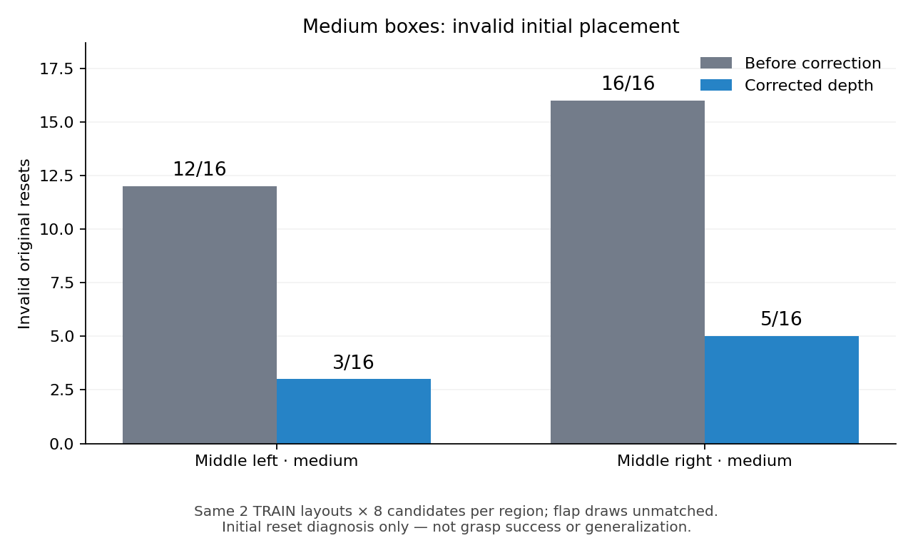
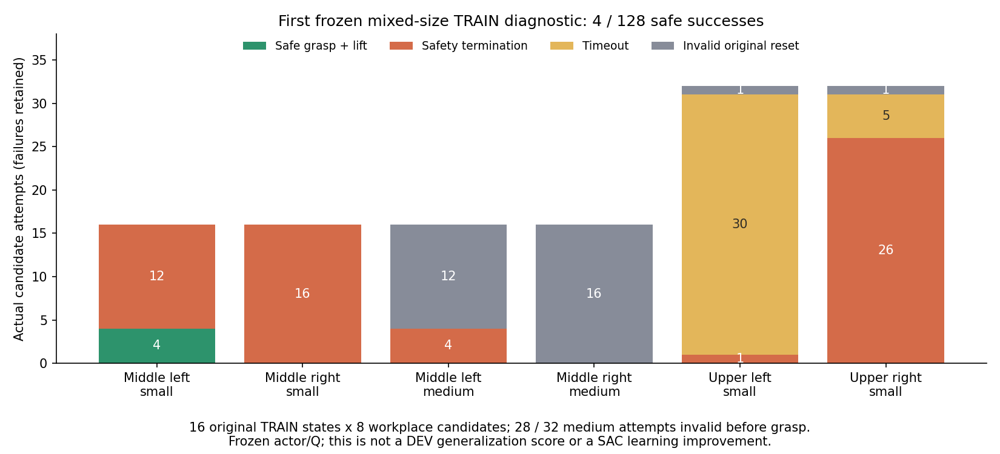

# 지원하는 박스 크기의 실제 TRAIN 접근 위치 측정

## 초기 배치의 전면 빔 침투 수정

05:10 KST에GPU0으로 수정 후 같은128요청의 실제 고정 정책 진단을 시작했다.
실제 writer2002091·CUDA0과 새 reset manifest 계약을 확인했고 actor·Q·replay0으로
진행했다. 원래 배치 guard에서 **medium 무효28/32→8/32**로 줄었다.
중간 좌12→3/16, 우16→5/16이며 small 무효는 두 실행 모두2/96이다.
같은 대표env40의 첫 스텝 속도1.639→0.08175m/s, 각속도15.57→약0,
순접촉력111.37→0N이었다. 새 초기 위치에서 중력 낙하가 시작되는 첫 스텝의
표본이며 전체 접촉·모든 사례의 속도가0이라는 의미는 아니다.



수정 후 진단은 정상 종료했고 실제198개 모델·normalizer tensor와 actor·Q·replay0
고정 검사를 통과했다. 전체128요청은 성공4·안전 위반77·시간 초과37·초기 무효10이다.
성공4개는 모두 중간 왼쪽small이며 수정 전과 같았다. **초기 배치는 개선됐지만
medium 파지 성공은0이며 파지 성능 개선을 확인한 것은 아니다.** 원래 요청과
실패를 지우지 않았으며 후보 간 flap 추첨·접촉 이력까지 맞춘 비교도 아니다.
새 독립 TRAIN 확인과 남은 초기 무효·파지 실패 분석이 필요하다.
[정상 종료·198 tensor 고정·원래 전체128 결과](assets/rl_v2_medium_front_beam_corrected_closed_TRAIN_20261008.json).
[완료된 reset guard·원래 trace·첫 스텝 근거](assets/rl_v2_medium_corrected_original_reset_guard_20261008.json).

05:51 KST에GPU0에서 수정된 배치의 **새 TRAIN 시작 조건16개×같은 접근 후보8개**
재확인을 시작했다. Seed origin4,920,000은 앞선4,880,000 및 기존 주 학습의 TRAIN·DEV와
겹치지 않는다. Source`ddef524881a0864c2c8677526653c00ab40a0d30`, 실제 writer2344224의
소유자·CUDA0·고유 실행 경로를 확인했다. 같은 immutable checkpoint·waypoints와
수정된 배치 계약을 사용하며 actor·Q·replay를 학습하지 않는다. 중간 좌·우small/medium과
상단 좌·우small의 여섯 조합과 원래128요청을 유지한다. 전체 결과와198 tensor 고정 검사는
종료 후 확인하며, 독립FINAL은 사용하지 않았다. 실행 폴더는
`CPU_regional_mixed_size_corrected_fresh_TRAIN_confirmation_gpu0_20261008_055144`다.

### 새 TRAIN 재확인 결과

06:24 KST 확인에서 writer는 정상 종료했다. 같은 원본 checkpoint·waypoints·
수정된 reset 계약과 두 진단의 TRAIN seed 비중복을 확인했고198개 runtime
모델·normalizer tensor와 actor·Q·replay0 고정 검사도 통과했다.

| 구역·종류 | 원래 요청 | 성공 | 안전 위반 | 시간 초과 | 초기 무효 |
| --- | ---: | ---: | ---: | ---: | ---: |
| 중간 왼쪽 small | 16 | 6 | 9 | 0 | 1 |
| 중간 오른쪽 small | 16 | 2 | 14 | 0 | 0 |
| 중간 왼쪽 medium | 16 | 0 | 14 | 0 | 2 |
| 중간 오른쪽 medium | 16 | 0 | 14 | 0 | 2 |
| 상단 왼쪽 small | 32 | 0 | 2 | 28 | 2 |
| 상단 오른쪽 small | 32 | 2 | 15 | 13 | 2 |
| 전체 | 128 | 10 | 68 | 41 | 9 |

이는 모델을 학습하지 않은 접근 위치 진단이며 SAC 성공률 개선이 아니다.
독립적인 시작 조건은16개이고 같은 조건을 후보8개에서 반복했다. **medium은
이번에도 성공0회이며 유효한28회 모두 안전 위반이었다.** 원래 발견·새 재확인
결과를 함께 사용해도 medium의 측정된 성공 또는 안전한 접근 위치를 준비할
수 없다. 여섯 조합의 학습 준비를 완료한 것으로 표시하지 않는다.
[종료·동일 입력·198 tensor 고정·전체 결과와 후보 적격성](assets/rl_v2_size_corrected_fresh_TRAIN_confirmation_20261008.json).

첫 수정 후 실행의 닫힌118개 episode에서 실제 손가락 접촉도 확인했다.
손이 매우 가까워도 한쪽 pad가5N 미만이라 파지가 안 되거나 짧게 잡혔다가
풀리는 사례가 있었다. 기존 성공·안전 기준을 유지하며 접근 위치와 실제
접촉 유지에 대한 진단을 계속한다.
[접촉·랙 충돌·base 안정성의 측정과 한계](RL_V2_CONTACT_AND_BASE_DIAGNOSIS_20261008.md).

2026-10-08의 두 번째 같은TRAIN 반복도 정상 종료했고 첫 진단과 같은
성공4·안전 위반59·시간 초과35·초기 무효30/128이었다. 실제198개 runtime
tensor와 actor·Q·replay0 고정을 확인했다. 새 독립적인 성공 확인이 아니다.

재생성 전의 실제 root·body·flap 자세를 이용해 USD collision geometry를
직접 검사했다. medium 표본3개의 옆벽이 중간 선반 전면 빔과 **3.17mm** 겹쳤다.
랙 좌표 복원 오차는0.00005mm 이하였고, 파지 전 첫 물리 스텝부터 선속도
1.64m/s·각속도15.57rad/s·순접촉력111N인 기록과 함께 초기 침투의 근거다.
순접촉력만으로 접촉 상대를 역추정한 것이 아니라 실제 두 collision mesh의
SAT 겹침을 확인했다. 모든medium·모든 접촉 상대를 측정했다는 의미는 아니다.

small의 깊이18.5cm를medium22cm로 바꾸면서 root의 깊이를 그대로 재사용한
오류를 수정했다. 깊이 반 증가분17.5mm에 기존 neutral spawn clearance8mm를
더해 안쪽으로 옮기고, 원래 바닥 평면에 투영한다. 반 증가분만 옮기면 기울어진
앞벽이 빔에 여전히1.26mm 침투하기 때문에 clearance도 필요했다. 원래 body
기울기·바닥 평면·source 시연과 small reset은 보존한다. 박스를 고정하거나
base·박스의 randomization 범위, settle 실패 조건, 파지·충돌 기준은 줄이지 않았다.

실제 USD의 위3표본에서 수정 후 랙 frame mesh와 body wall의 초기 겹침은0개였다.
원래 TRAIN·DEV·FINAL 배치 생성 검사와 두 반선반 회귀 검사를 포함한 관련25개
테스트가 통과했고 실제 관리 실행의 기존 계약 관련38개 검사도 통과했다.
**이는 정적 geometry와 연결 검사이며 수정 후 동적 안정화·
medium 파지 성공은 별도 실제 실행에서 확인해야 한다.**
[원래 collision geometry·수정 전후 정적 검사](assets/rl_v2_medium_initial_front_beam_overlap_20261008.json).

새 manifest에`layout_generation_contract`를 기록한다. 크기별 접근 위치를
준비하는CLI는 수정 전 reset으로 수행한 결과나 계약이 없는 결과를 거부한다.
발견·겹치지 않는 새TRAIN 재확인 모두 같은 수정된 reset geometry와 같은
immutable checkpoint·waypoints로 다시 수행해야 한다. 아래 첫4/128은 수정 전
실패 기록으로 보존하며 수정된6종류의 학습 근거로 재사용하지 않는다.

현재 구역별 초기 정책의34/128회 성공은 small 박스만의 개발 평가다.
원래 목표에는 다른 박스 크기와 base·박스·배경·움직이는 flap의 무작위화도
포함한다. 현재 정책의 성능을 전체 목표 달성으로 보지 않는다.

| 위치 | 측정할 실제 박스 크기 W × D × H |
| --- | --- |
| 중간 좌·우 | small 26.6 × 18.5 × 13cm / medium 32 × 22 × 18.5cm |
| 상단 좌·우 | small 26.6 × 18.5 × 13cm |

## 무엇을 추가했는가

`GraspLayout.target_box_type`은 선택형 reset 설정이다. 크기를 생략하면 기존
직렬화와 동작이 그대로다. 명시하면 실제 지원 asset의 type·dimensions·pool을
선택한다. 큰 footprint를 의미상 반 선반 안에 배치하되 원래2..4cm 안쪽
perturbation과 yaw·depth·base·배경 범위를 줄이거나 clamp하지 않는다.
박스 몸체 root가 바닥면에 가까운 현재 USD wrapper의 위치 기준도 보존한다.
기록된 시연 action·성공·reward를 다른 크기의 데이터로 재라벨링하지 않는다.

기존 파지 단계는 측정한 박스 크기가 다르면 실행을 거부한다. 이 검사를
일반 학습에서 유지하며, 명시적 고정 TRAIN 진단에만
`--unmeasured-size-workplace-probe`를 추가했다. 실제 medium을 쓰더라도
small의 접근 위치를 medium의 측정된 성공 위치라고 표시하지 않는다.
원래 측정 source template·actor·Q·normalizer·optimizer 계약은 유지하고
새 크기의 후보는`measured_success: false`로 기록한다.

같은16개 TRAIN 초기 조건에8개 접근 후보를 비교한다. 각 구역4조건이며
중간은small2·medium2, 상단은small4다. 원래 후보도 포함한다. 물리 요청은
128개지만 독립적인 초기 조건은16개다. 후보 사이 flap 추첨과 접촉 이력은
같다고 가정하지 않는다. 성공·충돌·초기 무효·시간 초과를 모두 기록하고
중간의 두 크기 결과를 각각2조건씩 따로 집계한다. 섞은4조건의 성공 수는
크기별 학습 waypoint 근거로 사용할 수 없다.

이 진단은900스텝·모델 고정·TRAIN 전용이다. DEV·FINAL·학습 모드·지원하지
않는 크기·상단medium을 거부하며, Q/replay 전이를 가져오지 않는다.
지역 actor의 전체198개 모델·normalizer tensor가 바뀌지 않아야 한다.
기존 단일 actor의178개 검사도 유지하고 단순 최소 개수 검사로 완화하지 않는다.

## 사용법

CPU 준비 도구는 다음과 같다. 아래 경로는 모두 고유 실행의 예시다.

```bash
CUDA_VISIBLE_DEVICES='' PYTHONPATH=src:scripts/rl python scripts/rl/prepare_region_grasp_layouts.py \
  --output-dir /absolute/path/new_mixed_layouts --seed-origin 4880000 \
  --train-per-region 4 --development-per-region 32 --eval-per-region 32 \
  --mixed-middle-box-types

CUDA_VISIBLE_DEVICES='' PYTHONPATH=src:scripts/rl python scripts/rl/prepare_size_workplace_probe.py \
  --layout-recipe /absolute/path/new_mixed_layouts/recipe.json \
  --training-manifest /absolute/path/compatible_source/training_manifest.json \
  --output /absolute/path/new_inputs/mixed_size_TRAIN16_candidates8.json
```

실제 진단은 기존 관리 진입점에`--no-training --cpu-workplace-probe
--base-waypoint-probe --unmeasured-size-workplace-probe`를 전달한다.
`--steps 900`을 사용하고 호환된 고정 checkpoint·원래 waypoints와 manifest를
지정한다. `--physics-device cpu`와 별개로 렌더러 GPU를`--gpu`와
`CUDA_VISIBLE_DEVICES`로 제한한다. 예시는 GPU0을 사용한다.

```bash
CUDA_VISIBLE_DEVICES=0 python scripts/rl/batched_staged_goal_with_drive.py \
  --experiment-dir /absolute/path/unique_size_probe --gpu 0 --physics-device cpu \
  --checkpoint /absolute/path/compatible_source/checkpoint.pt \
  --training-manifest /absolute/path/compatible_source/training_manifest.json \
  --waypoints /absolute/path/compatible_source/waypoints.json \
  --waves-json /absolute/path/new_inputs/mixed_size_TRAIN16_candidates8.json \
  --demo-dataset /absolute/path/demos.hdf5 \
  --native-seed /absolute/path/lower_seed.hdf5 --native-seed /absolute/path/upper_seed.hdf5 \
  --no-training --cpu-workplace-probe --base-waypoint-probe \
  --unmeasured-size-workplace-probe --steps 900 --checkpoint-log-backup-only
```

원래 writer의 정상 종료 후`summarize_cpu_workplace_probe.py`로 집계한다.
결과의`promising_by_region_and_box_type_for_fresh_TRAIN_recheck`를 참고하되
새 크기의 실제 TRAIN 재확인과 크기별 계약을 거친 뒤 별도 SAC를 시작해야 한다.
일반 학습에 진단 flag를 붙여 검사를 우회하지 않는다.

## 지금 확인한 범위

관련77개 검사와 실제 구역별 전체 trainer의 복원을 통과했다. 새128개
neutral reset·stage 구역과 medium 후보32개를 준비했고 원래 모델·optimizer·
관측 정규화·source 시연을 보존했다. 새 보상·Q/replay 은행은0이다.
이는 준비 및 연결 검사이며 실제 medium 파지 성공은 아직 측정 전이다.
별도 DEV128·FINAL128은 준비했지만 사용하지 않았다.
[실제 입력·복원 근거](assets/rl_v2_regional_mixed_size_TRAIN_workplace_preparation_20261008.json).

## 두 번의 실제 TRAIN 측정 후 크기별 SAC 연결

`prepare_size_workplaces.py`는 첫 탐색과 **시작 조건이 겹치지 않는 새 TRAIN
재확인**을 함께 사용한다. 두 실행 모두 정상 종료한 고정 정책의128회 요청·
모든 실패·같은 실제 checkpoint/waypoints와 model 고정 검사를 확인한다.
중간의 small/medium은 각각2조건씩 두 번, 상단small은4조건씩 두 번이다.
새 확인에서 파지 성공이 없으면 성공 위치로 표시하지 않는다. 안전한 시도만
있는 후보는`measured_success:false`인 파지 미확인 후보로 유지할 수 있다.
후보 간 flap 추첨과 물리 접촉 이력까지 일치한다고 가정하지 않는다.

선택 JSON은`구역 -> 박스 종류 -> 후보 이름` 구조다. 중간 좌·우의small/medium,
상단 좌·우의small **여섯 조합을 모두 명시**해야 한다. 실제 asset pool·원래
접근 offset·시도 분모·새 확인 결과를 따로 보존한다. 크기별 stage는 실제 관측의
구역·종류·dimensions가 이 측정과 맞을 때만 해당 위치를 사용한다.

```bash
CUDA_VISIBLE_DEVICES='' PYTHONPATH=src:scripts/rl python scripts/rl/prepare_size_workplaces.py \
  --discovery-run /absolute/path/closed_discovery/batch_sac_run \
  --confirmation-run /absolute/path/closed_fresh_confirmation/batch_sac_run \
  --selections-json /absolute/path/explicit_six_selections.json \
  --output /absolute/path/new_measured_size_waypoints.json

CUDA_VISIBLE_DEVICES='' PYTHONPATH=src:scripts/rl python scripts/rl/prepare_size_workplace_actor.py \
  --initial-checkpoint /absolute/path/original_pristine/checkpoint_00000000.pt \
  --training-manifest /absolute/path/original_pristine/training_manifest.json \
  --waypoints /absolute/path/new_measured_size_waypoints.json \
  --output-dir /absolute/path/new_size_SAC_initialization
```

두 번째 도구는 원래 **학습 전 regional checkpoint**와 비어 있는 experience만
허용한다. Q는 갱신되지 않은 초기값을 유지하고, actor/Q counter·optimizer·
보상/return/replay 은행이0이어야 한다. 바뀐 위치의 학습된 Q를 가져오지 않는다.
Actor와 정규화·제어기 tensor는 그대로다. 기존 성공 TRAIN의 actor 참고 데이터는
원래held x/y/yaw 관측·action·성공과 원래 계약을 보존하며 medium으로 재라벨링하지
않는다. 새 목표는 그 원래 위치가 관측으로 드러나는 actor 참고만 허용한다.
이전 경로의 Q/보상 전이는 가져오지 않는다. 새 성공은 새 학습에서 직접 측정한다.

현재 연결의 관련135개 CPU 검사가 통과했고, CUDA 복원 검사2개는 GPU를
노출하지 않은 검사에서 제외됐다. 이 검사는 합성 fixture의 계약·데이터 분리와
실제 SAC gradient 연결을 다루며 물리 파지 성공을 증명하지 않는다. 실제 두
TRAIN 측정·새 계약의 전체 trainer 복원과 학습 후 평가가 끝나기 전에는 크기별
파지가 해결됐다고 보지 않는다. 독립 FINAL과 원래 무작위화 범위도 유지해야 한다.

## 첫 실제 크기별 진단 결과와 초기화 문제

GPU0의 첫 고정 정책 진단은 정상 종료했다. 새 TRAIN16조건을 각 접근 후보
8개로 시도한128회 중 성공4·안전 위반59·시간 초과35·초기화 무효30회다.
198개 실제 모델 tensor와 actor/Q/replay counter0을 유지했다. 성공4회는
모두 중간 왼쪽small이다. 같은16조건을 반복한 결과이며 DEV 성공률이 아니다.

| 구역·크기 | 시도 | 성공 | 초기화 무효 |
|---|---:|---:|---:|
| 중간 왼쪽small | 16 | 4 | 0 |
| 중간 오른쪽small | 16 | 0 | 0 |
| 중간 왼쪽medium | 16 | 0 | 12 |
| 중간 오른쪽medium | 16 | 0 | 16 |
| 상단 왼쪽small | 32 | 0 | 1 |
| 상단 오른쪽small | 32 | 0 | 1 |

**Medium32회 중28회는 파지를 시작하기 전 원래 배치가 무효였다.** 이 상태의
실패를 SAC 탐색만의 문제로 해석하지 않는다. 최종 guard의 일부 박스 좌표는
부분 respawn 후 비활성 asset을 보관한 위치이므로, 그 좌표로 원래 박스가
어디서 어떻게 실패했는지 단정할 수 없다. 실패 배치도 원래128회 분모에 남긴다.
[실제 종료·크기별 집계](assets/rl_v2_regional_mixed_size_TRAIN_first_result_20261008.json).



같은 명령에`--workplace-reset-diagnostics`를 추가하면 **명시적인 고정 TRAIN
접근 후보 진단에서만** 원래 박스가 부분 respawn되기 전 첫 실패와 neutral
hold의 링크·속도·기존 normal contact trace를 남긴다. 새 sensor나 접촉 필터,
물리 파라미터·무작위화·안전·성공 조건을 변경하지 않고 Q/replay에 넣지 않는다.
일반 SAC·DEV/FINAL 또는1스텝 진단으로 이 옵션을 사용할 수 없다.
전체 trace는`reset_failure_diagnostics_wave_0000.json`에 한 번 저장한다.
같은16조건 재실행은 원인 진단이며 시작 조건이 겹치지 않는 새 TRAIN 확인을
대신하지 않는다. 실제 원인을 확인하기 전에는 medium 성공이나 수정 완료를
주장하지 않는다.

이번 read-only trace 경로와 크기별 연결의 관련113개 검사를 통과했다.
GPU를 노출하지 않은 실행에서 CUDA 복원2개는 제외했다. 이전135개 연결
검사도 통과했으며, 어느 검사도 새로운 물리 파지 성공을 의미하지 않는다.

## 재생성 전 기록에서 확인된 원인 범위

같은 TRAIN 배치의 초기화 trace가 저장됐다. 전체900스텝 파지 진단은 아직
진행 중이므로 그 진단의 새 성공률을 주장하지 않는다. 재생성 전 최초 실패
27개 중medium이26개다. Medium의19개는 배정 구역·지지면 이탈이고7개는
안정화 시간 초과다. 세부 판정은footprint 밖16개·지지면 밖7개이며 서로
겹칠 수 있다. 이 최초 실패들은 quaternion·위치·속도가 모두 유한했다.

**SAC 파지 동작 전 neutral hold에서 이미 움직임이 커졌다.** 중간 오른쪽
medium 표본env40은 초기 속도0·정상 footprint·지지면 clearance약9.9mm에서,
첫 물리 스텝에선속도1.64m/s·각속도15.57rad/s·기존 source-body net normal
접촉111.4N을 기록했다. 이후 지지면에서 튀어 올라 구역을 벗어났다.
같은small 표본env0은 첫 스텝선속도0.00117m/s·각속도0.00980rad/s·접촉5.09N이었다.
다른medium 표본은 명목상 지지면 clearance가 음수가 되거나 흔들림이
가라앉지 않은 기록도 있다.
[원래 상태·neutral trace·최초 실패 근거](assets/rl_v2_medium_original_reset_causal_trace_20261008.json).

이 기록은 **초기화·접촉 안정성의 병목이며 SAC가 파지 명령을 내서 만든 실패가
아님**을 보여준다. 다만 현재net normal reporter는 다른 collider와 마찰력을
구분하지 못하므로 초기 geometry 관통이나 접촉 상대를 아직 특정하지 않는다.
실제 collision geometry·복원된 몸체·지지면 위치를 대조한 뒤 수정해야 한다.
무효 조건을 약하게 하거나 박스를 고정해 문제를 숨기지 않는다.
