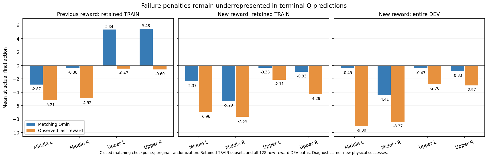

# 실패 종료 동작의 critic 학습을 보강하는 SAC 옵션

새 종료 보상만 적용한 SAC도 **초기23→1/128**로 떨어졌다. 평가뿐 아니라
실제 학습에 사용한 TRAIN의 마지막 동작에서도 Q가 실패 감점보다 높게 남았다.
실패·성공의 마지막 실제 동작을 더 자주 학습하는 선택형 sampling을 추가했다.
보상·제어·성공·충돌·무작위화는 유지한다. 구현·실제 trainer 복원·입력 Drive
검증까지 마친 뒤 **10/07 09:53 KST에 GPU3에서 새 고유 실행을 시작했다.**
실제 writer2413288·supervisor의 소유자·명령·`CUDA_VISIBLE_DEVICES=3`과 서비스
실행 상태를 확인했다. 초기화를 마치고 첫 DEV 평가에 진입했으며 실제 learner의
종료 표본25% sampler·성공 명령 유지 손실·새 보상·표준편차0.0075–0.03을 확인했다.
현재 초기 평가의 actor·Q·온라인 replay·성공/n-step 은행은0이다. 아직 새 TRAIN
배치의16개 종료 표본이나 학습 후 물리 성능을 측정한 것은 아니다.
[실제 실행·입력 백업](assets/rl_v2_terminal25_actual_launch_20261007.json).
[실제 첫 DEV·적용 계약](assets/rl_v2_terminal25_first_actual_DEV_20261007.json).

## 전체 평가에서 확인한 결과

| 비교 | 자신의 전체 DEV 성공 흐름 | 마지막 중간 좌/우·상단 좌/우 | 실패 |
| --- | --- | --- | --- |
| 실제 servo 명령을 Q에 입력 | 23 → 9 → 7 /128 | 0 /0 /7 /0 | 랙64·시간 초과56·초기화 무효1 |
| 종료 기하 잠재값을0으로 처리 | 23 → 1 /128 | 0 /0 /1 /0 | 랙69·시간 초과58 |

매번 네 구역32요청씩인 원래 DEV이며, 실제 서로 다른 flap의 양손 pad 접촉·
0.25초 유지·8mm proof lift·안전 조건을 모두 충족해야 성공이다. 각 평가의
동일 모델을 완료 전에 보존했다. 두 writer는 `policy_regression` 판정으로
종료 코드1을 반환했다. OOM이나 runtime 예외가 아니므로 오류 재시작하지 않는다.
두 원래 supervisor가 writer 종료 뒤 로그·체크포인트의 최종 업로드와 크기·MD5
검증을 마친 상태를10:06 KST에 확인했다. 별도 중복 업로더를 만들지 않았다.
[종료 실행 백업 기록](assets/rl_v2_closed_servo_absorbing_final_backup_20261007.json).

## 실제 마지막 동작의 Q와 보상

종료된 두 실행의 전체 평가를 각각 동일 actor/Q로 복원했다. 이전 보상은
원래128요청 중 유효127경로, 새 보상은 유효128경로다. 새 보상 평가의
실제 명령 최대 복원 차이는0.0001491이었다. 학습·평가의 물리 계약도 같았다.
HDF·모델·동작을 수정하거나 평가 전이를 TRAIN에 넣지 않았다.

새 보상 모델은 actor695·Q4826이다. 아래는 구역별 **실제 마지막 동작**의 평균이다.

| 구역 | Qmin | 실제 마지막 보상 | 보존된 같은 실행 TRAIN의 종료 표본 평균 Q−보상 |
| --- | ---: | ---: | ---: |
| 중간 왼쪽 | −0.45 | −9.00 | +4.59 ·18경로 |
| 중간 오른쪽 | −4.41 | −8.37 | +2.36 ·16경로 |
| 상단 왼쪽 | −0.43 | −2.76 | +1.78 ·10경로 |
| 상단 오른쪽 | −0.83 | −2.97 | +3.36 ·11경로 |

TRAIN은 최종 닫힌 experience의 보존 은행55경로이며 전체 과거 TRAIN의 통계가
아니다. 이전 보상 은행에서도 같은 문제가 보였고 해당 실행이 수집한53경로만
분석했다. 이전 실행에서 초기화한1경로는 명시적으로 제외했다. Source reward와
terminal label을 그대로 사용하고 모든 마지막 mask가 종료임을 확인했다.



시간 초과도 종료로 취급하고 reward scale1·entropy backup 없음이므로 이 마지막
target에는 이후 Q가 더해지지 않는다. 다만 Q는 동작 전 관측의 기대값이고 보상은
한 실제 결과다. 이 평균 차이만으로 전체 critic의 보정이나 실패의 유일한 원인을
단정하지 않는다. 보존 TRAIN에도 실패 감점 차이가 남아 있어 종료 표본의 학습
빈도를 보강하는 비교를 선택했다. 성능은 새 실제 전체 평가로 판단한다.

[이전 보상 전체 평가 Q](assets/rl_v2_servo_second_DEV_actual_matching_Q_20261007.json) ·
[새 보상 전체 평가 Q](assets/rl_v2_absorbing_first_DEV_actual_matching_Q_20261007.json) ·
[실제 보존 TRAIN 종료 Q](assets/rl_v2_closed_TRAIN_terminal_Q_20261007.json).

## 변경한 sampling

`--measured-train-credit measured-nstep16-terminal25`를 선택한다. 기존 옵션은
`measured-nstep16`이며 기본 동작은 바꾸지 않았다.

| 항목 | 기존 | 새 옵션 |
| --- | --- | --- |
| 별도 critic 배치 | 실제 n-step64개 | 실제 n-step48개 + 실제 마지막 동작16개 |
| 마지막 동작 선택 | 구역 안 전체 행에서 우연히 선택 | 가능한 구역을 균등 배정하고 구역 안 episode를 균등 선택 |
| 마지막 target | 선택된 마지막 행의 실제 보상 | 같은 실제 보상, `n_steps=1`, bootstrap0 |
| horizon·critic 보조 가중치 | 최대16·0.1 | 유지 |
| online one-step SAC·success Q20→5% | 기존 설정 | 유지 |
| 성공·실패·시간 초과·reward 라벨 | 실제 완료 TRAIN | 유지, relabeling 없음 |

긴 경로가 짧은 성공 경로보다 마지막 표본을 독점하지 않게 episode를 균등
선택한다. 성공과 실패를 같은 은행에서 사용하며 DEV·FINAL·불연속 reset·
수치 오류·다른 controller probe는 계속 제외한다. 실제 terminal next placeholder는
기존 mask로 target 네트워크 계산에서 제외된다. 추가된 마지막 표본 자체에는
미래 행동에 대한 off-policy bootstrap이 없다. 나머지 실제 n-step 보조 손실의
off-policy correction/중간 entropy 없음이라는 실험적 한계는 유지한다.

구현은 [측정 TRAIN 은행](../src/kuavo_isaaclab_scene/rl/multi_box/experiments/measured_train_credit.py),
[실제-flap pilot의 config 복원](../src/kuavo_isaaclab_scene/rl/multi_box/experiments/actual_flap_residual_sac.py),
[학습 CLI](../scripts/rl/train_batched_staged_goal.py)에 있다. 새 sampler를 저장해
resume하며 기존 sampler로의 명시적 덮어쓰기는 거부한다.

## 비교 준비·검증·사용법

[성공 제어 명령 유지](RL_V2_SERVO_SUCCESS_RETENTION_20261007.md) 옵션과 조합한
새 초기 입력을 만들었다. 초기 greedy 몸체·gripper·Gaussian·모든 Q·target·
normalizer는 같고 모든 optimizer·온라인 replay·성공/n-step 은행은0이다.
TRAIN123상태에서 동작 보존과 실제 full trainer의 새 sampler 복원을 확인했다.
해당 상태는 검사에만 사용하고 새 은행에 가져오지 않았다.
[실제 full trainer 복원](assets/rl_v2_terminal25_full_restore_20261007.json).

관련28개 테스트가 통과했다. 실제 마지막 reward·단일 동작·bootstrap0·구역
균형·길이가 다른 episode의 선택·success label 보존·sampler resume·기존 동작
동일성을 포함한다. 큰 전체 테스트를 반복하거나 별도 물리 진단을 시작하지 않았다.

```bash
CUDA_VISIBLE_DEVICES='' PYTHONPATH=src:scripts/rl python scripts/rl/prepare_servo_retention_actor.py \
  --initial-checkpoint /absolute/path/to/closed-quarter-inputs/checkpoint_00000000.pt \
  --training-manifest /absolute/path/to/closed-quarter-inputs/training_manifest.json \
  --waypoints /absolute/path/to/closed-quarter-inputs/waypoints.json \
  --identity-checkpoint /absolute/path/to/closed-actual-TRAIN-checkpoint.pt \
  --measured-train-credit measured-nstep16-terminal25 \
  --output-dir /absolute/path/to/unique-new-input-directory
```

학습된 Q·optimizer·보상 은행을 다른 sampler로 옮기는 기능이 아니다. 위 준비는
미학습 quarter 입력과 닫힌 빈 replay에만 적용한다. 이후 학습 CLI에도 같은
`--measured-train-credit measured-nstep16-terminal25`를 사용한다.

새 계획은 고유 TRAIN1,536조건과 원래 DEV128·17개 wave다. 이전10개 계획과
TRAIN seed가 겹치지 않고 독립 FINAL은 사용하지 않았다. 입력8개를 기존
Drive 연결로 크기·MD5 검증했다. 실행할 때 GPU3/CUDA 마스크·5분 업로드·
검증된 오래된 checkpoint만 정리·최근2개 유지·writer 종료 뒤 로그 검증을
사용한다. 현재 자기 실행 중인 다른 비교는 변경하지 않는다.
박스 고정·curriculum·무작위화 축소·성공 또는 충돌 기준 완화는 없다.
