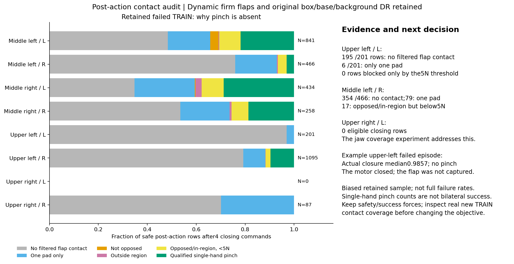
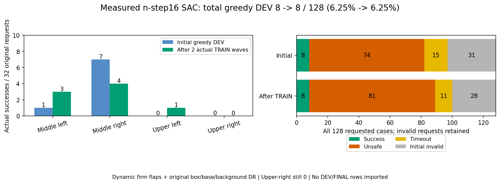

# 단단한 flap의 실제 TRAIN 병목과 그리퍼 탐색: 2026-10-06

Flap의 강성1.5–2.5Nm/rad·감쇠0.15–0.25Nm·s/rad·정마찰0.45–0.65·동마찰0.30–0.40·
초기 각도±1° 무작위화를 유지한다. Box/flap은 동적이며 원래 box/base/background DR도
유지한다. GPU3 전체 DEV는6→7→4/128으로 아직 안정적인 개선이 없다. 새 분석에서
위 오른쪽은 접근 실패에 더해 **접근 후 닫힘 경험이 거의 없는 별도 병목**을 확인했다.


## 실제 기록의 단계별 병목

Drive 크기·MD5 검증을 마친 immutable matching replay의 measured bank64경로와
성공 bank15경로를 identity로 합쳤다. 중복 제외69경로이며 용량 제한에 따른 편향이 있다.
이 표는 전체 학습 성공률이나 평가 결과가 아니다. 안전한 current row의 기하·접촉을
집계하고 terminal의 실제 success와 비교했다.

| 지역 | 보존 실패 경로 | 양손 접근 경험 | 접근 후 양손 닫힘 | 양손 qualified pinch |
|---|---:|---:|---:|---:|
| 중간 왼쪽 | 16 | 16 | 15 | 1 |
| 중간 오른쪽 | 11 | 11 | 9 | 2 |
| 위 왼쪽 | 11 | 11 | 4 | 0 |
| 위 오른쪽 | 16 | 6 | 0 | 0 |

접근은 실제 flap 중점≤12cm인 진단이며 표면 접촉이나 성공 조건이 아니다. Production
nominal gate와 actual 중점 gate의 차이는 위 오른쪽 실패에서 hand-row6개로, 그 지역의
닫힘 부재를 gate 차이만으로 설명하기 어렵다. 위 왼쪽은 차이393행이 있으며 다른
기하 문제도 남아 있다. 한 손씩 따로 발생한 force peak를 양손 동시 pinch로 세지 않는다.
[행/경로별 원본](assets/rl_v2_actual_TRAIN_contact_stages_20261006.json).

위 오른쪽 실패6경로의 **안전한 production 양손 near572행**을 같은 상태로 고정하여
actor1204/Q6864와 n-step 후 actor1792/Q9216을 CPU에서 읽었다. Recorded 양손 닫힘과
현재 greedy 양손 닫힘은 모두0행이었다. 현재 양손 닫힘 확률 평균은
5.5834e−7→1.3193e−11이다. Discrete alpha는0.01557→0.01872로 올랐지만 left logit이
−23.92→−33.80인 예처럼 sigmoid가 포화되어 있다.

기존 confident jaw는 `sign(reference)*logit(0.8)+20*(current_raw-reference_raw)`다.
Residual gain20이 작은 raw 이동을 큰 effective logit 이동으로 만든다. Confidence는
hard jaw constraint가 아니며 실제 학습으로 열림 확률에 포화될 수 있다. 이 식을 지금
바꾸면 actor/Q target distribution까지 달라지므로 이번 비교에서는 유지한다.
[54개 실패 TRAIN의 같은 상태 확률·Q 대조](assets/rl_v2_actual_failed_TRAIN_jaw_opportunities_20261006.json).

Learned Q가 일부 상태에서 양손 닫힘을 높게 예측해도 실제 안전한 파지를 검증한 것이
아니다. 접근 자체에 실패한 위 오른쪽10/16경로, 랙 접촉과 초기 무효도 별도로 남는다.

## 옵션형 TRAIN 행동 탐색

`--jaw-behavior joint-epsilon10`을 actual-flap SAC TRAIN에만 추가한다. 기본은 기존
정책이며 옵션을 생략해도 이미 활성화한 checkpoint를 재개하면 저장 설정을 복원한다.
활성화한 checkpoint에 `--jaw-behavior policy`를 지정하여 조용히 끄는 요청은 거부한다.

- 수집 행동의 jaw 분포는90% 기존 factorized 정책+10% 네 조합의 uniform mixture다.
  두 손 모두 gate 안인 고정 상태·stationary noise marginal에서는 각 조합에 최소2.5%가
  생긴다. AR noise와 상태 feedback에 조건부인 실제 live coverage 보장은 아니다.
- 기존21-D AR Gaussian 중 마지막 두 noise만 재사용한다. Mixture 선택에 사용한 left
  uniform은 learned branch에서 조건부 범위를 재조정해 기존 left marginal의 편향을 막는다.
  Body19D noise·offset·goal과 global environment ID 및 whole-wave reset을 유지한다.
- 기존 projector를 한 번 적용한다. 12cm gate 밖의 손은 열린 상태를 유지하며 reward,
  rack10N·robot-only obstacle5N·self-collisionOFF·양손5N hold0.25s·8mm proof는 유지한다.
- Actor/target의 네 jaw 기대값·Q·normalizer·4optimizer·success retention·n-step 보조 목적을
  바꾸지 않는다. Greedy DEV/FINAL과 frozen TRAIN 진단에는 mixture를 적용하지 않는다.
- 설정·활성화 시점 actor/Q counter·기존 replay 행 수·source checkpoint와 실제 수집 branch
  통계를 checkpoint/replay에 저장한다. 이전 replay는 원래 행동 출처를 유지한 off-policy
  데이터이며 새 설정으로 재표기하지 않는다. 새 TRAIN outcome/HDF metadata도 설정을 기록한다.

사용할 때 기존 `batched_staged_goal_with_drive.py --gpu 3 --training`의 physical manifest,
matching checkpoint/replay·waypoints·waves·demo/native seed를 그대로 유지하고 다음만 추가한다.

```bash
--jaw-behavior joint-epsilon10
```

`--measured-train-credit measured-nstep16`과 함께 사용할 수 있다. 이 옵션은 nominal policy
또는 frozen-only 실행에 명시적으로 지정할 수 없다. 이미 활성화된 checkpoint의 frozen
평가는 읽을 수 있고 평가 행동은 기존 learned policy다.

## 확인과 실제 비교

관련 CPU 검사52개를 통과했다. 포화/일반 확률·조건부 left uniform·far gate·body·extra RNG0·global ID·기본
sampler·4optimizer/replay/contract 보존·frozen 평가·재개를 확인했다. 실제 위 오른쪽572개
near 상태에64번 stationary noise를 적용한36,608회 CPU 샘플에서는 양손 닫힘이
기존0→mixture916개(2.50%)였다. 같은 noise의 body goal과 모델/normalizer tensor는
bitwise 같았다. CPU 샘플은 물리 파지 성공을 의미하지 않는다.
[CPU 실제 상태 확인](assets/rl_v2_actual_TRAIN_joint_jaw_mixture_CPU_20261006.json).

새 GPU3 비교는 기존 n-step 실험과 같은 immutable actor1204/Q6864·replay224,621행·
measured bank31,447행에서 시작한다. 초기 전체 DEV128→원래 TRAIN7/8→후속 DEV128을
진행하고 네 영역 요청32개씩·초기 무효 분모·독립 FINAL 미사용을 유지한다. 기존 소유
학습은 유지하며 입력 replay를 복사하지 않는다. 기존 Drive 연결·300초 업로드·checksum
검증 후 최신2 checkpoint 보호·writer 종료 후 로그/HDF/replay 검증을 재사용한다.
실제 launch/PID와 수집 통계를 확인한 뒤 결과를 이어 기록한다. 목표는 아직 미완료다.

04:33:09 KST에 `actual_flap_joint_jaw_credit16_sac_pgs128_gpu3_20261006_043309`를 시작했다.
실제 run은 `batch_sac_20261006_043309_c23294`, writer562553·supervisor562445이며
서비스active·소유UID·CUDA3를 확인했다. 구현 commit은 `75e1143`이다. PGS 환경 설정을
마쳤고 초기 DEV 전 model/input 준비 단계다. 아직 mixture의 실제 TRAIN 수집이나 물리
성공률 개선은 확인 전이다. 기존 n-step 비교는 actor1961/Q9890으로 TRAIN 두 wave를
마친 뒤 후속 전체 DEV를 시작했으며 TRAIN 성공은5→8/128, 양쪽 상단은0이다.

SSD 여유는 약10GiB여서 새 출력만 `/dev/shm/HumanoidScene_rl_seonho/`의 private0700
owned tmpfs에 둔다. 시작 전 기존 tmpfs504GiB와 가용RAM 약948GiB를 확인했다.
기존 입력2.16GiB를 복사하지 않으며 기존 Drive와 관리자를 그대로 사용한다. RAM 로컬
파일은 재부팅 시 사라진다. Drive의 검증본이 보관본이며 active log는 업로드하지 않고
writer 종료 뒤 검증한다. 기존 SSD 실행이나 다른 사용자 파일/프로세스는 변경하지 않았다.
Notion에 새 native PNG를 포함한97개 미디어를 확인했고 기존96개를 모두 보존했다.

04:45:39 KST에 실제 초기DEV31step을 확인했다. 검증 property cache는18개 box asset·
전체128환경·각4panel을 포함하며 각 property9,216값이 모두 요청 범위 안이었다.
이는 reset 때 setter readback을 누적한 cache이며 새 전체 PhysX query가 아니다.
요청128개 중 원래 유효99개·무효29개로 후자의 대체 상태 property를 원래 요청의
성공 데이터로 세지 않는다. 기존 비교 초기DEV의 유효97개와 동일한 초기 물리 상태라고
주장하지 않으며 각 실행의 무효 요청을 포함한 전체128개로 비교한다.
Actor1204/Q6864·replay224,621행·online0·measured bank31,447행·jaw sampler0행을
그대로 유지했다. 평가 중 탐색/학습을 하지 않았으며 실제 TRAIN 탐색 효과는 확인 전이다.
[최초 DEV·전체 flap 범위 readback 요약](assets/rl_v2_joint_jaw_GPU3_initial_DEV_readback_20261006.json).

분석·구현·검사·launch 기록22개와 영수증을 기존 Drive에 업로드해 각각 크기/MD5를
검증했다. 활성 로그·인증·계정별 remote 별칭은 복사하지 않았다. 학습의 완료 및
성공률 개선과 이 분석 자료 백업의 완료를 구분한다.

## 후속 진단: 닫혔지만 양쪽 패드가 닿지 않는 경우

같은 immutable 실제 TRAIN69경로에서 recorded action에 대응하는 **next critic의 실제
접촉**을 분류했다. 안전한 성공 terminal도 포함하고 current/next unsafe row는 제외했다.
Post flap assignment가 무효인 행은 perceived 중점 거리 통계에서 제외하고 별도로 센다.
Production near 조건에서4회 이상 연속 닫힘 명령을 보낸 이후의 값은 actuator 지연을
줄여 보는 진단이며 새 성공 조건이 아니다. 이 표본은 whole failure rate가 아니다.



| 실패 TRAIN의 손 | 조건부 post-action 행 | 접촉 없음 | 한쪽 패드만 | opposed/region 유효지만5N 미만 | qualified 한 손 pinch |
|---|---:|---:|---:|---:|---:|
| 중간 왼쪽 L | 841 | 407 | 146 | 73 | 184 |
| 중간 왼쪽 R | 466 | 354 | 79 | 17 | 14 |
| 중간 오른쪽 L | 434 | 151 | 107 | 39 | 125 |
| 중간 오른쪽 R | 258 | 138 | 52 | 18 | 48 |
| 위 왼쪽 L | 201 | 195 | 6 | 0 | 0 |
| 위 왼쪽 R | 1095 | 868 | 98 | 22 | 106 |
| 위 오른쪽 L | 0 | 0 | 0 | 0 | 0 |
| 위 오른쪽 R | 87 | 61 | 26 | 0 | 0 |

표의 나머지 행은 opposed 또는 graspable region을 만족하지 못한 접촉이다. 한 손
pinch 수를 양손 동시 성공으로 해석하지 않는다. `in_region`은 positive contact도
요구하므로 없다는 사실이 곧 geometric aperture의 불가능을 뜻하지 않는다.

위 왼쪽 실패 `wave5/env110/seed120259`의 L은 조건부167행 중164행이 접촉 없음,
3행이 한쪽 패드만이었다. Actual closure 중앙값은0.9857로 실제 그리퍼가 닫혔다.
현재 이 표본의 실패를 motor가 닫히지 않아서 생겼다거나5N threshold만 과도해서
생겼다고 설명할 수 없다. 이전 양손 닫힘 구간에서는 alignment potential 중앙값0.979,
capture potential0.849였지만 실제 left pinch는0이었다. 점수는 geometric potential이며
접촉 성공 flag가 아니다. 넓은10cm capture falloff·양손 평균 점수에서 정밀 포착을
덜 구분하는 가능성은 후속 실제 TRAIN과 비교할 대상으로 남긴다.

현재 reward/안전/성공 threshold는 바꾸지 않는다. 위 오른쪽의 닫힘 탐색은 새 비교로
검사하고, 충분히 닫힌 손에서도 실제 두 패드 접촉이 생기지 않으면 reach 이후의
정밀 포착·weaker hand 신호와 실제 fingertip/flap 기하를 다음으로 점검한다.
[post-action 패드·실제 closure·거리·potential 원본](assets/rl_v2_actual_TRAIN_pad_contact_bottlenecks_20261006.json).

## 추가 진단: body correction 범위가0으로 막혔는지 확인

같은69경로·immutable actor1204/Q6864에서 frozen executed body anchor와
`min(0.15, 1 - abs(anchor))`의19개 좌표별 실제 radius를 CPU로 읽었다. 안전한
전체33,508행과 그중 양손 near6,506행에서 **radius가 정확히0인 좌표는 없었다**.
이 표본에는 관절 또는 upright torsoXZ가 한계값에 고정되어 correction 자체가
불가능하다는 증거가 없다. 원래21-D remaining action에는 base가 포함되지 않으며
첫17개가 joint goal, 다음2개가 upright torsoXZ, 마지막2개가 binary jaw다.
현재 bounded distribution/entropy 계산은 변경하지 않는다. 이 확인은 radius0
고착을 배제하는 진단이며 충분한 물리 탐색 범위나 일반화를 입증하지 않는다.
[좌표·지역·경로별 radius 원본](assets/rl_v2_actual_TRAIN_body_correction_bounds_20261006.json).

## n-step16 실제 비교의 학습 후 전체 DEV

05:15 KST에 기존 n-step 비교 writer가 exit0으로4개 wave를 마쳤다. 두 실제
TRAIN wave에서89167행을 추가하고 actor1204→1961·critic6864→9890을 업데이트했다.
그 후 학습·탐색 없는 전체 DEV128개를 마친 결과는 **8→8/128(6.25%→6.25%)**이다.



| 전체 DEV 지역 | 초기 /32 | TRAIN 두 wave 후 /32 |
|---|---:|---:|
| 중간 왼쪽 | 1 | 3 |
| 중간 오른쪽 | 7 | 4 |
| 위 왼쪽 | 0 | 1 |
| 위 오른쪽 | 0 | 0 |

위 왼쪽1건은 실제 양손 pinch·서로 다른 flap·stable hands·hold0.2667s·
roller 기준 clearance0.0580m를 만족했고 unsafe가 없었다. DEV 성공 경로를
TRAIN/Q/retention으로 가져오지 않았다. 전체 초기 무효는31→28, unsafe는74→81이다.
PGS 초기화 결과는 동일한 요청 layout에도 서로 달라 각 실행의 원래 무효를 포함한
128개로 비교한다. 한 지역의1건을 전체 개선 또는 일반화 성공으로 결론짓지 않는다.
위 오른쪽 실패와 불안정한 초기화가 남았으며 독립 FINAL은 아직 사용하지 않았다.

종료된 manager는 final upload 중이다. Writer의 정상 종료와 checkpoint·로그·HDF·
replay의 최종 Drive 검증 완료를 구분한다. 새 GPU3 joint-jaw 비교는 같은 immutable
초기 모델에서 초기 전체 DEV를 진행하고 있으며 실제 TRAIN 비교가 뒤따른다.
[완료된 DEV·TRAIN 집계와 실제 위 왼쪽 성공 원본](assets/rl_v2_measured_nstep16_completed_DEV_20261006.json).
