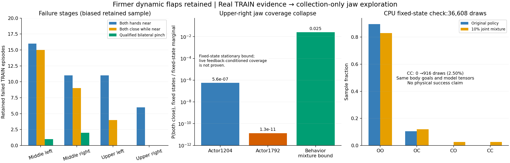

# 단단한 flap의 실제 TRAIN 병목과 그리퍼 탐색: 2026-10-06

Flap의 강성1.5–2.5Nm/rad·감쇠0.15–0.25Nm·s/rad·정마찰0.45–0.65·동마찰0.30–0.40·
초기 각도±1° 무작위화를 유지한다. Box/flap은 동적이며 원래 box/base/background DR도
유지한다. GPU3 전체 DEV는6→7→4/128으로 아직 안정적인 개선이 없다. 새 분석에서
위 오른쪽은 접근 실패에 더해 **접근 후 닫힘 경험이 거의 없는 별도 병목**을 확인했다.



## 실제 기록의 단계별 병목

Drive 크기·MD5 검증을 마친 immutable matching replay의 measured bank64경로와
성공 bank15경로를 identity로 합쳤다. 중복 제외69경로이며 용량 제한에 따른 편향이 있다.
이 표는 전체 학습 성공률이나 평가 결과가 아니다. 안전한 current row의 기하·접촉을
집계하고 terminal의 실제 success와 비교했다.

| 지역 | 보존 실패 경로 | 양손 접근 경험 | 접근 후 양손 닫힘 | 양손 qualified pinch |
|---|---:|---:|---:|---:|
| 중간 왼쪽 | 16 | 16 | 15 | 1 |
| 중간 오른쪽 | 11 | 11 | 9 | 2 |
| 위 왼쪽 | 11 | 11 | 4 | 0 |
| 위 오른쪽 | 16 | 6 | 0 | 0 |

접근은 실제 flap 중점≤12cm인 진단이며 표면 접촉이나 성공 조건이 아니다. Production
nominal gate와 actual 중점 gate의 차이는 위 오른쪽 실패에서 hand-row6개로, 그 지역의
닫힘 부재를 gate 차이만으로 설명하기 어렵다. 위 왼쪽은 차이393행이 있으며 다른
기하 문제도 남아 있다. 한 손씩 따로 발생한 force peak를 양손 동시 pinch로 세지 않는다.
[행/경로별 원본](assets/rl_v2_actual_TRAIN_contact_stages_20261006.json).

위 오른쪽 실패6경로의 **안전한 production 양손 near572행**을 같은 상태로 고정하여
actor1204/Q6864와 n-step 후 actor1792/Q9216을 CPU에서 읽었다. Recorded 양손 닫힘과
현재 greedy 양손 닫힘은 모두0행이었다. 현재 양손 닫힘 확률 평균은
5.5834e−7→1.3193e−11이다. Discrete alpha는0.01557→0.01872로 올랐지만 left logit이
−23.92→−33.80인 예처럼 sigmoid가 포화되어 있다.

기존 confident jaw는 `sign(reference)*logit(0.8)+20*(current_raw-reference_raw)`다.
Residual gain20이 작은 raw 이동을 큰 effective logit 이동으로 만든다. Confidence는
hard jaw constraint가 아니며 실제 학습으로 열림 확률에 포화될 수 있다. 이 식을 지금
바꾸면 actor/Q target distribution까지 달라지므로 이번 비교에서는 유지한다.
[54개 실패 TRAIN의 같은 상태 확률·Q 대조](assets/rl_v2_actual_failed_TRAIN_jaw_opportunities_20261006.json).

Learned Q가 일부 상태에서 양손 닫힘을 높게 예측해도 실제 안전한 파지를 검증한 것이
아니다. 접근 자체에 실패한 위 오른쪽10/16경로, 랙 접촉과 초기 무효도 별도로 남는다.

## 옵션형 TRAIN 행동 탐색

`--jaw-behavior joint-epsilon10`을 actual-flap SAC TRAIN에만 추가한다. 기본은 기존
정책이며 옵션을 생략해도 이미 활성화한 checkpoint를 재개하면 저장 설정을 복원한다.
활성화한 checkpoint에 `--jaw-behavior policy`를 지정하여 조용히 끄는 요청은 거부한다.

- 수집 행동의 jaw 분포는90% 기존 factorized 정책+10% 네 조합의 uniform mixture다.
  두 손 모두 gate 안인 고정 상태·stationary noise marginal에서는 각 조합에 최소2.5%가
  생긴다. AR noise와 상태 feedback에 조건부인 실제 live coverage 보장은 아니다.
- 기존21-D AR Gaussian 중 마지막 두 noise만 재사용한다. Mixture 선택에 사용한 left
  uniform은 learned branch에서 조건부 범위를 재조정해 기존 left marginal의 편향을 막는다.
  Body19D noise·offset·goal과 global environment ID 및 whole-wave reset을 유지한다.
- 기존 projector를 한 번 적용한다. 12cm gate 밖의 손은 열린 상태를 유지하며 reward,
  rack10N·robot-only obstacle5N·self-collisionOFF·양손5N hold0.25s·8mm proof는 유지한다.
- Actor/target의 네 jaw 기대값·Q·normalizer·4optimizer·success retention·n-step 보조 목적을
  바꾸지 않는다. Greedy DEV/FINAL과 frozen TRAIN 진단에는 mixture를 적용하지 않는다.
- 설정·활성화 시점 actor/Q counter·기존 replay 행 수·source checkpoint와 실제 수집 branch
  통계를 checkpoint/replay에 저장한다. 이전 replay는 원래 행동 출처를 유지한 off-policy
  데이터이며 새 설정으로 재표기하지 않는다. 새 TRAIN outcome/HDF metadata도 설정을 기록한다.

사용할 때 기존 `batched_staged_goal_with_drive.py --gpu 3 --training`의 physical manifest,
matching checkpoint/replay·waypoints·waves·demo/native seed를 그대로 유지하고 다음만 추가한다.

```bash
--jaw-behavior joint-epsilon10
```

`--measured-train-credit measured-nstep16`과 함께 사용할 수 있다. 이 옵션은 nominal policy
또는 frozen-only 실행에 명시적으로 지정할 수 없다. 이미 활성화된 checkpoint의 frozen
평가는 읽을 수 있고 평가 행동은 기존 learned policy다.

## 확인과 실제 비교

관련 CPU 검사52개를 통과했다. 포화/일반 확률·조건부 left uniform·far gate·body·extra RNG0·global ID·기본
sampler·4optimizer/replay/contract 보존·frozen 평가·재개를 확인했다. 실제 위 오른쪽572개
near 상태에64번 stationary noise를 적용한36,608회 CPU 샘플에서는 양손 닫힘이
기존0→mixture916개(2.50%)였다. 같은 noise의 body goal과 모델/normalizer tensor는
bitwise 같았다. CPU 샘플은 물리 파지 성공을 의미하지 않는다.
[CPU 실제 상태 확인](assets/rl_v2_actual_TRAIN_joint_jaw_mixture_CPU_20261006.json).

새 GPU3 비교는 기존 n-step 실험과 같은 immutable actor1204/Q6864·replay224,621행·
measured bank31,447행에서 시작한다. 초기 전체 DEV128→원래 TRAIN7/8→후속 DEV128을
진행하고 네 영역 요청32개씩·초기 무효 분모·독립 FINAL 미사용을 유지한다. 기존 소유
학습은 유지하며 입력 replay를 복사하지 않는다. 기존 Drive 연결·300초 업로드·checksum
검증 후 최신2 checkpoint 보호·writer 종료 후 로그/HDF/replay 검증을 재사용한다.
실제 launch/PID와 수집 통계를 확인한 뒤 결과를 이어 기록한다. 목표는 아직 미완료다.
