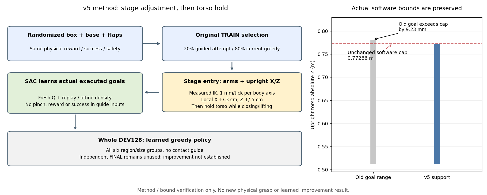
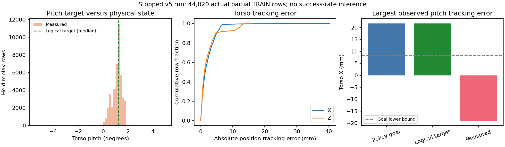
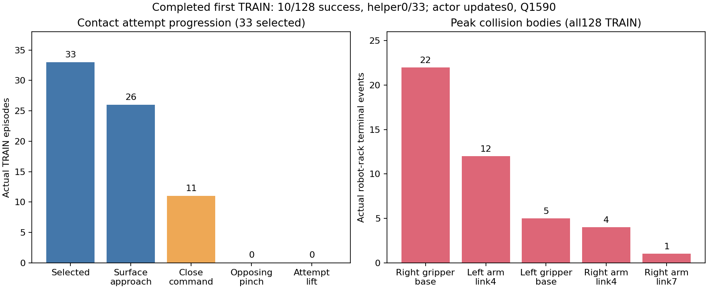

# 몸통 위치와 팔을 함께 조절하는 SAC 비교

목표는 박스와 base의 시작 상태가 달라도 양손 flap 파지·유지·들기에 성공하는
학습된 정책이다. 현재 일반화 성공은 미해결이며 중형 박스의 전체 평가 성공은 0회다.
기존 장기 학습을 유지하면서, 상단 진입과 닫힘 유지 문제를 별도 v5로 시험한다.

## 확인한 문제

완료된 실제 v3 TRAIN의 상단 탐색 11경로는 랙 앞 준비 위치/정렬 조건을 넘지
못했다. 손을 안내하는 동안 몸통의 원래 시간 기반 목표는 계속 올라갔고,
SAC가 조절할 수 있던 몸통 범위는 그 목표 주변 X 약 ±1cm, Z 약 ±4cm였다.
별도의 정적 IK 검토는 몸통 X/Z를 팔과 함께 조절할 근거를 주었지만 물리적인
접촉·충돌·성공을 입증하지 않는다.

또한 기존 목표 정규화의 Z 상한은 0.78189m인 반면 실제 소프트웨어 상한은
0.77266m다. 단순히 전체 정규화 범위를 쓰면 약 9.23mm 과도한 목표가 생긴다.
v5는 원래 목표 범위와 실제 이동 범위의 교집합을 사용한다. 로봇의 실제
이동 범위, 몸통 기울기, 관절 속도/힘 제한은 넓히지 않는다.

## 적용한 방법



- **SAC action:** 팔 14관절과 몸통 X/Z에 절대 목표 범위를 제공한다. 몸통
  목표 범위는 X 0.00823–0.07518m, Z 0.51228–0.77266m다. 몸통 경계의
  원래 목표는 가능한 구간 안쪽 1%로 이동시킨다. 이는 초기 몸통 목표를
  조금 바꾸므로 기존 버전과 초기 성공률이 같다고 가정하지 않는다.
- **20% TRAIN 탐색:** 기존 선택 마스크를 사용한다. 랙 앞 진입 중에는 실제
  관절·손 자세와 flap 관측을 사용해 몸통 X/Z와 양팔을 함께 조절한다.
  몸통의 한 틱 이동 제안은 축별 최대 1mm이며, 측정된 탐색 시작 위치에서
  X ±3cm·Z ±5cm 안으로 제한한다. 실제 upright IK와 URDF 한계도 적용한다.
- **닫힘·들기:** 진입 후에는 마지막 몸통 목표를 유지해 시간 기반 상승을
  멈춘다. 현재 flap 이동 추종 v4의 닫힘 피드백과 기존 거리·축 정렬·그리퍼
  정착 조건을 유지한다. 닫힘 명령이나 IK 도달을 성공으로 기록하지 않는다.
- **학습·평가:** 실제 실행 목표·환경 보상으로 SAC를 학습한다. 목표 범위의
  affine Jacobian을 확률밀도와 entropy에 반영하며 actor, Q target, 성공
  명령 학습, 체크포인트 재개, 영상 복원에 같은 분포를 사용한다. 전체 평가의
  greedy 정책은 접촉 안내를 쓰지 않는다.

Box/base/flap randomization과 원래 reward·양손 opposing pinch·유지·들기·안전
기준을 유지한다. Base/waist/head 채널은 이 안내에서 변경하지 않는다.
Curriculum이나 평가 데이터를 학습에 추가하지 않는다.

## 검증과 실행 범위

관련 CPU 검사 **73개**와 실제 초기 체크포인트 저장·학습 재개·Q 영상용 복원이
통과했다. 기존 v4의 actor/정규화 29개와 frozen source를 보존했고, 새 Q와
replay/성공 은행은 비어 있다. 검증된 완료 TRAIN의 384상태에 초기 정책을
질의했을 때 팔·jaw·기타 목표는 같았고 몸통 Z의 최대 변화는 0.4003mm였다.
이 상태나 분석 결과를 새 학습에 넣지 않았다. 모델 복원/범위 검증이며
새 물리 성공이나 성능 개선의 결과가 아니다.
[검증 근거](assets/rl_v2_URDF_upright_contact_initial_verified_20261009.json).

선택 옵션은 `scripts/rl/prepare_urdf_regional_goal_sac.py`의
`--servo-retention-profile full-arm-upright-contact`와
`--body-behavior arm20-gentle-rest-greedy`다. 기존 옵션의 기본 동작은 유지한다.
다른 action support이므로 이전 Q/replay를 그대로 재개하지 않고, 같은
actor-only source에서 새 초기 체크포인트를 만든다.

첫 비교는 기존 원래 첫 다섯 배치, TRAIN384·초기/학습 후 전체 DEV각128·
replay25만으로 한다. 여섯 위치/크기 조합과 독립 FINAL 미사용 조건을 유지한다.
기존 일곱 장기 비교는 TRAIN6,144·replay200만으로 진행한다. 실제 실행 여부는
PID·GPU mask·런타임 상태로 확인하며 준비 파일의 존재만으로 실행을 주장하지 않는다.

GPU3의 앞선 v3는 TRAIN384 뒤 성공8/128회로 계획을 정상 종료하고 최종
checkpoint/log의 Drive 검증을 마쳤다. 메모리와3GiB 여유를 다시 확인한 뒤
**05:53 KST에 새 v5 writer84,979·supervisor84,473이 실제 시작됐다.**
06:07 KST에 초기 전체평가step121·고정 소스748개·중력보상18관절·
`CUDA_VISIBLE_DEVICES=3`·Kit단일GPU3·VRAM2,791MiB를 확인했다.
06:41 KST에 전체 초기평가128회가 끝나 성공14·안전 위반44·시간 초과57·
초기 무효13·수치 실패0회였다. 중간 왼쪽small9·상단 오른쪽small5회이며
다른 네 조합과 중형은0회다. 안전 위반은랙43·박스 낙하1회다.
실제 저장 모델/정규화77개가 검증한 초기 모델과 같고259개tensor가 유한했다.
Actor/Q 갱신0인 자기 초기 기준이며 학습의 개선을 뜻하지 않는다.
이후 첫 실제 TRAIN 수집을 시작했다. 학습 후 전체 greedy 결과는 대기 중이다.
[전체 초기 결과·실제 저장 모델](assets/rl_v2_URDF_upright_contact_first_full_DEV_20261009.json).
CPU 대기 coordinator는 학습을 시작한 뒤exit0으로 종료했고, 새 학습의 중단을 뜻하지 않는다.
전체 평가 모델 보존·초기/최종 전체 결과·첫 TRAIN·런타임/Drive 확인용
CPU 관찰 다섯 개도 실제 시작했다.
[실제 시작·런타임 계약](assets/rl_v2_URDF_upright_contact_SAC_actual_startup_20261009.json) ·
[실제 CPU 관찰 작업](assets/rl_v2_URDF_upright_contact_actual_CPU_observers_20261009.json).
기존 Drive 연결과 300초 업로드·크기/MD5 검증·최신 두 checkpoint 보호를
재사용한다. 06:00의 첫 검증은manifest/env/agent 계약이었다. 초기 평가 뒤
저장된 `checkpoint_00000000.pt`는06:45:25에 기존 업로더의 Drive 검증을 마쳤다.
Raw HDF/replay/영상은 checkpoint/log 전용 백업 범위에 없으므로
로컬에 남긴다. 다른 사용자의 실행은 종료하거나 변경하지 않는다.

성능 판단에는 실제 파지/안전 종료와 같은 모델의 전체 128조건 평가를 사용한다.
상단 진입 개선만으로 중형의 충돌 문제까지 해결됐다고 판단하지 않는다.
좋은 전체 평가 모델을 보존하고, 충분한 성능을 확보한 뒤 독립 FINAL로 확인한다.

구현: `experiments/urdf_upright_contact_sac.py`, `upright_contact_control.py`,
`perceived_contact_exploration.py`. 전체 진행과 재생 가능한 실제 성공/실패 영상은
[진행 보고](RL_V2_SAC_PROGRESS_20261009.md)에 있다.

## 07:04 몸통 IK 경계 오류와 복구 수정

v5는06:54 KST에 첫 TRAIN 도중 `Upright IK violated fixed pitch or software/local support`
오류로 종료했다. Actor0·Q732·실제 부분 수집44,020행을 저장했고 초기/오류
checkpoint와 닫힌 로그는06:55에 기존Drive 검증을 마쳤다. 부분 TRAIN을
완료된128회 수집이나 학습 후 성공률로 표시하지 않는다.

종료된 실제 관측에서 몸통 X=-18.99mm인 상태에 허용 범위의 X=8.23mm를
요청해도 속도 제한된 IK 결과는X=-10.72mm로 남았다. 목표가 범위 안이라는
것과 물리가 한 틱 안에 그 범위로 돌아오는 것은 다르다. 이 상태를 다시
계산하면 기존 경계 검사가 오류를 낸다. 원래 탐색 마스크·handoff 전체를
재현한 결과는 아니며 실제 관측 상태에서 경계 원인을 확인한 계산이다.

수정 버전은 이런 IK 제안을 채택하지 않고 해당 환경의 마지막 유효 몸통
목표를 유지한다. 그 환경은 팔만의 DLS로 접근을 계속하고 다른 환경은
유효한 몸통/팔 제안을 사용한다. 잘못된 목표·NaN이나 pitch 계산 오류를
실행에 넘기지 않으며 원래 이동 범위·속도·보상·성공·안전 기준은 유지한다.
현재 배치의 `upright_projected_proposal_rejections_current_wave`로 제외된
제안 수를 기록한다. SAC 분포와greedy평가 동작은 바뀌지 않는다.

관련81검사와 실제 관측 상태의 유효 목표 유지가 통과했다. 같은 제어기를
쓰는 v6는 GPU 시작 전이어서 기존 CPU 대기만 중단했다. 기존 GPU 학습과
다른 사용자 실행은 변경하지 않았다. 수정 소스를 별도로 고정한 뒤 같은
초기 actor에서 다시 시작하며 새 물리 성공이나 성능 개선은 아직 미확인이다.
[실제 상태·경계 오류·복구 근거](assets/rl_v2_upright_IK_projection_recovery_actual_state_20261009.json).

07:10 KST에 수정 source3740689·749개Python 파일의 별도 장기 실행을
GPU3에서 실제 시작했다. writer1,261,376·supervisor1,261,247·GPU mask3를
확인했다. 기존 초기 actor/정규화와Q 이외의model37개·frozen body source는
같고 새 Q/replay를 사용한다. TRAIN6,144·replay40만·전체DEV각128·65배치로
늘렸고 첫다섯 배치는원래 요청과같다. 현재 여유에서3GiB를남기는것을 고려한
초기 버퍼 크기이며 실제 사용량은 실행 상태로 다시확인한다. 기존 장기7개와
v4를유지하고 새 초기/학습 후 결과는아직대기중이다. 기존Drive 인증·300초
업로드·검증된 저장본만정리·최근2개보호를재사용한다. 모든17개DEV의실제
모델보존과초기/첫TRAIN/첫학습후평가·완료replay분석 CPU 관찰6개를연결했다.
[실제 수정 실행·설정·관찰 PID](assets/rl_v2_URDF_upright_repaired_long_actual_launch_20261009.json).

## 실제 몸통 목표와 물리 자세의 차이



종료된 v5의 실제 부분 TRAIN44,020행에서 목표·관절 telemetry를 비교했다.
몸통 pitch 명령은 약1.214°로 유지됐고, 실제 pitch의 명령 대비 절대 오차는
중앙값0.214°·99백분위1.436°였다. 3°를 넘는 행은66개였다. 실제 다음 상태의
최대 오차는6.644°이며, 이 상태가 이전 IK 경계 오류의 관측 상태와 같다.
전체 몸통이 계속 무너졌다고 볼 자료는 아니지만 일부 물리 추종 이탈은 실제다.

이 행에서 정책 X 목표와 논리 관절 목표의 X는 모두21.643mm인데 실제 X는
-18.990mm였다. 따라서 범위 밖 X를 정책이 명령해서 오류가 났다는 설명은
맞지 않는다. 관절 목표와 실제 물리 상태가 다르고, IK가 한 틱 안에 추종
오차를 없애지 못한 상태를 전체 배치 실패로 처리했던 문제다.
X 추종 오차의 중앙값은1.390mm·최대40.273mm, Z는1.171mm·최대15.502mm였다.

이 replay에는 실제 모터 torque·effort 포화 측정이 없으므로 중력보상 부족이나
힘 제한을 원인으로 단정할 수 없다. robot-rack 안전 위반 flag는 이 부분
자료에서0이며, 이는 기준 미만 접촉이나 box/gripper 접촉이 없다는 뜻이 아니다.
교정 목표·관절 명령·실제 상태를 구별하고, 수정 장기 실행의 완료된 TRAIN과
도움 없는 전체 평가를 확인한 뒤 제어기나 탐색 설정의 추가 변경을 판단한다.
이 자료는 성공률·완료 episode 통계가 아니며 새 학습에 넣지 않았다.

재현 명령은 `scripts/rl/analyze_closed_upright_tracking.py --run-dir <종료된 실행>`에
`--output-json`과 선택형 `--output-plot`을 지정한다. CPU 전용이며 원래 writer와
supervisor의 종료·안정된 파일·입력 불변·실행 목표 범위를 확인한다.
[실제 관절 목표·추종 오차 근거](assets/rl_v2_closed_upright_torso_tracking_20261009.json).


## 수정 장기의 실제 초기 평가와 첫 TRAIN

07:56 KST에 수정 실행의 원래 전체128조건 초기평가가 완료됐다. 성공14·안전
위반44·시간 초과57·초기 무효13회이며 중간 왼쪽small9·상단 오른쪽small5·
다른 네 조합0회였다. Actor/Q0이므로 학습 효과가 아니다. 실제 평가 후 저장
모델/정규화77개가 초기 입력과 같고259개 tensor가 유한했다.
08:04 KST에 같은 writer의 첫 TRAIN step151·Q178·수집9,064행과 기존
Drive 검증을 확인했다. 경계 복구 수정의 실제 완료 수집과 학습 후 전체
성능은 아직 대기 중이다. TRAIN6,144·replay40만과 원래 무작위화를 유지한다.
[전체 초기 평가 근거](assets/rl_v2_URDF_upright_contact_repaired_first_full_DEV_20261009.json).


08:11 KST에 같은 수정 writer가 첫 TRAIN step451·Q778·수집46,659행까지
진행했다. `upright_projected_proposal_rejections_current_wave`는37이었다.
이전 오류 실행의44,020행/마지막progress421을 넘었고, 범위 밖의 유한 제안을
거부하고 이전 유효 몸통 목표와 팔 제어를 유지하는 분기가 실제로 실행된
상태에서도 배치가 계속됐다. 같은 실제 접촉 이력의 반복이나 전체 episode
완료·파지 성공·학습 개선을 뜻하지 않는다. 실제 pitch/접촉 영향은 완료된
첫 TRAIN 자료에서 별도로 확인한다.
[실제 경계 복구 관찰](assets/rl_v2_upright_repaired_actual_boundary_recovery_20261009.json).

## 완료 TRAIN에서 구역별 몸통 추종 비교

`scripts/rl/analyze_completed_upright_tracking.py`는 원래 writer의 raw 파일 대신
완료 wave를 별도로 복사·SHA256 검증·읽기 전용으로 만든 자료만 사용한다.
저장된 실제 clock과 종료 contact를 대조해 각 행을 환경에 배정하고, 구역·크기·
원래 탐색 선택별로 실제 자세와 논리 목표의 차이를 비교한다. 범위 밖의 정책
목표, 실제 물리 추종 이탈, 랙 안전 종료의 동시 발생을 구별한다. 이 연관성만으로
중력보상·torque 포화를 원인으로 단정하지 않으며 자료를 학습에 넣지 않는다.

10개 검사로 완료128경로 매핑·clock/종료 contact 불일치 거부·검증되지 않은
복사본/활성 경로/변경 파일 거부·실제 pitch와 목표의 구분을 확인했다.
종료된 실제44,020행의 기존32개 보고 필드도 동일하게 재현됐다.
08:23 KST에 빈 CUDA mask의 별도 CPU 작업을 연결했고, 08:25에 정상 종료했다.
원래 writer가 다음 배치를 진행하는 동안 완료된 첫 TRAIN의 별도 읽기 전용
복사본 80,977행·SHA256을 검증하고 전체128경로를 실제 종료 결과에 배정했다.
같은 몸통 함수로 이전 종료 자료와 새 완료 wave를 비교했다.

```bash
CUDA_VISIBLE_DEVICES='' python scripts/rl/analyze_completed_upright_tracking.py \
  --snapshot-proof /absolute/path/to/verified-copy/snapshot_verified.json \
  --output-json /absolute/path/to/new-diagnosis.json
```

[실제 CPU 관찰·검증 범위](assets/rl_v2_completed_TRAIN_torso_analysis_actual_observer_20261009.json).

## 첫 완료 TRAIN의 실제 실패 원인

08:23:48 KST의 첫 TRAIN128은 성공10·안전 위반46·시간 초과72회였다.
초기 무효와 수치 오류는0회다. Greedy95회 중10회, 접근 안내를 선택한33회
중0회 성공했고 actor0·Q1,590이었다. 첫 수집 성능이며 학습 후 전체DEV
개선으로 표시하지 않는다. 이후 같은 writer는 두 번째 TRAIN과 actor 갱신을
계속한다. 학습 후 성능은 보조 없는 전체128조건으로 확인한다.
[실제 첫 TRAIN·같은 저장 모델](assets/rl_v2_upright_contact_repaired_first_TRAIN_actual_20261009.json).



접근 안내33회 중26회는 표면 접근 단계에 도달했고11회는 닫기를 시도했지만
실제 양손 opposing pinch와 들기 시도는0회였다. 다시 열린19개 구간은 모두
선택한 점의 거리12mm 초과였고 축 오차0.30rad 초과는0회였다. 닫힘 유지
틱은 중앙값6·범위5–10, 다시 열릴 때 실제 닫힘 중앙값은 좌36.0%·우42.9%였다.
최근접 패널 점으로 계산해도19구간 모두 양손6mm 안에 있지는 않았다.
단순히 점을 잘못 골라 거리가 커졌다고 보기는 어렵다.

같은 닫힘 구간에서 flap 점 이동 중앙값은13.43mm, TCP 이동은10.85mm,
두 이동량의 차이는9.18mm였다. 몸통 X/Z 이동 중앙값은0.33mm·최대2.19mm다.
양쪽 pad 중 더 약한 측정 힘은 모두0N이었다. 다른 부위나 한쪽 pad의 접촉
부재를 뜻하지 않는다. 움직이는 flap을 닫힘 완료까지 따라가지 못한 문제를
다음 제어 비교에서 확인해야 하며, 거리 기준만 완화해 성공으로 만들지 않는다.

랙 안전 종료44회의 최고 힘 부위는 오른쪽 그리퍼 몸체22·왼팔4번 링크12·
왼쪽 그리퍼 몸체5·오른팔4번 링크4·오른팔7번 링크1회였다. 박스 낙하2회는
이 집계에서 제외했다. 중간 왼쪽medium16회는 모두 안전 종료였다. 그중
greedy10회의 몸통 pitch 오차 최대는2.42°·X 차이 최대7.54mm여서 몸통
붕괴만으로 중형 실패를 설명할 수 없다. TCP/닫힘 축뿐 아니라 그리퍼 몸체와
팔 링크의 랙 진입 여유를 확보하는 방향을 검토한다.
[실제 단계·닫힘·충돌 부위·분석 한계](assets/rl_v2_upright_repaired_completed_TRAIN_approach_failures_20261009.json).

몸통 전체 분석에서는 목표 대비 pitch 절대 오차 중앙값0.238°·99백분위
5.223°·최대9.230°, X 차이 중앙값1.443mm·최대65.235mm였다. 대부분의
추종 오차는 작지만 일부 경로의 이탈은 남아 있다. 모터 torque/effort 포화는
기록하지 않았으므로 중력보상 부족을 원인으로 단정하지 않는다. Replay의
critic 안전 flag는0인 반면 실제 종료 메트릭에는 랙44회가 있어, 충돌 통계는
실제 종료 메트릭을 사용한다. Flag와 종료 기록의 차이는 추가 확인 대상이다.
[전체128경로의 실제 몸통 추종](assets/rl_v2_upright_repaired_completed_TRAIN_torso_tracking_20261009.json).

기존 접촉 분석은 몸통 연속 IK 재계산의 엄격한 오차 검사에서 멈췄다. GPU
학습 오류가 아니며 원래 학습은 재시작하지 않았다. 기본3e-5 검사는 유지했고
명시적 `--upright-phase-only` 분석에서 실제 저장된 jaw 명령·clock·정수 카운터·
128개 종료 pinch/안정/성공 결과가 정확히 같음을 확인했다. 연속 몸통 목표는
최대 정규화 차이0.0312로 일치하지 않으므로 완전한 제어 재현으로 보고하지
않는다. 위 닫힘/이동 측정에는 실제 기록된 명령과 관측을 사용했다. 분석
자료는 새 학습에 넣지 않았고 원래 무작위화·보상·성공·안전 조건을 유지했다.
