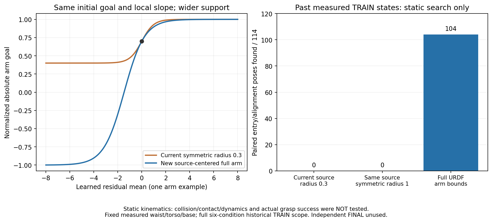

# 기준 동작을 유지하며 전체 팔 관절 목표를 표현하는 SAC

## 수정 근거

기존 URDF SAC의 첫 학습 후 전체 평가가14→8/128회로 줄었고, 완료된 첫
TRAIN640조건은성공36·안전 위반269·시간 초과335회였다. 큰 팔 탐색138조건의
성공은0회였다. 중형 왼쪽80조건은 모두 랙 충돌이고 종료 시 peak body는62회가
왼팔4번째 링크였다. 중간 오른쪽small80조건은성공0·시간 초과79회, 종료 시
오른손–배정flap 표면 거리 중앙값은1.07m였다. 종료 거리/peak body는 전체 경로의
최단 거리나 첫 충돌을 뜻하지 않는다. TRAIN 조건·수집 중 정책이 달라 배치별
성공 수를 고정 평가 추세로 비교하지 않는다.
[완료 TRAIN640의 실제 분포](assets/rl_v2_URDF_first_closed_TRAIN640_failures_20261008.json).

현재 servo guard도팔 목표를 URDF로 정규화했지만 기준 actor 주변의 **대칭적인
보정 반경0.3** 안에서만 바꿀 수 있다. 종료된 원래 TRAIN의 실제198입력에
현재 guard 초기 모델을 복원해 팔 목표 범위를 계산했다. 같은 자세에서 두 손의
랙 앞 진입 위치5cm·닫힘축0.25rad를 만족하는 후보를400회 최적화했다.

| 현재 source를 사용하는 목표 범위 | 처음 base 정착114상태 | 실제22cm 진입84상태 |
| --- | ---: | ---: |
| 대칭 보정0.3 | 0 | 38 |
| 대칭 보정1.0 | 0 | 60 |
| 전체 URDF 관절 범위 | 104 | 60 |

두 열은 다른 시점의 상태다. 고정 waist/torso/base에서 정적 팔 자세만 계산했고
충돌·접촉·동역학은 검사하지 않았다. 후보 미발견은 물리적 불가능을 증명하지
않지만, 정규화와 보정 반경을 키우는 것만으로 전체 관절 범위가 열리는 것은
아니다. 현재source와 당시 입력에서 계산했으며 새 평가나 TRAIN 경험으로
가져오지 않는다.
[현재 실제 guard 모델의 범위 비교와 모든 입력](assets/rl_v2_closed_actual_guard_target_envelopes_20261008.json).



그림 오른쪽은 정적인 자세 후보 수이며 물리 파지 성공률이 아니다.

## 선택형 정책 표현

팔14관절의 Gaussian 평균을`atanh(source_goal) + local_scale * residual_mean`으로
표현하고 tanh를 거쳐 절대 URDF 목표를 만든다. 기준 mean0은 원래 source 목표를
유지하지만 학습된 평균은 전체[-1,1] 목표로 이동할 수 있다. Source의 대칭 여유
반경은**국소적인 명령 변화·탐색 단위**를 맞추는 데만 사용한다. 팔 목표 지원
범위를 제한하는 반경으로 쓰지 않는다. 경계에서의 무한값을 막는 정규화 여유는
1e-6이며 production 속도/명령/URDF 제한은 그대로다.

작은 Gaussian과 coherent episode offset도 같은 국소 scale로 조정한다.
국소적으로는 기존 guard의 명령 변화와 탐색 크기를 보존하며, 큰 offset의
전체 변환은 비선형이다. 같은 작은 잡음이라는 이유로 큰 탐색 경로까지
동일하다고 주장하지 않는다. 실제 범위를 가진 Gaussian/tanh 확률 밀도와
entropy 목표를 collection·actor·성공 손실·target Q에 모두 사용한다.

현재 측정한 raw 관측을 분포에 직접 전달한다. Clip된 normalizer를 역변환해
관절 상태를 추측하지 않는다. 기본 hybrid 정책의 새 hook는기존
`parameters_at` 결과를 그대로 반환하므로 기존 정책의 기본 동작은 유지한다.

나머지 몸체5좌표·그리퍼2개·production12cm jaw gate·source confidence0.8/
residual gain20과19body+2jaw 차원은 유지한다. 실제 절대 목표와 pending target
기반 servo Q 좌표도 같다. 성공 명령 유지0.1·actor64개 중 절반은 실제 성공
경로 마지막64행, Q 성공 표본 설정도 guard와 같다. 새로운 artifact/계약은
`staged_actual_flap_URDF_full_arm_servo_guard_hybrid_sac_v1`이다.

기존 두 데모에서 나온 기준 actor만 사용하고 Q·replay·성공/return 은행과
optimizer는0에서 시작한다. VR·교사·평가 행을 새 Q나 reward에 가져오지 않는다.
보상·박스/base/배경/firm dynamic flap randomization·중력 보상18관절·upright
몸통과별도 base 접근·성공/안전 기준을 유지한다. 양손 opposing pad5N·0.25초
유지·8mm 들기·랙10N·장애물5N·drop10cm·self OFF이고 curriculum은 없다.

## 실제 초기화와 최소 확인

관련64개 검사가 통과했다. 새 전체 지원 범위·초기 기준 동작·측정 상태의
분포·확률Jacobian·경계 escape gradient·실제 actor/target/success 갱신·재개와
기존 정책의 동작을 검사했다. 19:22 KST 실제 CPU 초기화·저장·SAC 재개·Q/video
복원에서 모델/optimizer/contract가 정확히 같았고 모든 갱신/은행은0이었다.

과거 성공7,666입력에서 actor/normalizer29개와frozen source/body anchor를
보존했다. Binary jaw는모두 같고 greedy 목표 최대 차이는2.98e-8,
실제 servo 차이는1.19e-5다. 같은 Gaussian을 사용한 servo 변화는기존 guard와
약0.149~0.154로 거의 같다. 이는정적 질의이며 새 물리 성공·학습 개선을
증명하지 않는다.
[실제 초기화·재개·명령과 국소 noise 검사](assets/rl_v2_URDF_full_arm_ready_static_20261008.json).

## 사용법과 비교 계획

기존 URDF 초기화 입력에 새고유 output과 다음옵션을 추가한다.

```bash
--servo-retention-profile full-arm-tail64
```

기본값은`uniform`, 앞선 guard는`guard-tail64`로 유지한다. 초기화만으로
물리 학습은 시작되지 않는다. 기존 장기 비교와 같은 TRAIN6,144조건·replay200만,
원래여섯 조합 DEV128을384TRAIN마다 사용한다. GPU3·CUDA_VISIBLE_DEVICES=3/
learnercuda:0,격리 소스를사용한다. 기존 실행을 중간에 바꾸지 않는다.

기존 Drive 인증·300초 검증·최신2개 및 최신 검증2개 보호를 유지한다.
Checkpoint/계약/종료 로그 백업이며 raw HDF/replay는 로컬에 유지한다.
완료 로그는 writer가 종료된 뒤 검증한다. 실제 실행과 원래 전체 결과,
중형 포함학습 개선 및독립FINAL을 따로 확인한다. 현시점독립FINAL은 미사용이고
목표는 아직 달성되지 않았다.
