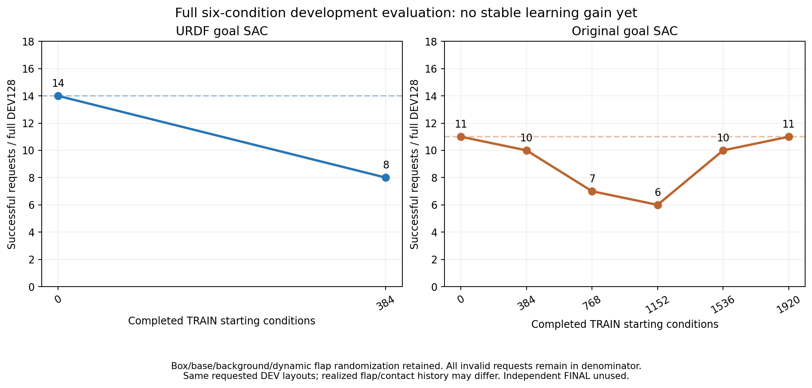

# 성공 동작 유지와 팔 탐색 단위를 보정한 SAC

## 적용 배경

기존 URDF 목표 SAC의 첫 학습 후 전체 DEV128은 **성공8·랙 충돌46·시간 초과74회**였다.
초기 기준14회보다 낮다. 같은 요청에서 초기·최신 모두 유효한115조건도14→8회였고
초기 성공10회를 잃고 새 성공4회가 생겼다. 실제 평가의 actor698·Q4,840 모델과
평가 종료 저장 모델이 같고 optimizer·유한성·원래 여섯 조합과 성공/안전/DR를
확인했다. 같은 요청이며 실제 flap 추첨·접촉 이력이 같은 반복은 아니다.
중간 왼쪽small은9→1회, 상단 오른쪽small은5→6회, 상단 왼쪽small은0→1회다.
중간 오른쪽small과 중형 양쪽은 여전히0회다.
[전체 결과·평가와 동일한 모델](assets/rl_v2_URDF_first_learned_full_DEV4_20261008.json).

별도 기존 여섯 조합 SAC는 TRAIN1,920조건 뒤11/128회였다. 흐름은
11→10→7→6→10→11회이며 초기 수준을 회복했지만 중형은0회다. 현재 URDF
초기14회와 다른 실행의11회를 직접 학습 개선으로 비교하지 않는다.
[기존 실행의 다섯 번째 전체 결과](assets/rl_v2_all6_fifth_learned_full_DEV_20261008.json).



## 확인한 학습 문제

Actual actor256·Q3,072 모델을 과거의 실제 성공 TRAIN16경로·7,666입력에
적용하면 작은 목표 차이가 servo 명령에서는 큰 차이로 나타났다. 중간 왼쪽/
상단 오른쪽/상단 왼쪽의 목표 평균 차이는0.004~0.007이지만 servo 명령 차이는
0.271/0.264/0.161이다. 마지막64행의 차이는0.296/0.262/0.336이며 이미
파지·들기에 가까운 상태에서도 명령이 변한다.

그 입력에서 Q는 바뀐 greedy 명령을 각각100%/96.5%/88.3%의 행에서 더 높게
평가했다. 실제 이후 경로의 결과를 측정한 반사실적 비교는 아니므로 이 순위가
틀렸다고 확정하지 않는다. 과거 경로의 실제 discounted return과 현재 정책의
Q도 다른 미래 동작을 가정하므로 그 차이를 그대로 Q 오차라고 부르지 않는다.

같은 성공 입력64행에서 Q 쪽 actor 기울기 크기는8.20, 기존 성공 유지 손실은
1.89였다. 두 방향은 반대 성분을 가졌고 cosine은-0.62였다. Servo 유지 계수를
0.01→0.1로 바꾸면 같은 정적 기울기는18.32가 된다. 실제 writer의 혼합 replay
미니배치나 optimizer step을 재현한 값은 아니지만, 성공 동작을 유지하는 신호를
보강할 근거다. 학습 때와 같은 실제 pending target·step clip·binary jaw로 계산했다.
[명령 포화·Q 순위·기울기와 분석 범위](assets/rl_v2_URDF_first_actor_servo_Q_geometry_diagnosis_20261008.json).

## 선택형 수정

| 항목 | 새 설정 | 목적 |
| --- | --- | --- |
| 팔14관절의 작은 Gaussian | 기존 목표 halfspan/URDF halfspan 비율로 축소, 최대 배율1 | 넓힌 목표 좌표에서 작은 탐색의 물리적 크기 보정 |
| 확률 밀도와 entropy 목표 | 같은 관절별 배율을 collection·actor·target Q 모두에 적용 | 한 경로만 다른 분포를 사용하지 않도록 연결 |
| 성공 servo 유지 계수 | 0.01→0.1 | 목표 차이뿐 아니라 실제 명령 차이를 더 강하게 제한 |
| Actor 성공 표본64행 | 절반은 실제 성공 경로의 마지막64행, 구역 균형 유지 | 파지·유지·들기 구간의 드문 학습 신호 보강 |
| Q 성공 replay 표본 | 기존 설정 유지 | Actor 보강의 범위를 분리 |

연속 목표의 넓은 URDF 범위·학습 가능한 평균 보정·20% coherent 팔 탐색의
큰 bias는 유지한다. 작은 Gaussian의14관절 배율은 실제 입력에서0.190~0.972다.
나머지5개 몸체 좌표의 Gaussian과 binary jaw·confidence0.8/residual gain20·
production gate12cm는 유지한다. Scalar quarter std0.0075~0.03은 **보정 전
기본값**이며 실제 관절별 min/max는 새 계약과 runtime report에 따로 기록한다.
Entropy 목표도 이 실제 분포의 가능한 범위로 계산한다.

보상·success event·중력 보상18관절·관측518/578·19body+2jaw·별도 base 접근·
원래 속도와 명령 제한·충돌 센서·box/base/배경/firm dynamic flap 무작위화를
보존한다. Opposing pads5N·hold0.25초·proof lift8mm·랙10N·장애물5N·drop10cm·
selfOFF 기준도 그대로다. Curriculum·박스 고정·성공 reset·평가 데이터 학습은 없다.

새 artifact는`staged_actual_flap_URDF_regional_goal_servo_guard_tail_hybrid_sac_v1`이다.
독립 모듈의 class/계약과 shared staged dispatch·Q/video 복원을 사용하며
일반 PPO/SAC/DPPO 및 기존 URDF 실행의 기본값은 변경하지 않는다. 이전 좌표의
Q/replay와 VR/접촉 교사의 goal을 가져오지 않는다. 기준 actor만 같은 원래 source로
복원하고 Q·replay·성공/return 은행과 optimizer는 새로 시작한다.

## 실제 준비 확인

관련55개 검사가 통과했다. 실제 초기화·저장·SAC 학습 재개·Q 복원에서 모델·
optimizer·contract가 정확히 일치했고 모든 갱신/은행은0이었다. 기존 초기 모델의
actor/normalizer29개 tensor와 frozen source/body anchor를 보존했다. 과거 실제
성공7,666입력에서 greedy 목표·binary jaw·servo 명령은 **최대 오차0**이었다.

같은 Gaussian 표본만 넣은 정적 질의의 전체 body servo 변화는 중간 왼쪽
0.204→0.154·상단 오른쪽0.191→0.149·상단 왼쪽0.195→0.150이었다. 큰 episode
bias와 stochastic jaw는 이 비교에 포함하지 않았다. 성공 입력 일부의 분석이며
원래 전체 여섯 조합 평가를 대신하지 않는다. 새 closed-loop rollout의 성공이나
학습 개선은 아직 증명하지 않았다.
[실제 초기화·원래 명령 보존·paired noise 질의](assets/rl_v2_URDF_servo_guard_ready_static_20261008.json).

## 사용법과 장기 비교

[URDF 초기화 명령](RL_V2_URDF_REGIONAL_GOAL_SAC_20261008.md)의 입력을 사용하되
새 고유 출력 폴더와 다음 옵션을 추가한다.

```bash
--servo-retention-profile guard-tail64
```

옵션을 생략하면 기존`uniform` 설정이다. 준비 단계는 GPU/Isaac 학습을 시작하지
않는다. 이후 동일한 장기 계획인 TRAIN6,144조건·버퍼200만·TRAIN384조건마다
원래 전체 DEV128로 비교한다. 훈련 자식은 CUDA_VISIBLE_DEVICES=3·cuda:0과
물리 renderer3·multiGPU OFF를 사용한다. 기존 실행은 격리 소스를 유지한다.

기존 Drive 연결과300초 검사·검증된 오래된 checkpoint만 정리·최근2개 보호를
재사용한다. 체크포인트/계약/종료 로그 범위이며 raw HDF/replay는 로컬에 남는다.
종료 로그는 writer가 멈춘 뒤에만 검증한다. 중형 포함 전체 성능과 아직 사용하지
않은 독립FINAL로 목표 달성을 판단하며 초기 명령 일치나 새 옵션의 존재만으로
학습이 성공했다고 판단하지 않는다.

## 10/08 18:45 KST 실제 시작

GPU3에서 기존 두 학습을 유지한 채 새 고유 관리 폴더
`GPU3_URDF_servo_guard_long_SAC128_20261008_184553`로 시작했다.
실제 supervisor3828498·writer3829178과 CUDA_VISIBLE_DEVICES=3를 확인했다.
고정 소스는479c781이며 기존 인증의 about 검사를 통과했다. 시작 전 GPU3
여유는58,504MiB였다. 초기화·학습 전 전체 평가 진행 중이며 실제 설정/첫
백업/전체 결과는 별도 검증 뒤 기록한다. 실행을 시작한 사실을 성공으로
표시하지 않는다. 기존 학습과 다른 사용자의 프로세스에 신호를 보내지 않았다.

## 10/08 18:54 KST 실제 설정·백업 확인

초기화를 마친 writer3829178이 학습 전 전체DEV0을 진행한다. 실제 source730개
hash와 고정 commit479c781, renderer와 모든 보존 manifest 항목, 원래 전체
TRAIN6,144/DEV128 요청을 대조했다. Runtime의 관절별 Gaussian min/max와
`guard-tail64`·servo 유지0.1을 확인했다. 실제 중력 보상18관절 로그도 있다.
현재 actor/Q와 replay/성공 bank는0이며 초기 전체 결과와 종료 저장 모델의
동일성은 아직 미확인이다. 지정한 초기 파일257개 tensor의 유한성은 확인했지만
writer의 메모리 모델을 읽은 것이 아니므로 실제 저장 후 별도 대조한다.

첫 Drive 계약 범위의 검증은18:51:34 KST였다. 기존 인증·300초·최근2개와 최신
검증2개 보호를 유지한다. 새 writer GPU 메모리는17,561MiB, 우리 세 실행은
총40,248MiB다. Root 여유155.7GiB·shm220.4GiB이며 현재 payload는 유지한다.
완료 로그의 검증은 writer 종료 뒤이고 원격 백업만으로 raw HDF/replay를
정리하지 않는다. 다른 프로세스에 신호를 보내지 않았다.
[실제 런타임·원래 환경·메모리·검증 백업 기록](assets/rl_v2_URDF_servo_guard_SAC_actual_startup_20261008.json).
