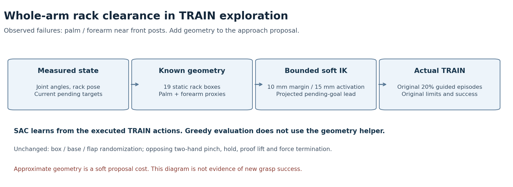

# 손바닥·팔뚝 랙 간격을 고려하는 SAC 탐색 — 10/09

학습 시간이 늘어도 성공률이 낮아지는 실험이 있어, 긴 학습과 함께 실제 실패
경험을 고친다. 수정 torso 장기의 첫 학습 후 전체평가는 **10/128회**로 초기
14회보다 낮았다. Uniform의 TRAIN3,456 뒤 전체평가도 **2/128회**였다.
두 실험 모두 중형 성공0이며 일반화 목표는 아직 미달성이다.
[수정 torso 전체 결과](assets/rl_v2_URDF_upright_contact_repaired_first_learned_full_DEV4_20261009.json),
[uniform 전체 결과](assets/rl_v2_URDF_regional_goal_ninth_learned_full_DEV36_20261008.json).

완료 TRAIN의 실제 랙 실패44회 중43회를 손바닥·팔뚝 명목 형상으로 대조했다.
33회는 앞 기둥이 최근접이었고41회는 계산상 간격10mm 미만이었다.
손끝의 접근과 닫힘 축만 맞춰도 전체 손·팔은 기둥을 스칠 수 있다.
[실제 분석과 한계](RL_V2_RACK_ENTRY_GEOMETRY_20261009.md).

## 무엇을 바꿨는가

선택형 **v8**은 기존20% TRAIN 탐색에서 손끝 접근·축 정렬과 함께 손바닥·팔뚝의
랙 간격 비용을 푼다. 관절·랙 측정값과 알려진 형상만 사용하며 force·pinch·reward·
Q값이나 평가 결과를 제어 입력으로 읽지 않는다. SAC 배우와 Q는 실제 실행한
TRAIN 행동을 학습한다. **보조 없는 greedy 평가에는 이 제어를 쓰지 않는다.**

| 설정 | 값 |
|---|---|
| 랙 형상 | 고정 상자19개; 원본 USD2개 SHA256 확인 |
| 로봇 형상 | 손바닥 convex hull247개 점/손, 팔뚝33점·반경50mm |
| 목표 여유 / 비용 활성 거리 | 10mm / 15mm |
| 바깥 복구량 상한 / 비용 가중치 | 2mm/제어 tick / 4 |
| 관절 증분 / 기존 목표 선행 제한 | 기존20mrad / 80mrad 유지 |
| 몸통 | 기존 고정 pitch X/Z IK·속도·이동 범위 유지 |
| 닫힘 / 재접근 / 유지 | 기존6mm / 12mm, 실제85% 닫힘·6틱 정착·24틱 유지 |
| 움직이는 flap 예측 | 기존 v7의3틱·8mm 한도, 원래5mm 접선 목표 |

실제 실패 상태의 pending 목표는 측정 관절보다 최대0.483rad 앞서 있었지만 실제
명령은80mrad와 URDF 범위로 제한된다. 따라서 비용은 **제한을 통과한 기존 목표
자세의 FK**에서 계산한다. 이미 포화된 관절은 목표 증분에 대한 국소 민감도를0으로
처리한다. 제한 전 목표를 그대로 쓰거나 측정 자세의 기울기로 큰 목표 선행을
선형 예측하는 시안은 사용하지 않았다. 이전 시안·초기 모델은 로컬에 보존하며
GPU 학습에 사용하지 않았다.

이 계산은 완전한 충돌 검사가 아니다. 손바닥 점 표본과 팔뚝 swept-radius는
근사이며 rollers·박스·다른 장애물·self collision은 이 비용에 들어가지 않는다.
**원래 실제 force 종료 판정은 유지한다.** 양손 opposing flap 파지·유지·proof lift,
박스/base/flap/배경 무작위화, 보상·관절 한도·물리 PD도 유지한다.

## 확인한 범위와 다음 실험

30개 검사: 형상 거리·회전·기울기/FK, 실제 pending 목표 제한, 선택되지 않은
환경과 보호 채널, 실제 명령 저장, 기존v5/v6/v7 호환성을 확인했다.
실제 저장 상태384개에서 초기 정책 목표21개가 v5와 모두 정확히 같았으며,
모델·정규화·저장/재개·Q 영상 복원을 확인했다. Q·replay·optimizer·성공 bank는
새로 시작하고 진단 표본/출력을 학습으로 가져오지 않는다.
[최종 초기 모델 검증](assets/rl_v2_URDF_whole_arm_rack_clearance_initial_verified_20261009.json).

저장된 마지막 action **전** 자세43개의 명목 거리 계산은 기존 분석과 최대
10.27µm 차이였다. 선택된 랙 실패18개에서 가정한 닫힘 IK의 팔 목표를 비교하면
17개의 계산상 간격이 늘고1개는 유지됐다. 중앙 변화는+1.621mm였다. 이는 실제
수집 단계/명령 재현이나 물리 rollout이 아니고 몸통 목표 변화도 비교에서 제외했다.
따라서 새 충돌 감소나 파지 성공의 근거로 쓰지 않는다.
[원자료·가정·계산 결과](assets/rl_v2_whole_arm_clearance_actual_state_proposals_20261009.json).

준비 옵션은 `prepare_urdf_regional_goal_sac.py --servo-retention-profile full-arm-rack-clearance`
와 `--body-behavior arm20-gentle-rest-greedy`다. 새 고유 실행 폴더와 고정 소스,
`CUDA_VISIBLE_DEVICES=3`·learner `cuda:0`를 사용한다. 기존 v7의 정상 종료·최종
Drive 검증과 실제 GPU/디스크 여유 뒤에 순차 실행하며 다른 작업을 중단하지 않는다.
RAM의 우리 고유 실행 경로로 raw payload를 저장해 일반 디스크의 장기 저장량과
분산한다. 실제 CPU 대기 PID4,186,466을 확인했으며 v8 GPU writer는 아직 시작 전이다.
[실제 대기·고정 소스·기존 writer 검증](assets/rl_v2_whole_arm_clearance_actual_GPU3_queue_verified_20261009.json).
TRAIN384조건·초기/학습 후 DEV128조건을 원래 여섯 조합으로 비교하고,
전체 학습 후 효과가 확인되면 장기를 이어 간다. 준비 파일만으로 실행됐다고
표시하지 않으며 실제 대기/시작 PID는 별도 증거로 기록한다. 기존 장기 학습은 유지한다.
